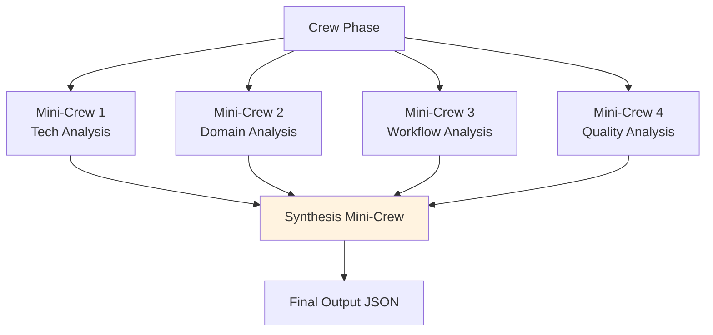
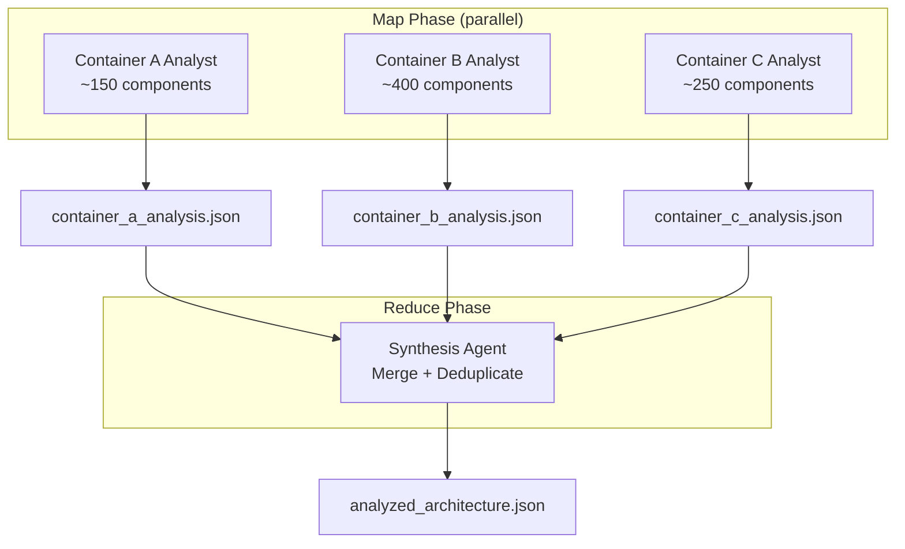

# Crew Pattern

Multi-agent AI collaboration for phases requiring analysis, interpretation, and synthesis.

> **Reference Diagrams:**
> - [analysis-crew.drawio](../diagrams/analysis-crew.drawio) — Analysis crew agent architecture
> - [analysis-crew-schema.drawio](../diagrams/analysis-crew-schema.drawio) — Analysis output schemas
> - [synthesis-crew.drawio](../diagrams/synthesis-crew.drawio) — Synthesis crew flow

## MiniCrew Architecture

Each crew phase is decomposed into independent **mini-crews** — small, focused groups of agents that each get a fresh LLM context window. This prevents context overflow and enables checkpoint/resume.

### Why Mini-Crews?

- **Fresh LLM context**: Each mini-crew creates a new `Crew()` instance, avoiding context window overflow
- **Checkpoint/Resume**: Completed mini-crews are saved to `.checkpoint_analysis.json`; on retry, only failed crews re-run
- **Isolation**: A failure in one mini-crew doesn't corrupt others' results

## Agent Specialization

Each agent has a specific role, goal, and backstory that guides LLM behavior:

| Agent | Role | Tools |
|-------|------|-------|
| Technical Architect | Patterns, layers, tech stack | FactsQuery, RAGQuery |
| Functional Analyst | Domain model, capabilities | FactsQuery, RAGQuery |
| Quality Analyst | Debt, risks, quality attributes | FactsQuery, RAGQuery |
| Synthesis Lead | Merge analyses into unified output | FactsQuery |

## Tool System

Agents interact with the codebase through structured tools, not raw file reads:

- **FactsQueryTool**: Query `architecture_facts.json` by dimension/key (max 50 results)
- **RAGQueryTool**: Semantic search against ChromaDB vector store
- **StereotypeListTool**: List known architectural stereotypes
- **DocWriterTool**: Write Markdown/AsciiDoc to knowledge directory
- **DrawioDiagramTool**: Generate draw.io XML for architecture diagrams

## Evidence-First Principle

Every claim in crew output must be backed by tool query results:
- If a tool returns no evidence, the crew marks the claim as `UNKNOWN`
- No invented containers, components, or relationships
- Evidence includes file path, line number, and confidence score

## Scaling for Large Repositories

For large repositories (**≥300 components** across **≥2 containers**), analysis automatically switches to a MapReduce strategy. This prevents context window overflow and enables parallel execution.

### MapReduce Pattern

**Map**: Each container is analyzed independently by a dedicated analyst agent with a fresh LLM context window, keeping the per-agent token budget small (200-400 components instead of 951+).

**Reduce**: A synthesis agent merges the container-level analyses into a unified `analyzed_architecture.json`, deduplicating cross-container patterns and reconciling shared interfaces.

### Benefits

- **Smaller context per agent**: ~200-400 components vs. the full set, avoiding token limit overflow
- **Parallel execution**: Container analyses run concurrently (3x+ speedup)
- **Horizontal scaling**: Scales to 100k+ components — just add more containers
- **Failure isolation**: A failure in one container's analysis doesn't corrupt others

## CrewAI + MCP Integration

Crews use CrewAI as the agent framework with MCP (Model Context Protocol) for tool integration:
- CrewAI manages agent turns, delegation, and retry logic
- MCP provides a standardized tool interface
- LLM provider configured via `LLM_PROVIDER` env var (local Ollama or on-prem)

## Pydantic Output Validation

Each crew task specifies an `expected_output` with a Pydantic schema. After the LLM produces output, it is validated against the schema. Invalid output triggers a retry with the validation error fed back to the LLM.

## 2 Crew Phases

### Analyze (Architecture Analysis)
- 5 mini-crews, 4 agents, 17 tasks
- Input: `architecture_facts.json` + ChromaDB
- Output: `knowledge/analyze/analyzed_architecture.json`

### Document (Architecture Synthesis)
- Generates C4 diagrams, Arc42 documentation, quality reports
- Input: `architecture_facts.json` + `analyzed_architecture.json`
- Output: `knowledge/document/c4/`, `knowledge/document/arc42/`
