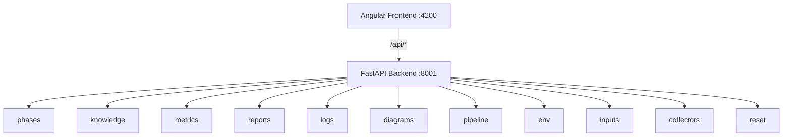

# Dashboard Architecture

The SDLC Dashboard provides a web UI for running pipelines, browsing knowledge, and monitoring execution.

> **Reference Diagrams:**
> - [dashboard-architecture.drawio](../diagrams/dashboard-architecture.drawio) — Frontend/backend architecture

## Technology Stack

| Layer | Technology | Notes |
|-------|-----------|-------|
| Frontend | Angular 21 (zoneless) | Standalone components, no NgModules |
| UI Framework | Angular Material + Tailwind CSS | Capgemini theme |
| Backend | FastAPI (Python) | Async, SSE streaming |
| Communication | REST + SSE | Proxy from :4200 to :8001 |

## Frontend Architecture

**Directory:** `ui/frontend/`

### 10 Pages

| Route | Page | Purpose |
|-------|------|---------|
| `/dashboard` | Dashboard | Overview with phase status cards |
| `/run` | Run Pipeline | Select preset, start execution, live logs |
| `/inputs` | Input Files | Upload/manage JIRA XML, DOCX, Excel files |
| `/phases` | Phases | Phase configuration and dependency graph |
| `/knowledge` | Knowledge | Browse generated knowledge artifacts |
| `/reports` | Reports | View run reports and code generation results |
| `/metrics` | Metrics | Token usage, duration, LLM call statistics |
| `/logs` | Logs | Real-time log viewer with filtering |
| `/collectors` | Collectors | Architecture dimension collector status |
| `/history` | History | Run history with stats and trends |

### Key Patterns

- **Standalone components** with lazy loading (no NgModules)
- **Zoneless change detection** (Angular 21 signal-based)
- **`$any()` accessor** for `Record<string, unknown>` nested access in templates
- **Proxy configuration** (`proxy.conf.json`): `/api/*` forwarded to `http://localhost:8001`

> **Important:** Always use `npm start` (which adds `--proxy-config`), not `ng serve` directly.

## Backend Architecture

**Directory:** `ui/backend/`

### 11 Routers

| Router | Prefix | Purpose |
|--------|--------|---------|
| `phases` | `/api/phases` | Phase config, status, presets |
| `knowledge` | `/api/knowledge` | Browse/download knowledge artifacts |
| `metrics` | `/api/metrics` | Token usage, durations, LLM stats |
| `reports` | `/api/reports` | Run reports, code gen reports |
| `logs` | `/api/logs` | Log file contents, real-time tail |
| `diagrams` | `/api/diagrams` | Generated architecture diagrams |
| `pipeline` | `/api/pipeline` | Start/stop pipeline, SSE stream |
| `env` | `/api/env` | Environment configuration |
| `inputs` | `/api/inputs` | File upload/management |
| `collectors` | `/api/collectors` | Dimension collector status |
| `reset` | `/api/reset` | Phase reset with cascade |

### Subprocess Isolation

The backend does **not** run pipelines in-process. Instead:

1. `POST /api/pipeline/run` spawns `python -m aicodegencrew run ...` as a subprocess
2. The backend polls `logs/phase_state.json` for status updates
3. Updates are pushed to the frontend via SSE (Server-Sent Events)
4. This ensures the backend stays responsive even during long-running phases

### Health Checks

- `GET /api/health` - Basic liveness check
- `GET /api/health/setup-status` - Validates: repo configured, LLM reachable, input files present

## Deployment Modes

| Mode | Frontend | Backend | Use Case |
|------|----------|---------|----------|
| Dev | `npm start` (:4200) | `uvicorn` (:8001) | Development |
| Production | Built into `dist/`, served by FastAPI | `uvicorn` (:8001) | Deployment |
| Docker | Nginx (:80) | Gunicorn (:8001) | Container |
