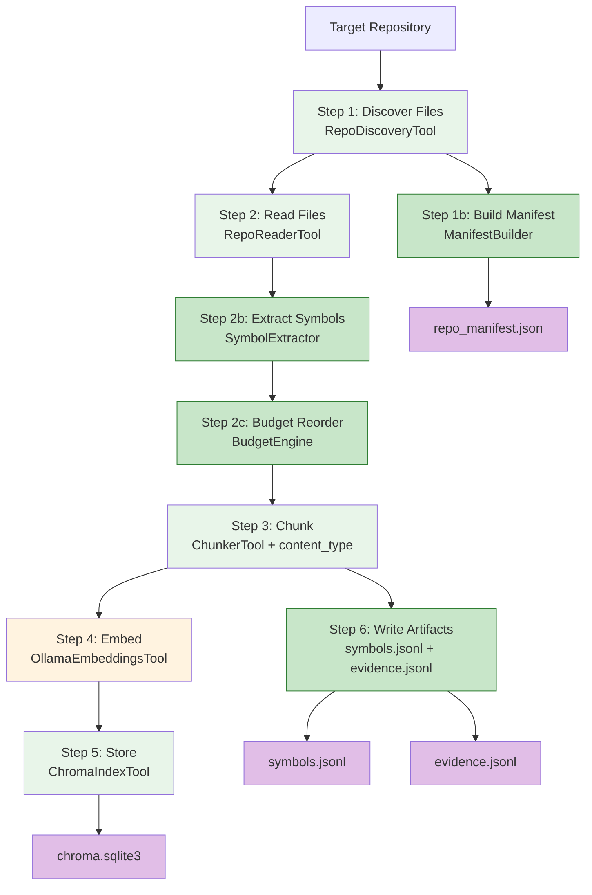
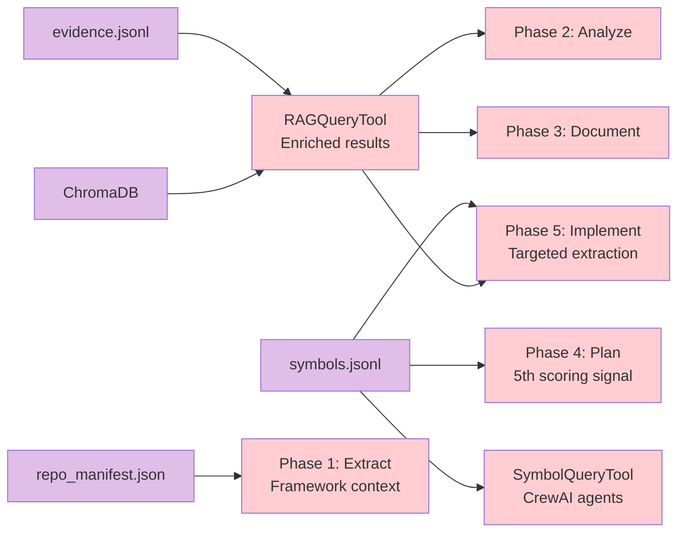

# Indexing Pipeline

Enhanced repository indexing with symbol extraction, evidence traceability, repo manifest, and budget-based prioritization.

> **Reference Diagrams:**
> - [indexing-pipeline.drawio](../diagrams/indexing-pipeline.drawio) — Full indexing pipeline with all stages, inputs, outputs, and downstream consumers
> - [knowledge-structure.drawio](../diagrams/knowledge-structure.drawio) — Knowledge directory layout
> - [evidence-flow.drawio](../diagrams/evidence-flow.drawio) — Evidence chain from code to docs

## Concept & Motivation

The Discover phase is Phase 0 of the SDLC pipeline -- the foundation that every subsequent phase builds on. It transforms a raw repository into a structured, queryable knowledge base without making a single LLM call.

### The Problem

Enterprise repositories contain thousands of files across multiple languages and frameworks. Downstream phases (Analysis, Planning, Code Generation) need to **find the right code** for a given task -- fast and precise. Loading entire repositories into LLM context is impossible (token limits), and naive file-path matching misses semantic relationships.

### The Solution

The Indexing Pipeline produces **four complementary artifacts**, each solving a different retrieval problem:

| Artifact | Retrieval Type | Problem Solved |
|----------|---------------|----------------|
| **ChromaDB** | Semantic (vector similarity) | "Find code related to authentication" -- fuzzy, meaning-based search |
| **symbols.jsonl** | Deterministic (exact lookup) | "Where is class `AuthController`?" -- precise symbol-to-location mapping |
| **evidence.jsonl** | Structural (chunk-to-source tracing) | "Which lines of code does this search result come from?" -- traceability |
| **repo_manifest.json** | Structural (repo overview) | "What frameworks and modules exist?" -- project-level context |

### How Downstream Phases Use the Artifacts

```
                          ChromaDB (semantic search)
                         /        |         \          \
                        v         v          v          v
                   Analysis   Synthesis   Planning   Code-Gen
                   (Phase 2)  (Phase 3)  (Phase 4)  (Phase 5)
                        \         |          |          /
                         \        |          |         /
                          RAGQueryTool (shared)
                                  |
                          evidence.jsonl (enrichment)

                          symbols.jsonl (deterministic)
                         /              \
                        v                v
                   Planning          Code-Gen
                   (Phase 4)         (Phase 5)
                   20% scoring       Targeted extraction
                   signal            (exact line ranges)

                          repo_manifest.json (structural)
                                  |
                                  v
                             Extract (Phase 1)
                             Framework hints
```

**Phase 1 (Extract)** reads `repo_manifest.json` to skip re-scanning for frameworks already detected during indexing. This is an optimization -- Extract works without it but runs faster with it.

**Phase 2 (Analyze)** uses `RAGQueryTool` to give AI agents code context. Agents query ChromaDB with domain-specific terms (e.g., "REST controller endpoint mapping", "database persistence layer patterns") and receive relevant code snippets for architecture analysis.

**Phase 3 (Document)** uses `RAGQueryTool` identically. C4 and arc42 mini-crews query for patterns, configurations, and service implementations to produce evidence-backed documentation.

**Phase 4 (Plan)** combines two artifacts:
- **ChromaDB** via semantic search to find components related to a task description (30% weight in the 5-signal scoring algorithm)
- **symbols.jsonl** via deterministic substring matching to find symbols by name (20% weight). This catches exact matches that semantic search might rank lower.

**Phase 5 (Implement)** combines two artifacts:
- **ChromaDB** via `RAGQueryTool` for pattern-consistent code generation
- **symbols.jsonl** for targeted context extraction. Instead of truncating a 2000-line file at 12K characters (potentially missing the target method), the symbol index provides the exact line range (e.g., lines 34-52), so the LLM receives only the relevant method body with 5 lines of padding.

**All phases** benefit from `evidence.jsonl` indirectly: when `RAGQueryTool` returns search results, it enriches them with line numbers, content type, and linked symbols from the evidence store. This turns vague "found in AuthService.java" into precise "lines 28-56 of AuthService.java, symbols: [AuthService, authenticate], type: code".

### Design Principles

1. **Deterministic & Reproducible** -- No LLM randomness. Only a local Ollama embedding model (Step 4). Same input always produces same index.
2. **Graceful Degradation** -- Every artifact is optional. Missing `symbols.jsonl`? Plan falls back to 4-signal scoring. Missing `evidence.jsonl`? RAG results lack line numbers but still work.
3. **Incremental by Default** -- Smart mode re-indexes only changed files (SHA-256 per file). 12 changed files in a 3000-file repo take ~30 seconds instead of ~90 minutes.
4. **Budget-Driven** -- High-value files (controllers, configs, docs) are embedded first. If indexing is interrupted, the most important content is already in ChromaDB.

---

## Fingerprinting & Change Detection

The pipeline uses a two-level fingerprinting strategy to decide whether re-indexing is needed:

### Repository Fingerprint

Two strategies, first available wins:

| Strategy | Method | Speed |
|----------|--------|-------|
| **Git** (preferred) | SHA-256 of `HEAD` commit + `git status --porcelain` + submodule status | Fast (~100ms) |
| **Filesystem** (fallback) | SHA-256 of size+mtime for first/last N files (configurable, default 2000) | Moderate (~1s) |

### Decision Matrix (auto mode)

| Fingerprint Match | ChromaDB Exists | State File Exists | Action |
|:-:|:-:|:-:|--------|
| Yes | Yes | Yes | **Skip** -- nothing changed |
| Yes | No | Yes | **Skip with warning** -- ChromaDB deleted but repo unchanged. Use `force` to rebuild. |
| No | Yes | Yes | **Smart mode** -- incremental re-index of changed files |
| - | Yes | No | **Smart mode** -- no baseline, re-index conservatively |
| - | No | No | **Full index** -- first run |

### Stale Lock Recovery

If a previous indexing run crashed, a `.index.lock` file may remain. The pipeline checks if the PID that created the lock is still alive (Windows: `ctypes.windll.kernel32.OpenProcess`, Unix: `os.kill(pid, 0)`). If the process is dead, the lock is automatically cleaned up.

---

## Pipeline Flow



Green = existing deterministic, dark green = new v0.6.0, orange = embedding (no LLM), purple = output artifact.

10 steps, 0 LLM calls, 100% deterministic. The only AI call is the Ollama embedding model (Step 4) — a local embedding model, not an LLM.

## Output Artifacts

All outputs reside in `knowledge/discover/`:

| File | Format | Records | Content |
|------|--------|---------|---------|
| `chroma.sqlite3` | ChromaDB | ~25,000 vectors | Embeddings with file, hash, `content_type` metadata |
| `symbols.jsonl` | JSONL | ~15,000 symbols | One record per symbol: name, kind, path, line range, language, module |
| `evidence.jsonl` | JSONL | ~25,000 chunks | One record per chunk: chunk_id, path, type, line range, linked symbols |
| `repo_manifest.json` | JSON | 1 document | Repo stats, detected frameworks, modules, noise folders, git commit |
| `.indexing_state.json` | JSON | 1 document | Fingerprint, chunk/symbol/evidence counts, timestamp |

---

## Symbol Extractor

Regex-based extraction of classes, methods, functions, interfaces, endpoints, and decorators. One JSONL record per symbol — deterministic, no LLM.

### Language Support

| Language | Detected Symbols |
|----------|-----------------|
| **Java** | classes, methods, annotations (`@RestController`, `@Service`, `@Repository`, `@Entity`), Spring endpoints (`@GetMapping`, `@PostMapping`, etc.) |
| **TypeScript** | classes, interfaces, functions, methods, Angular decorators (`@Component`, `@Injectable`, `@NgModule`), NestJS decorators |
| **Python** | classes, functions/methods, decorators |

### Record Schema

```json
{
  "symbol": "AuthController",
  "kind": "class",
  "path": "backend/src/main/java/com/uvz/auth/AuthController.java",
  "line": 12,
  "end_line": 89,
  "language": "java",
  "refs": ["@RestController"],
  "module": "backend"
}
```

### Extraction Example

Source file:

```java
@RestController                          // detected: annotation
@RequestMapping("/api/auth")
public class AuthController {            // detected: class (lines 6-89)
    @PostMapping("/login")               // detected: endpoint (lines 11-25)
    public ResponseEntity<TokenResponse> login(@RequestBody LoginRequest req) { ... }

    @GetMapping("/me")                   // detected: endpoint (lines 17-30)
    public ResponseEntity<UserDto> getCurrentUser(@AuthenticationPrincipal User u) { ... }
}
```

Produces 4 records:

| Symbol | Kind | Lines | Refs |
|--------|------|-------|------|
| `AuthController` | class | 6-89 | `@RestController` |
| `login` | endpoint | 11-25 | `@PostMapping("/login")` |
| `getCurrentUser` | endpoint | 17-30 | `@GetMapping("/me")` |
| `@RestController` | annotation | 4 | — |

### SymbolQueryTool

CrewAI tool for deterministic lookups. Lazy-loads `symbols.jsonl`, cached in memory.

| Query Mode | Example | Result |
|------------|---------|--------|
| Exact match | `_run("AuthService", exact=True)` | Single class record |
| Substring | `_run("Auth")` | AuthService, AuthController, AuthGuard, ... |
| Kind filter | `_run("login", kind="endpoint")` | Only endpoint records |
| Module filter | `_run("Component", module="frontend")` | Only frontend `@Component` classes |

Returns empty (never fails) if `symbols.jsonl` is missing.

---

## Evidence Store

Each chunk gets traceability metadata: file path, line range, content type, and linked symbols.

### Content Type Classification

| Type | Extensions | Purpose |
|------|-----------|---------|
| `code` | `.java`, `.ts`, `.py`, `.go` | Source files |
| `doc` | `.md`, `.adoc`, `.txt`, `.rst` | Documentation |
| `config` | `.yaml`, `.yml`, `.json`, `.xml`, `.properties`, `.gradle` | Configuration |

### Record Schema

```json
{
  "chunk_id": "abc123",
  "path": "backend/src/main/java/com/uvz/auth/AuthService.java",
  "type": "code",
  "module": "backend",
  "start_line": 15,
  "end_line": 56,
  "hash": "e3b0c44298fc1c149afb",
  "symbols": ["AuthService", "authenticate"],
  "language": "java"
}
```

### Symbol-Chunk Linking

Symbols are linked to chunks by checking if the symbol's line range overlaps the chunk's line range:

```
Chunk: lines 15-56 of AuthService.java

AuthService  (lines 15-142) → overlaps → linked
authenticate (lines 28-56)  → overlaps → linked
validate     (lines 60-80)  → outside  → not linked
```

### RAG Enrichment

`RAGQueryTool` enriches search results with evidence metadata when `evidence.jsonl` exists:

```
Before:  {"content": "...", "score": 0.87, "metadata": {"file": "AuthService.java"}}
After:   {"content": "...", "score": 0.87, "metadata": {"file": "AuthService.java",
          "content_type": "code", "start_line": 15, "end_line": 56,
          "symbols": ["AuthService", "authenticate"]}}
```

Optional `content_type` filter parameter enables targeted retrieval (only code, only config, only docs).

---

## Repo Manifest

One-time snapshot of repository structure. Computed from file paths (Step 1) and marker files.

### Framework Detection

| Marker File | Detected Framework |
|-------------|-------------------|
| `pom.xml` | Spring/Maven |
| `build.gradle` | Spring/Gradle |
| `angular.json` | Angular |
| `package.json` | Node.js |
| `Jenkinsfile` | Jenkins |
| `Dockerfile` | Docker |
| `docker-compose.yml` | Docker Compose |
| `requirements.txt` / `pyproject.toml` | Python |

### Record Schema

```json
{
  "repo_root": "C:\\uvz",
  "commit": "45ff7224939f14e7973b6a1fc2184db9325963d1",
  "stats": {"total_files": 2934, "ext_.ts": 1259, "ext_.java": 1100, "...": "..."},
  "modules": [
    {"name": "backend", "file_count": 1516, "extensions": {".java": 1100, ".sql": 311}},
    {"name": "frontend", "file_count": 1314, "extensions": {".ts": 1241, ".json": 58}}
  ],
  "frameworks": ["Angular", "Jenkins", "Node.js", "Spring/Gradle"],
  "noise_folders": [".git", ".idea"],
  "generated_at": "2026-02-15T01:15:03.023086+00:00"
}
```

---

## Budget Engine

Classifies files into 3 priority tiers and reorders the indexing queue. High-value files are embedded first — if indexing is interrupted, the most important content is already in ChromaDB.

### Tier Classification

| Tier | Allocation | Patterns | Examples |
|------|-----------|----------|---------|
| **A** (high) | 40% | READMEs, ADRs, controllers, root configs, Angular modules | `AuthController.java`, `app.module.ts`, `application.yaml` |
| **B** (medium) | 40% | Services, repositories, entities, components, files with 3+ symbols | `AuthService.java`, `user.component.ts`, `User.java` |
| **C** (low) | 20% | Tests, utilities, generated code, type definitions | `AuthServiceTest.java`, `test-utils.ts`, `*.d.ts` |

Files with 3+ extracted symbols are promoted to at least tier B regardless of path pattern.

### Example Classification

```
AuthController.java     12 symbols  → A  (controller pattern)
application.yaml         0 symbols  → A  (root config)
AuthService.java        15 symbols  → B  (service pattern)
StringUtils.java         4 symbols  → B  (3+ symbols → promoted)
AuthServiceTest.java     3 symbols  → C  (test pattern)
environment.d.ts         0 symbols  → C  (.d.ts pattern)
```

### Configuration

| Variable | Default | Description |
|----------|---------|-------------|
| `INDEX_ENABLE_BUDGET` | `true` | Enable/disable budget prioritization |
| `INDEX_PRIORITY_A_PCT` | `40` | Tier A allocation percentage |
| `INDEX_PRIORITY_B_PCT` | `40` | Tier B allocation percentage |

---

## Indexing Modes

| Mode | Behavior | Use Case |
|------|----------|----------|
| `off` | Skip entirely | Index already exists and is current |
| `auto` | Skip if ChromaDB exists and fingerprint matches | Default — fastest for repeat runs |
| `smart` | Incremental — only re-index changed files (by SHA-256 hash) | After small code changes |
| `force` | Delete and rebuild everything | After major changes or feature upgrades |

Smart mode performance:
```
Run 1 (force): 2934 files → ~90 min
Run 2 (smart): 12 changed  → ~30 seconds
```

---

## Downstream Consumers

The Discover phase outputs feed into every subsequent phase. The shared `RAGQueryTool` and `SymbolQueryTool` act as the integration layer — all phases use identical tool implementations to ensure consistent retrieval behavior.



### Consumer Details

| Consumer | Artifact | Class / Method | What It Does |
|----------|----------|----------------|--------------|
| **Phase 1 (Extract)** | `repo_manifest.json` | `CollectorOrchestrator._load_repo_manifest()` | Loads detected frameworks and modules to skip redundant scanning. Optional -- Extract works without it but runs faster. |
| **Phase 2 (Analyze)** | ChromaDB via `RAGQueryTool` | 5 mini-crews (tech, domain, workflow, quality, synthesis) | AI agents query code patterns like "REST controller endpoint mapping" or "security annotation implementation" to produce code-backed analysis. |
| **Phase 3 (Document)** | ChromaDB via `RAGQueryTool` | C4 and arc42 mini-crews | Agents query for naming conventions, configuration properties, service patterns to generate evidence-backed documentation chapters. |
| **Phase 4 (Plan)** | `symbols.jsonl` | `ComponentDiscoveryStage._symbol_matching()` | Deterministic substring match of task keywords against symbol names. 5th scoring signal (20% weight) in component discovery. |
| **Phase 4 (Plan)** | ChromaDB | `ComponentDiscoveryStage._semantic_search()` | Embeds task description, queries top-20 results, maps file paths to component IDs. Similarity score = 1st scoring signal (30% weight). |
| **Phase 5 (Implement)** | `symbols.jsonl` | `ContextCollectorStage._get_target_line_range()` | Looks up exact line range for target symbol. Extracts method body + 5 lines padding instead of truncating at 12K chars. |
| **Phase 5 (Implement)** | ChromaDB via `RAGQueryTool` | Code generation agents | Query existing patterns to generate consistent code. |
| **SymbolQueryTool** | `symbols.jsonl` | All CrewAI agents (on-demand) | Deterministic lookup by name, kind, module. Returns empty if missing. |
| **RAGQueryTool** | ChromaDB + `evidence.jsonl` | All CrewAI agents (on-demand) | Semantic search + evidence enrichment (line numbers, content type, linked symbols). Optional `content_type` filter (code/doc/config). |

### Embedding Model Consistency

All consumers that query ChromaDB must use the **same embedding model** as the indexing pipeline. The `EMBEDDING_MODEL` env var (default: `nomic-embed-text`) controls both indexing and querying. A mismatch produces nonsensical similarity scores.

### Plan Phase Scoring (5 signals)

```
semantic:   30%  ← ChromaDB vector similarity
name:       25%  ← Exact/fuzzy component name match
symbol:     20%  ← Deterministic symbol index match
package:    15%  ← Package path alignment
stereotype: 10%  ← Component type relevance
```

Falls back to 4-signal scoring (40/30/20/10) when `symbols.jsonl` is missing.

### Implement Phase Targeted Extraction

```
Before:  Read entire file → truncate at 12,000 chars (may miss target method)
After:   Symbol lookup → exact line range → read method body + 5 lines padding
```

Example: Task "Fix login endpoint in AuthController"
- Symbol lookup: `login` → lines 34-52
- Extraction: reads lines 29-57
- LLM receives: only the relevant method, not 12K of random file content

---

## Configuration Reference

| Variable | Default | Description |
|----------|---------|-------------|
| `INDEX_MODE` | `auto` | Indexing mode: off, auto, smart, force |
| `INDEX_CHUNK_SIZE` | `1500` | Characters per chunk |
| `INDEX_CHUNK_OVERLAP` | `200` | Overlap between chunks |
| `INDEX_BATCH_SIZE` | `50` | Files per processing batch |
| `INDEX_ENABLE_BUDGET` | `true` | Enable A/B/C priority reordering |
| `INDEX_PRIORITY_A_PCT` | `40` | Tier A allocation percentage |
| `INDEX_PRIORITY_B_PCT` | `40` | Tier B allocation percentage |
| `EMBEDDING_MODEL` | `nomic-embed-text` | Ollama embedding model |
| `EMBEDDING_BASE_URL` | `http://localhost:11434` | Ollama server URL |

---

## Backward Compatibility

All features are additive with graceful degradation:

| Missing Artifact | Fallback Behavior |
|-----------------|-------------------|
| `symbols.jsonl` | `SymbolQueryTool` returns empty; Plan/Implement use old scoring/truncation |
| `evidence.jsonl` | `RAGQueryTool` returns results without enrichment |
| `repo_manifest.json` | Extract re-scans for frameworks (old behavior) |
| New `IndexingState` fields | Default to 0/false on load |
