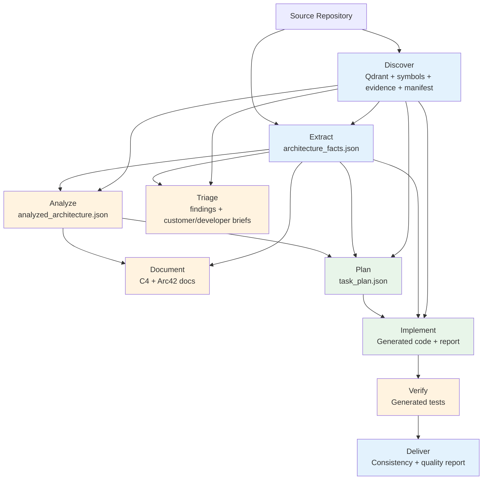
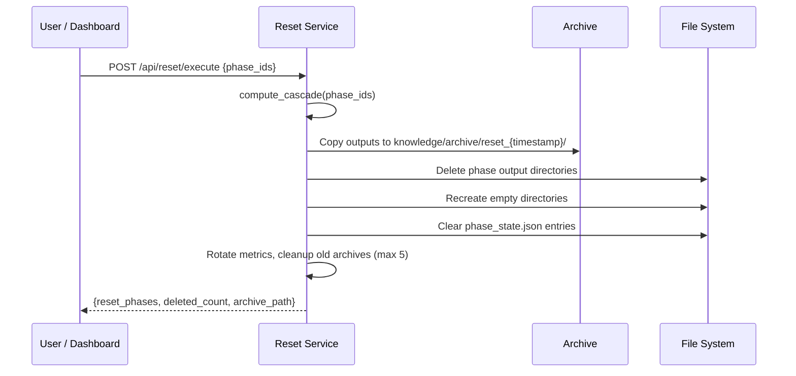

# Knowledge Lifecycle

How architecture knowledge flows through SDLC phases, from raw code to generated artifacts.

> **Reference Diagrams:**
> - [phase-0-discover-architecture.drawio](../phases/phase-0-discover/phase-0-discover-architecture.drawio) — Indexing pipeline
> - [knowledge-structure.drawio](../diagrams/knowledge-structure.drawio) — Knowledge directory layout
> - [evidence-flow.drawio](../phases/phase-0-discover/evidence-flow.drawio) — Evidence chain from code to docs
> - [phase-1-extract-architecture.drawio](../phases/phase-1-extract/phase-1-extract-architecture.drawio) — 16-dimension collector architecture
> - [reset-cascade.drawio](../diagrams/reset-cascade.drawio) — Reset cascade & archive flow

## Data Flow



> **Note:** Discover feeds directly into Triage (Qdrant similarity), Plan (symbol-based component scoring), and Implement (symbol-targeted context extraction), not just via Qdrant vectors.

## Knowledge Directory Structure

```
knowledge/
├── discover/          # Per-project subfolders (multi-project isolation)
│   ├── .active_project         # JSON marker: {"slug": "uvz", "repo_path": "C:\\uvz"}
│   ├── uvz/                    # Artifacts for project "uvz"
│   │   ├── chroma.sqlite3          # Vector embeddings (with content_type metadata)
│   │   ├── symbols.jsonl           # Symbol index (class/method/endpoint per line)
│   │   ├── evidence.jsonl          # Chunk evidence (line range, type, linked symbols)
│   │   ├── repo_manifest.json      # Repo stats, frameworks, ecosystems, modules, noise folders
│   │   ├── .indexing_state.json    # Fingerprint, counts, timestamp
│   │   └── ...                     # Qdrant internal files
│   └── myapp/                  # Artifacts for another project
│       └── ...
├── extract/           # Deterministic facts (single source of truth)
│   ├── architecture_facts.json    # Aggregated 16-dimension model
│   └── evidence_map.json          # File→entity evidence mapping
├── analyze/           # AI-interpreted analysis
│   └── analyzed_architecture.json # Unified analysis output
├── document/          # Generated documentation
│   ├── c4/            # C4 model diagrams (context, container, component)
│   ├── arc42/         # Arc42 documentation sections
│   └── quality/       # Quality assessment reports
├── triage/            # Issue triage output
│   ├── {issue_id}_findings.json   # Deterministic analysis
│   ├── {issue_id}_customer.md     # Customer-facing summary
│   ├── {issue_id}_developer.md    # Developer action brief
│   ├── {issue_id}_triage.json     # Full triage result
│   └── summary.json               # Run summary
├── plan/              # Implementation plans
│   └── {task_id}_plan.json
├── implement/         # Code generation reports
│   └── {task_id}_report.json
├── verify/            # Test generation output
├── deliver/           # Delivery artifacts (consistency, quality, synthesis)
└── archive/           # Reset archives
    └── reset_{timestamp}/
```

## 16 Architecture Dimensions

The `architecture_facts.json` file contains 16 dimensions extracted deterministically from source code:

| Dimension | Description | Example |
|-----------|-------------|---------|
| `system` | Top-level system metadata | Name, description, tech stack |
| `containers` | Deployable units | Spring Boot app, Angular frontend |
| `components` | Code-level building blocks | Controllers, services, repositories |
| `interfaces` | API endpoints and contracts | REST endpoints, GraphQL queries |
| `relations` | Dependencies between components | Service A calls Service B |
| `data_model` | Database entities and schemas | JPA entities, table definitions |
| `runtime` | Runtime configuration | Ports, profiles, environment vars |
| `infrastructure` | Deployment infrastructure | Docker, Kubernetes, CI/CD |
| `dependencies` | External library dependencies | Maven/npm packages |
| `workflows` | Business process flows | Request handling chains |
| `tech_versions` | Technology version matrix | Java 17, Angular 21, Spring 3.2 |
| `security_details` | Security configurations | Auth, CORS, CSRF settings |
| `validation` | Input validation patterns | Bean validation, custom validators |
| `tests` | Test patterns and coverage | JUnit, Jest, test utilities |
| `error_handling` | Error handling patterns | Exception handlers, error responses |
| `build_system` | Build tool configuration | Gradle tasks, npm scripts |

## Archive & Reset Lifecycle

When a phase is reset:



### Cascade Reset

Resetting a phase automatically resets all downstream phases. For example, resetting `extract` also resets `analyze`, `document`, `plan`, `implement`, `verify`, and `deliver`.

### Archive Retention

- Reset archives are kept in `knowledge/archive/reset_{timestamp}/`
- Maximum 5 archives retained; oldest are automatically deleted
- Metrics logs are also rotated on reset
