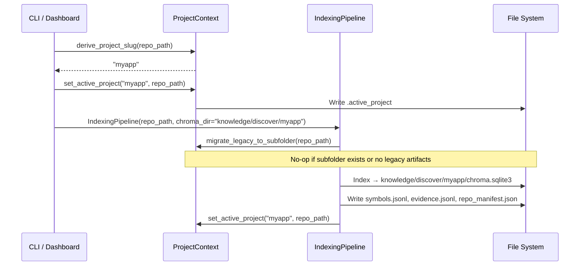
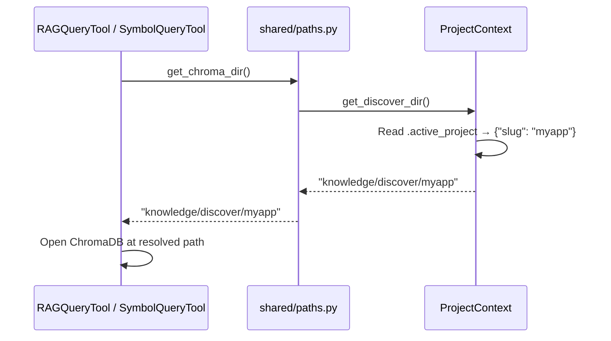

# Multi-Project Discover Isolation

Per-project subfolders under `knowledge/discover/` so that multiple target repositories can be indexed and queried side by side.

> **Reference:**
> - [Phase 0 — Discover](../phases/phase-0-discover/README.md) — Indexing pipeline overview
> - [Knowledge Lifecycle](knowledge-lifecycle.md) — Directory structure and data flow

## 1. Problem

Previously all Discover artifacts (ChromaDB, `symbols.jsonl`, `evidence.jsonl`, `repo_manifest.json`, `.indexing_state.json`) lived in a single flat directory `knowledge/discover/`. When `PROJECT_PATH` changed, the new indexing overwrote the old. Two projects could not coexist.

## 2. Solution: Per-Project Subfolders

Each target repository gets its own subfolder, keyed by a **slug** derived from the repository's folder name.

```
knowledge/discover/
├── .active_project           ← JSON marker: which project is "current"
├── uvz/                      ← Slug for C:\uvz
│   ├── chroma.sqlite3        ← ChromaDB embeddings
│   ├── 61f83c55-…/           ← ChromaDB internal segment
│   ├── symbols.jsonl         ← Symbol index
│   ├── evidence.jsonl        ← Evidence store
│   ├── repo_manifest.json    ← Repo manifest
│   ├── .indexing_state.json  ← Fingerprint & counts
│   └── .zero_chunk_hashes.json
└── myapp/                    ← Slug for C:\projects\myapp
    ├── chroma.sqlite3
    ├── symbols.jsonl
    └── ...
```

### Active Project Marker

```json
// knowledge/discover/.active_project
{
  "slug": "uvz",
  "repo_path": "C:\\uvz"
}
```

Written after every successful index and at the start of every pipeline run. Downstream tools read this to know which subfolder to query.

## 3. Slug Derivation

```python
def derive_project_slug(repo_path: str | Path) -> str:
    name = Path(repo_path).resolve().name
    slug = re.sub(r"[^a-z0-9_-]", "", name.lower())
    return slug or "default"
```

| Input | Slug |
|-------|------|
| `C:\uvz` | `uvz` |
| `C:\projects\my-app` | `my-app` |
| `/home/user/MonoRepo` | `monorepo` |

## 4. Path Resolution Chain

All consumers use function-based resolvers instead of hardcoded constants. The resolution chain ensures backward compatibility:

```
1. Explicit slug argument       → knowledge/discover/{slug}
2. .active_project marker       → knowledge/discover/{slug from marker}
3. Single subfolder heuristic   → if exactly one subfolder exists, use it
4. Legacy flat fallback         → knowledge/discover/  (backward compat)
```

### API Functions (`shared/paths.py`)

| Function | Returns |
|----------|---------|
| `get_chroma_dir(slug?)` | `knowledge/discover/{slug}` |
| `get_discover_symbols(slug?)` | `knowledge/discover/{slug}/symbols.jsonl` |
| `get_discover_evidence(slug?)` | `knowledge/discover/{slug}/evidence.jsonl` |
| `get_discover_manifest(slug?)` | `knowledge/discover/{slug}/repo_manifest.json` |

All functions accept an optional `project_slug`. When omitted, they resolve via the chain above.

### Legacy Constants (Unchanged)

The original constants remain for backward compatibility — no existing imports break:

```python
CHROMA_DIR = "knowledge/discover"         # still available
DISCOVER_SYMBOLS = "knowledge/discover/symbols.jsonl"
DISCOVER_EVIDENCE = "knowledge/discover/evidence.jsonl"
DISCOVER_MANIFEST = "knowledge/discover/repo_manifest.json"
```

## 5. Legacy Migration

On first index after upgrade, `migrate_legacy_to_subfolder(repo_path)` runs automatically:

1. Check if flat artifacts exist in `knowledge/discover/` (symbols.jsonl, chroma.sqlite3, etc.)
2. Derive slug from `repo_path`
3. Create `knowledge/discover/{slug}/`
4. Move all artifacts (JSONL files, ChromaDB sqlite + internal dirs) into subfolder
5. Write `.active_project` marker

If the subfolder already exists or no legacy artifacts are found, migration is a no-op.

## 6. Affected Modules

### Central (New)

| Module | Purpose |
|--------|---------|
| `shared/project_context.py` | Slug derivation, active project read/write, legacy migration |

### Updated (17 Files)

| Category | Files | Change |
|----------|-------|--------|
| **Path resolvers** | `shared/paths.py` | Added `get_chroma_dir()`, `get_discover_symbols()`, `get_discover_evidence()`, `get_discover_manifest()` |
| **Indexing pipeline** | `pipelines/indexing/indexing_pipeline.py` | Subfolder routing, migration trigger, `set_active_project()` after index |
| **ChromaDB tool** | `pipelines/indexing/chroma_index_tool.py` | Fallback uses `get_chroma_dir()` |
| **Query tools** | `shared/tools/rag_query_tool.py`, `shared/tools/symbol_query_tool.py` | Active-project-aware path resolution with legacy fallback |
| **CLI** | `cli.py` | Derives slug, passes project-aware `chroma_dir`, calls `set_active_project()` |
| **5 Crew constructors** | `architecture_analysis/crew.py`, `mapreduce_crew.py`, `architecture_synthesis/base_crew.py`, `review/crew.py`, `triage/crew.py` | `CHROMA_DIR` → `get_chroma_dir()` |
| **Hybrid consumers** | `stage2_component_discovery.py`, `preflight/import_index.py` | `get_chroma_dir()` + `get_discover_symbols()` |
| **Extract pipeline** | `collectors/orchestrator.py` | `get_discover_manifest()` |
| **Triage** | `triage/context_builder.py` | Active-project-aware discover loading |
| **Registry** | `phase_registry.py` | Added `get_discover_artifacts()` function |

## 7. Sequence: Indexing a New Project



## 8. Sequence: Tool Querying Active Project



## 9. Backward Compatibility

| Scenario | Behavior |
|----------|----------|
| Fresh install, first index | Creates `knowledge/discover/{slug}/` directly |
| Existing flat layout, first index | `migrate_legacy_to_subfolder()` moves artifacts into `{slug}/` |
| No `.active_project`, one subfolder | Heuristic: uses the single subfolder |
| No `.active_project`, no subfolders | Falls back to `knowledge/discover/` (legacy) |
| Old code importing `CHROMA_DIR` constant | Still works — constant unchanged |
| Tests (no real discover data) | Fallback chain ends at legacy path — tests unaffected |

---

 2026 Aymen Mastouri. All rights reserved.
