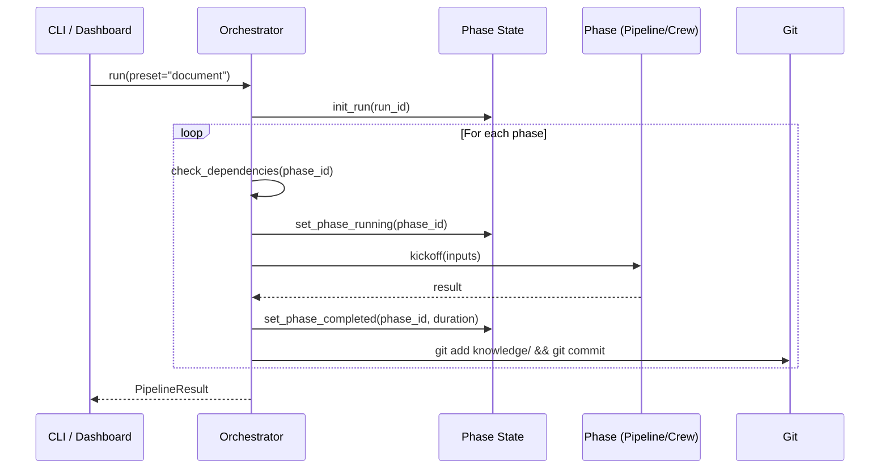
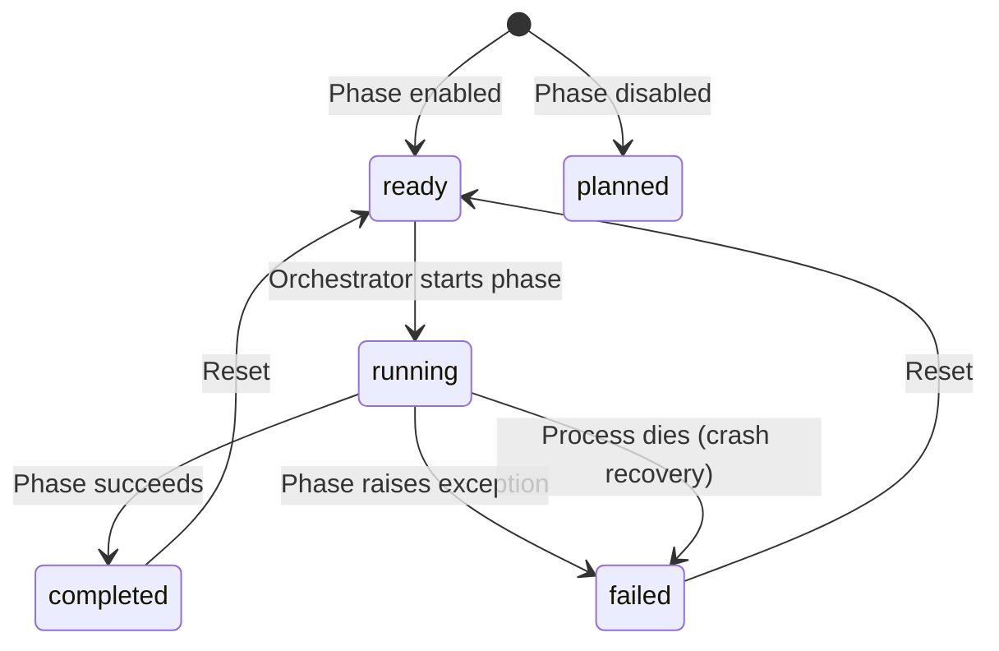

# Orchestration & State

How SDLC phases are scheduled, executed, and tracked.

> **Reference Diagrams:**
> - [pipeline-flow.drawio](../diagrams/pipeline-flow.drawio) — Phase execution flow
> - [orchestration-state.drawio](../diagrams/orchestration-state.drawio) — State lifecycle & crash recovery

## SDLCOrchestrator

**File:** `src/aicodegencrew/orchestrator.py`

The orchestrator is responsible for:
- Resolving which phases to run (preset, explicit list, or all enabled)
- Checking dependencies before each phase
- Executing phases sequentially with fail-fast behavior
- Tracking state persistently for crash recovery



### Phase Resolution

Phases are resolved in priority order:
1. **Explicit list** (`--phases extract analyze`) - validated against config
2. **Preset** (`--preset document`) - expanded from `phases_config.yaml`
3. **Default** - all enabled phases sorted by order

### Dependency Checking

Before executing a phase, the orchestrator checks each dependency:
1. Did it succeed in this session? (in-memory results)
2. Do its output files exist from a previous run? (via `phase_registry.outputs_exist()`)
3. Are outputs valid? (via `PhaseOutputValidator`)

If any dependency fails, the phase is skipped with status `"failed"`.

### Protocol-Based Polymorphism

All phases implement the `PhaseExecutable` protocol:

```python
class PhaseExecutable(Protocol):
    def kickoff(self, inputs: dict[str, Any]) -> dict[str, Any]: ...
```

Both pipelines and crews satisfy this interface, so the orchestrator treats them identically.

## Phase State Lifecycle

**File:** `src/aicodegencrew/shared/utils/phase_state.py`
**State file:** `logs/phase_state.json`



### Crash Recovery

The state file includes the process PID. On startup, if a phase is marked `"running"`:
1. Check if the PID is still alive (`os.kill(pid, 0)`)
2. If dead, mark as `"failed"` with "Process terminated unexpectedly"
3. Staleness threshold: 1 hour (phases running longer are assumed crashed)

### Atomic Writes

All state updates use `tempfile` + `os.replace()` to prevent corruption from crashes mid-write.

## Pipeline Executor (Dashboard)

**File:** `ui/backend/services/pipeline_executor.py`

When the dashboard starts a pipeline run, it spawns the CLI as a subprocess:

```
Dashboard → POST /api/pipeline/run → PipelineExecutor.start()
    → subprocess.Popen(["python", "-m", "aicodegencrew", "run", ...])
    → SSE stream: poll phase_state.json → push events to frontend
```

This provides process isolation: the CLI runs independently, and the dashboard monitors via the shared state file.

## Auto-Commit

After each successful phase, the orchestrator commits `knowledge/` to git:

```
git add knowledge/
git commit -m "[aicodegencrew] {phase_id} completed - {timestamp}"
```

This creates a checkpoint after each phase, enabling `git diff` to see exactly what changed.
