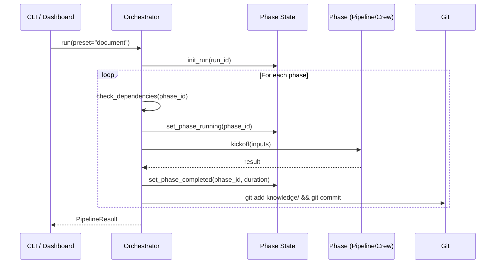
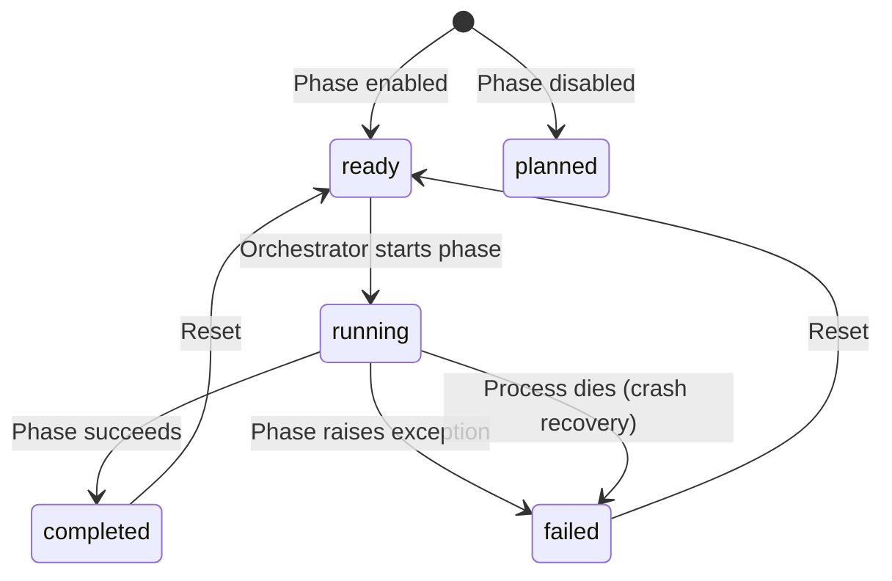

# Orchestration and State

How SDLC phases are scheduled, executed, and tracked.

> **Reference Diagrams:**
> - [pipeline-flow.drawio](../diagrams/pipeline-flow.drawio) - Phase execution flow
> - [orchestration-state.drawio](../diagrams/orchestration-state.drawio) - State lifecycle and crash recovery
>
> **Related Docs:**
> - [pipeline-contract.md](./pipeline-contract.md) - Central phase/preset/status contract used by orchestrator, CLI, and dashboard backend

## SDLCOrchestrator

**File:** `src/aicodegencrew/orchestrator.py`

The orchestrator is responsible for:
- Resolving which phases to run (preset, explicit list, or all enabled)
- Checking dependencies before each phase
- Executing phases sequentially with fail-fast behavior
- Tracking state persistently for crash recovery



### Phase Resolution

Phases are resolved in priority order:
1. **Explicit list** (`--phases extract analyze`) - validated against config
2. **Preset** (`--preset document`) - expand
ed from `phases_config.yaml`
3. **Default** - all enabled phases sorted by order

Phase and preset resolution is driven by `PipelineContract` (`src/aicodegencrew/pipeline_contract.py`), which merges static phase metadata with runtime config.

### Dependency Checking

Before executing a phase, the orchestrator delegates to `DependencyChecker`
(`src/aicodegencrew/shared/dependency_checker.py`):

```python
from .shared.dependency_checker import DependencyChecker
return DependencyChecker(contract, self.results).check(phase_id)
```

`DependencyChecker.check()` applies a two-tier resolution:
1. **Tier 1 — in-session results**: did the dependency succeed earlier in this run?
2. **Tier 2 — disk artifacts**: do output files exist from a previous run? (via `phase_registry.outputs_exist()` + `PhaseOutputValidator`)

ARCH-5 contract violations (dependency present in `PHASE_CONTRACTS` but not yet satisfied) are logged as warnings — observational only, never blocking.

If any required dependency fails both tiers, the phase is skipped with status `"failed"`.

### Protocol-Based Polymorphism

All phases implement the `PhaseExecutable` protocol:

```python
class PhaseExecutable(Protocol):
    def kickoff(self, inputs: dict[str, Any]) -> dict[str, Any]: ...
```

Both pipelines and crews satisfy this interface, so the orchestrator treats them identically.

## Phase State Lifecycle

**File:** `src/aicodegencrew/shared/utils/phase_state.py`
**State file:** `logs/phase_state.json`



### Crash Recovery

The state file includes the process PID. On startup, if a phase is marked `"running"`:
1. Check if the PID is still alive (`os.kill(pid, 0)`)
2. If dead, mark as `"failed"` with `"Process terminated unexpectedly"`
3. Staleness threshold: 1 hour (phases running longer are assumed crashed)

### Atomic Writes

All state updates use `tempfile` + `os.replace()` to prevent corruption from crashes mid-write.

## Pipeline Executor (Dashboard)

**File:** `ui/backend/services/pipeline_executor.py`

When the dashboard starts a pipeline run, it spawns the CLI as a subprocess:

```
Dashboard -> POST /api/pipeline/run -> PipelineExecutor.start()
    -> subprocess.Popen(["python", "-m", "aicodegencrew", "run", ...])
    -> SSE stream: poll phase_state.json -> push events to frontend
```

This provides process isolation: the CLI runs independently, and the dashboard monitors via the shared state file.

## Auto-Commit

After each successful phase, the orchestrator delegates to `PhaseGitHandler`
(`src/aicodegencrew/shared/phase_git_handler.py`):

```python
from .shared.phase_git_handler import PhaseGitHandler
PhaseGitHandler().commit_knowledge(phase_id)
```

`PhaseGitHandler.commit_knowledge()` stages and commits `knowledge/` to git:

```
git add knowledge/
git commit -m "[aicodegencrew] {phase_id} completed - {timestamp}"
```

This creates a checkpoint after each phase, enabling `git diff` to see exactly what changed.

> **Guard:** Set `CODEGEN_COMMIT_KNOWLEDGE=false` to disable auto-commit (useful in CI or when you want to control commits manually).

## Schema Versioning

All phase JSON outputs include a `_schema_version` field injected by
`src/aicodegencrew/shared/schema_version.py`:

```python
from .shared.schema_version import add_schema_version, check_schema_version

# Writers inject the version as the first key
json.dump(add_schema_version(data, "plan"), f)

# Readers log a warning on mismatch — never raises, fully backward-compatible
check_schema_version(loaded_data, "plan")
```

Current versions: `extract=1.0`, `analyze=1.0`, `plan=1.0`, `implement=1.0`, `verify=1.0`.
