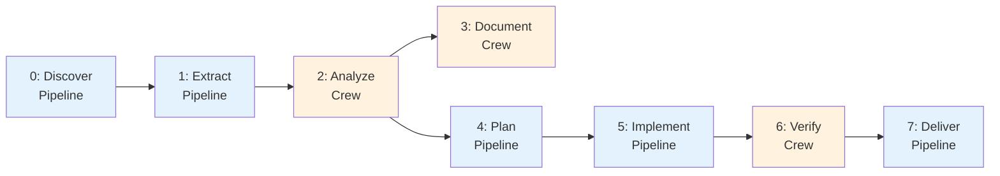

# Phase Registry

Single source of truth for all SDLC phase metadata.

**File:** `src/aicodegencrew/phase_registry.py`

> **Reference Diagrams:**
> - [sdlc-overview.drawio](../diagrams/sdlc-overview.drawio) — Full SDLC pipeline overview
> - [layer-architecture.drawio](../diagrams/layer-architecture.drawio) — 4-layer architecture model
> - [pipeline-flow.drawio](../diagrams/pipeline-flow.drawio) — Phase flow with layer context

## PhaseDescriptor Schema

| Field | Type | Description |
|-------|------|-------------|
| `phase_id` | `str` | Unique identifier (e.g. `"extract"`) |
| `display_name` | `str` | Human-readable name |
| `phase_type` | `"pipeline" \| "crew"` | Execution engine |
| `order` | `int` | Execution order (0-7) |
| `dependencies` | `tuple[str, ...]` | Phases that must complete first |
| `required` | `bool` | Must-complete phase? |
| `primary_output` | `str` | Path for completion detection (relative to project root) |
| `cleanup_targets` | `tuple[str, ...]` | Paths deleted on reset |
| `resettable` | `bool` | Whether the phase can be reset (False for discover) |

## All 8 Phases

| Phase | Display Name | Type | Dependencies | Required | Resettable |
|-------|-------------|------|--------------|----------|------------|
| `discover` | Repository Indexing | pipeline | - | yes | no |
| `extract` | Architecture Facts Extraction | pipeline | discover | yes | yes |
| `analyze` | Architecture Analysis | crew | extract | yes | yes |
| `document` | Architecture Synthesis | crew | analyze | no | yes |
| `plan` | Development Planning | pipeline | analyze | no | yes |
| `implement` | Code Generation | pipeline | plan | no | yes |
| `verify` | Test Generation | crew | implement | no | yes |
| `deliver` | Review & Deploy | pipeline | verify | no | yes |

## Registry vs phases_config.yaml

| Concern | Source |
|---------|--------|
| Output paths, cleanup targets, dependencies, display names | `phase_registry.py` (structural, static) |
| Enabled/disabled, presets, per-phase config | `phases_config.yaml` (runtime, configurable) |

## How to Add a New Phase

1. Add a `PhaseDescriptor` entry to `PHASES` in `phase_registry.py`
2. Add a section in `config/phases_config.yaml` with `enabled`, `order`, `config`
3. Register the phase executable in `cli.py` `cmd_run()`
4. (Optional) Add to relevant presets in `phases_config.yaml`

## Convenience Functions

| Function | Replaces |
|----------|----------|
| `get_phase(id)` | Direct dict lookups |
| `get_all_phases()` | Sorting phases by order |
| `get_cleanup_targets(id)` | `phase_outputs.get_cleanup_targets()` |
| `get_resettable_phases()` | Hardcoded `!= "discover"` filter |
| `get_dependency_graph()` | YAML loading in `reset_service._load_dependencies()` |
| `outputs_exist(id, base)` | `orchestrator._outputs_exist()` |
| `check_phase_output_exists(id, root)` | `phase_outputs.check_phase_output_exists()` |
