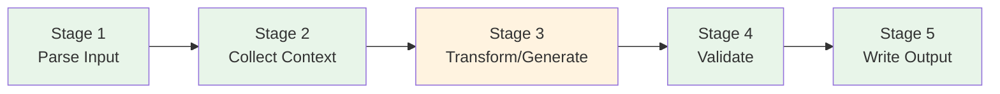
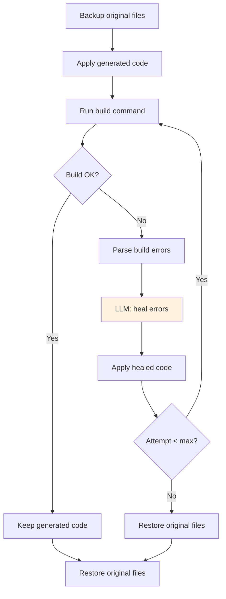
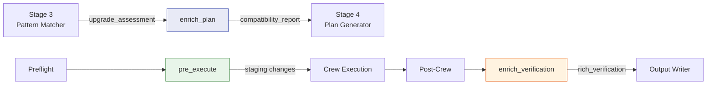

# Pipeline Pattern

Deterministic stage-based execution for phases that don't need multi-agent collaboration.

> **Reference Diagrams:**
> - [phase-0-discover-architecture.drawio](../phases/phase-0-discover/phase-0-discover-architecture.drawio) — Indexing pipeline
> - [phase-1-extract-architecture.drawio](../phases/phase-1-extract/phase-1-extract-architecture.drawio) — Facts collector pattern
> - [phase-5-plan-architecture.drawio](../phases/phase-5-plan/phase-5-plan-architecture.drawio) — Planning pipeline stages
> - [phase-6-implement-architecture.drawio](../phases/phase-6-implement/phase-6-implement-architecture.drawio) — Code generation crew
> - [code-generation-pipeline.drawio](../phases/phase-6-implement/code-generation-pipeline.drawio) — Code generation stages + strategy hooks
> - [task-type-strategy.drawio](../phases/phase-6-implement/task-type-strategy.drawio) — Task-type strategy pattern

## When to Use Pipeline vs Crew

| Use Pipeline when... | Use Crew when... |
|---------------------|-----------------|
| Most work is deterministic | Multiple perspectives needed |
| Only 0-1 LLM calls per item | Multi-turn agent collaboration |
| Predictable execution time | Quality depends on iteration |
| Reproducible output needed | Output is prose/analysis |

## Stage-Based Architecture

Every pipeline follows the same pattern: a sequence of stages, each with a single responsibility.



Green = deterministic, Orange = LLM-assisted.

Stages pass data forward via a shared `context` dict. Each stage reads what it needs and writes its output key.

## 4 Pipelines

### 1. Indexing Pipeline (Discover)

**Full docs:** [Phase 0 — Discover](../phases/phase-0-discover/README.md)

Indexes repository files into ChromaDB + symbol index + evidence store + repo manifest. 10 steps, 0 LLM calls. Modes: off/auto/smart/force.

### 2. Architecture Facts Pipeline (Extract)

**Full docs:** [Phase 1 — Extract](../phases/phase-1-extract/README.md)

Deterministic extraction of 16 architecture dimensions via modular collector pattern. No LLM.

### 3. Development Planning Pipeline (Plan)

**Full docs:** [Phase 5 — Plan](../phases/phase-5-plan/README.md)

Hybrid pipeline: 4 deterministic stages + 1 LLM call. 18–40 seconds vs 5–7 min with CrewAI.

### 4. Code Generation Pipeline (Implement)

**Full docs:** [Phase 6 — Implement](../phases/phase-6-implement/README.md)

Hierarchical CrewAI crew (4 agents) with preflight, task-type strategy hooks, and post-crew verification.

## Stage 4b: Self-Healing Build Verification

The build verifier is the most complex stage. It compiles the generated code, parses errors, and asks the LLM to fix them.



Key details:
- Reads build system from `architecture_facts.json` metadata (`gradle`, `maven`, `npm`)
- Windows: uses `.\gradlew.bat` / `.\mvnw.cmd` with `shell=True`
- Strips ANSI escape codes before regex parsing
- Handles Windows absolute paths in javac errors (`C:\...\File.java:268:`)
- Max 3 retry attempts (configurable via `CODEGEN_BUILD_MAX_RETRIES`)

## Cascade Mode (Code Generation)

When multiple tasks are planned, the code generation pipeline processes them sequentially on a single integration branch:

```
1. Create branch codegen/{first_task_id}
2. For each task:
   a. Read plan
   b. Collect context (sees prior tasks' changes)
   c. Generate code
   d. Validate + build verify
   e. Commit to branch
3. Final merge/PR
```

This ensures later tasks can build on earlier ones (e.g., a refactoring task followed by a feature that uses the refactored code).

## Task-Type Strategy Pattern

> **Full docs**: [Phase 6 — Implement](../phases/phase-6-implement/README.md#task-type-strategy-pattern)
> **Diagram**: [task-type-strategy.drawio](../phases/phase-6-implement/task-type-strategy.drawio)

The Strategy pattern extends pipelines with **task-type-specific behavior** without modifying core pipeline code. Each task type can register custom hooks via a decorator-based registry.

### Problem

Different task types need different pipeline behavior:
- **Upgrade**: schematics, config edits, version bumps (deterministic before LLM)
- **Migration**: codemod tools, config changes
- **Feature/Bugfix**: no special pre-processing needed

Without a strategy, this leads to `if task_type == "upgrade"` scattered across the pipeline.

### Solution: 3 Pipeline Hooks

```python
class TaskTypeStrategy(ABC):
    def enrich_plan(self, plan_data, facts) -> PlanEnrichment: ...
    def pre_execute(self, plan, staging, repo_path, dry_run) -> PreExecutionResult: ...
    def enrich_verification(self, build_result, staging, plan, ...) -> VerificationEnrichment: ...
```

| Hook | Phase | Purpose |
|------|-------|---------|
| `enrich_plan()` | Planning (Stage 3) | Validate feasibility, add compatibility checks |
| `pre_execute()` | Implement (before Crew) | Deterministic steps before LLM code generation |
| `enrich_verification()` | Implement (after Build) | Rich reporting: error clusters, deprecations |

### Registry

```python
@register_strategy("upgrade")
class UpgradeStrategy(TaskTypeStrategy): ...

@register_strategy("feature")
@register_strategy("bugfix")
@register_strategy("_default")
class DefaultStrategy(TaskTypeStrategy): ...  # no-op for hooks 1 & 2

# Usage in pipeline:
strategy = get_strategy(plan.task_type)  # never raises, falls back to DefaultStrategy
```

### Integration Points



### Adding a New Task Type

One file, zero pipeline changes:

```python
# strategies/migration_strategy.py
@register_strategy("migration")
class MigrationStrategy(TaskTypeStrategy):
    def enrich_plan(self, plan_data, facts): ...
    def pre_execute(self, plan, staging, repo_path, dry_run): ...
    def enrich_verification(self, build_result, staging, plan, ...): ...
```

Then import in `strategies/__init__.py` to trigger registration.
