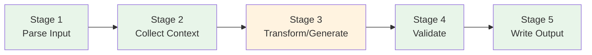
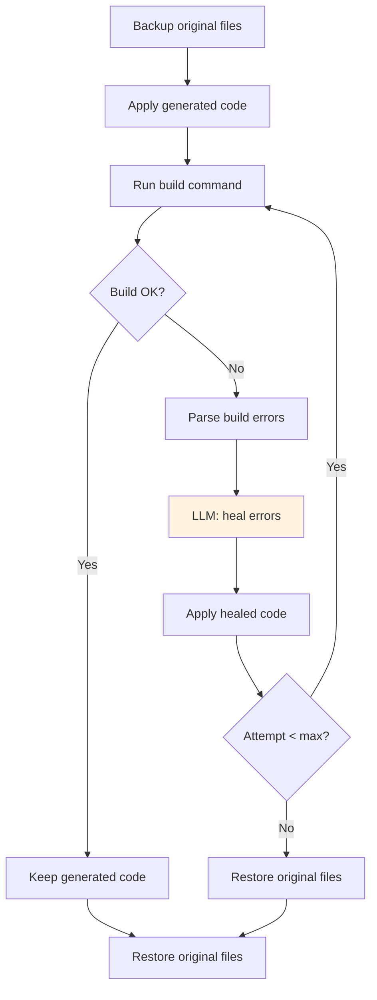

# Pipeline Pattern

Deterministic stage-based execution for phases that don't need multi-agent collaboration.

> **Reference Diagrams:**
> - [indexing-pipeline.drawio](../diagrams/indexing-pipeline.drawio) — Enhanced indexing pipeline (symbols, evidence, manifest, budget)
> - [code-generation-pipeline.drawio](../diagrams/code-generation-pipeline.drawio) — Code generation stages + self-healing
> - [development-planning-pipeline.drawio](../diagrams/development-planning-pipeline.drawio) — Planning pipeline stages
> - [facts-collectors.drawio](../diagrams/facts-collectors.drawio) — Architecture facts collector pattern

## When to Use Pipeline vs Crew

| Use Pipeline when... | Use Crew when... |
|---------------------|-----------------|
| Most work is deterministic | Multiple perspectives needed |
| Only 0-1 LLM calls per item | Multi-turn agent collaboration |
| Predictable execution time | Quality depends on iteration |
| Reproducible output needed | Output is prose/analysis |

## Stage-Based Architecture

Every pipeline follows the same pattern: a sequence of stages, each with a single responsibility.



Green = deterministic, Orange = LLM-assisted.

Stages pass data forward via a shared `context` dict. Each stage reads what it needs and writes its output key.

## 4 Pipelines

### 1. Indexing Pipeline (Discover)
**File:** `src/aicodegencrew/pipelines/indexing/`

Indexes repository files into ChromaDB for RAG queries, plus builds a symbol index, evidence store, and repo manifest.

```
Step 1:  Discover files              (RepoDiscoveryTool)
Step 1b: Build repo manifest         (ManifestBuilder → repo_manifest.json)
Step 2:  Read files                  (RepoReaderTool)
Step 2b: Extract symbols per file    (SymbolExtractor → symbols accumulator)
Step 2c: Apply budget prioritization (BudgetEngine, A/B/C tiers)
Step 3:  Chunk                       (ChunkerTool + content_type metadata)
Step 4:  Embed                       (OllamaEmbeddingsTool)
Step 5:  Store in ChromaDB           (ChromaIndexTool + content_type in metadata)
Step 6:  Write artifacts             (symbols.jsonl, evidence.jsonl)
```

- Modes: off, auto (skip if exists), force (re-index), smart (incremental)
- Budget engine reorders files so high-value files (docs, controllers, configs) are indexed first
- Symbol extractor supports Java, TypeScript, Python (regex-based, no LLM)
- Evidence records link each chunk to its line range, content type, and contained symbols
- Downstream phases consume `symbols.jsonl` via `SymbolQueryTool` and `evidence.jsonl` via `RAGQueryTool` enrichment

### 2. Architecture Facts Pipeline (Extract)
**File:** `src/aicodegencrew/pipelines/architecture_facts/`

Deterministic extraction of 16 architecture dimensions. No LLM.
- Collector pattern: one collector per dimension
- Canonical model normalizes all outputs
- Every entity has evidence (file, line, confidence)

### 3. Development Planning Pipeline (Plan)
**File:** `src/aicodegencrew/pipelines/development_planning/`

Hybrid pipeline: 4 deterministic stages + 1 LLM call.
- Stage 1: Input parser (JIRA XML, DOCX, Excel)
- Stage 2: Component discovery (RAG + scoring)
- Stage 3: Pattern matcher (TF-IDF + rules)
- Stage 4: Plan generator (single LLM call)
- Stage 5: Pydantic validator

### 4. Code Generation Pipeline (Implement)
**File:** `src/aicodegencrew/pipelines/code_generation/`

Hybrid pipeline with self-healing build verification.

```
Stage 1: Plan Reader → Stage 2: Context Collector → Stage 3: Code Generator (LLM)
→ Stage 4: Code Validator → Stage 4b: Build Verifier (LLM heal) → Stage 5: Output Writer
```

## Stage 4b: Self-Healing Build Verification

The build verifier is the most complex stage. It compiles the generated code, parses errors, and asks the LLM to fix them.



Key details:
- Reads build system from `architecture_facts.json` metadata (`gradle`, `maven`, `npm`)
- Windows: uses `.\gradlew.bat` / `.\mvnw.cmd` with `shell=True`
- Strips ANSI escape codes before regex parsing
- Handles Windows absolute paths in javac errors (`C:\...\File.java:268:`)
- Max 3 retry attempts (configurable via `CODEGEN_BUILD_MAX_RETRIES`)

## Cascade Mode (Code Generation)

When multiple tasks are planned, the code generation pipeline processes them sequentially on a single integration branch:

```
1. Create branch codegen/{first_task_id}
2. For each task:
   a. Read plan
   b. Collect context (sees prior tasks' changes)
   c. Generate code
   d. Validate + build verify
   e. Commit to branch
3. Final merge/PR
```

This ensures later tasks can build on earlier ones (e.g., a refactoring task followed by a feature that uses the refactored code).
