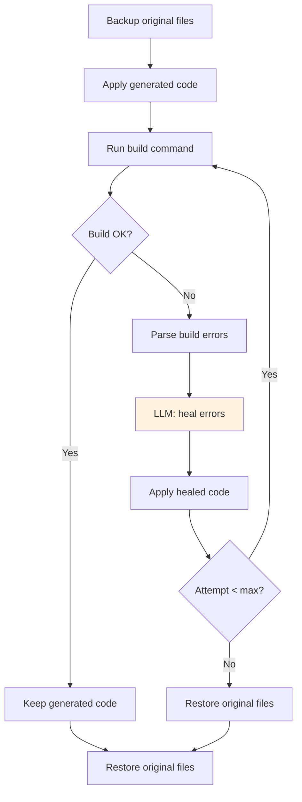
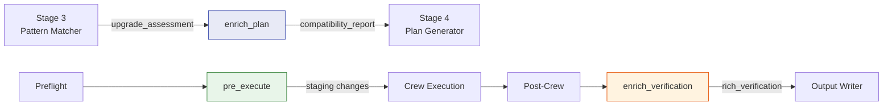

# Pipeline Pattern

Deterministic stage-based execution for phases that don't need multi-agent collaboration.

> **Reference Diagrams:**
> - [phase-0-discover-architecture.drawio](../phases/phase-0-discover/phase-0-discover-architecture.drawio) — Indexing pipeline
> - [phase-1-extract-architecture.drawio](../phases/phase-1-extract/phase-1-extract-architecture.drawio) — Facts collector pattern
> - [phase-2-analyze-architecture.drawio](../phases/phase-2-analyze/phase-2-analyze-architecture.drawio) — Analysis pipeline (16 sections + review + synthesis)
> - [phase-3-document-architecture.drawio](../phases/phase-3-document/phase-3-document-architecture.drawio) — Document pipeline (generate + validate + review)
> - [phase-5-plan-architecture.drawio](../phases/phase-5-plan/phase-5-plan-architecture.drawio) — Planning pipeline stages
> - [phase-6-implement-architecture.drawio](../phases/phase-6-implement/phase-6-implement-architecture.drawio) — Code generation crew
> - [code-generation-pipeline.drawio](../phases/phase-6-implement/code-generation-pipeline.drawio) — Code generation stages + strategy hooks
> - [task-type-strategy.drawio](../phases/phase-6-implement/task-type-strategy.drawio) — Task-type strategy pattern

## When to Use Pipeline vs Crew

| Use Pipeline when... | Use Crew when... |
|---------------------|-----------------|
| Most work is deterministic | Multiple perspectives needed |
| Only 0-1 LLM calls per item | Multi-turn agent collaboration |
| Predictable execution time | Quality depends on iteration |
| Reproducible output needed | Output is prose/analysis |

## Stage-Based Architecture

Every pipeline follows the same pattern: a sequence of stages, each with a single responsibility.

```mermaid
graph LR
    S1[Stage 1<br/>Parse Input] --> S1b[Stage 1b<br/>Build Template]
    S1b --> S2[Stage 2<br/>Collect Context]
    S2 --> S3[Stage 3<br/>Transform/Generate]
    S3 --> S4[Stage 4<br/>Validate]
    S4 --> S4b[Stage 4b<br/>Content Review]
    S4b --> S4c[Stage 4c<br/>Fact Grounding]
    S4c --> QG[Quality Gate]
    QG --> S5[Stage 5<br/>Write Output]

    style S1 fill:#e8f5e9
    style S1b fill:#e8f5e9
    style S2 fill:#e8f5e9
    style S3 fill:#fff3e0
    style S4 fill:#e8f5e9
    style S4b fill:#fff3e0
    style S4c fill:#e8f5e9
    style QG fill:#e3f2fd
    style S5 fill:#e8f5e9
```



Green = deterministic, Orange = LLM-assisted, Blue = quality gate.

Stage 1b (Build Template) is used by Document phase — creates a deterministic markdown skeleton with fact tables and LLM enrichment placeholders.

Stage 4b (Content Review) is used by Analyze and Document phases. It runs a second LLM call to check the generated output against source data for gaps, contradictions, and unsupported claims. Non-fatal — if the review fails, the pipeline continues.

Stage 4c (Fact Grounding) uses the shared `FactGrounder` utility to validate that generated text references real components and technologies from `architecture_facts.json`. Detects hallucinated names.

Quality Gate checks the phase's `quality_score` against `QUALITY_GATE_THRESHOLD` (default: 70). Below threshold → auto-retry once with lower temperature and escalating feedback.

Stages pass data forward via a shared `context` dict. Each stage reads what it needs and writes its output key.

## Pipelines by Phase

### Phase 0 — Indexing (Discover)

**Full docs:** [Phase 0 — Discover](../phases/phase-0-discover/README.md)

Indexes repository files into ChromaDB + symbol index + evidence store + repo manifest. 10 steps, 0 LLM calls. Modes: off/auto/smart/force. Uses **Ecosystem Strategy Pattern** for per-language symbol extraction and ecosystem detection (`repo_manifest.json` → `ecosystems` field).

### Phase 1 — Architecture Facts (Extract)

**Full docs:** [Phase 1 — Extract](../phases/phase-1-extract/README.md)

Deterministic extraction of 16 architecture dimensions via 45 specialist collectors organized in 4 ecosystem sub-packages. No LLM. All 9 ecosystem-dependent dimension collectors are thin routers that delegate via `ecosystem.collect_dimension()`. Cross-cutting logic (BPMN, Cucumber, SQL, OpenAPI) stays in the router. See [collector-delegation.drawio](collector-delegation.drawio).

### Phase 2 — Architecture Analysis (Analyze)

**Full docs:** [Phase 2 — Analyze](../phases/phase-2-analyze/README.md)

**Entry point:** `pipelines/analysis/pipeline.py` → `AnalysisPipeline(BasePipeline)`

16 parallel LLM calls (one per section) via `ThreadPoolExecutor(max_workers=8)` → review LLM call (cross-checks all sections for gaps, contradictions, number inconsistencies) → selective redo of flagged sections → 1 synthesis call. Checkpoint/resume support. Uses `SectionPromptBuilder`, `SynthesisPromptBuilder`, and `AnalysisReviewer`.

### Phase 3 — Architecture Synthesis (Document)

**Full docs:** [Phase 3 — Document](../phases/phase-3-document/README.md)

**Entry point:** `pipelines/document/pipeline.py` → `DocumentPipeline(BasePipeline)`

Per-chapter pipeline with template-first approach: `DataCollector → TemplateBuilder → PromptBuilder → LLMGenerator → ChapterValidator → FactGrounder → DocumentReviewer → Write`. Three-phase quality: (1) deterministic template with fact tables guarantees structure, (2) structural validation (7 checks) + template integrity checks (placeholders filled, fact tables preserved), (3) content review LLM call. Adaptive retry with escalating feedback (severity increases per attempt, temperature decreases).

### Phase 4 — Issue Triage (Triage)

**Full docs:** [Phase 4 — Triage](../phases/phase-4-triage/README.md)

**Entry point:** `pipelines/triage/pipeline.py` → `TriagePipeline(BasePipeline)`

Deterministic scan (<5s) + single LLM synthesis (~30s). Two-level validation: (1) `TriageValidator` with 9 structural checks (developer_context structure, big_picture length ≥80 chars, scope boundaries, context boundaries ≥2, no action steps, anticipated questions ≥2, no file paths, source facts referenced), (2) quality scoring. Validate→retry quality loop: if quality score < `TRIAGE_QUALITY_THRESHOLD` (default 50), retries with adaptive escalating feedback. Returns `quality_score` for Pipeline Quality Score aggregation.

### Phase 5 — Development Planning (Plan)

**Full docs:** [Phase 5 — Plan](../phases/phase-5-plan/README.md)

**Entry point:** `pipelines/plan/pipeline.py` → `PlanPipeline(BasePipeline)`

Hybrid pipeline: 4 deterministic stages + 1 LLM call + 2 validators. 18–40 seconds vs 5–7 min with CrewAI. Stage 5 (Pydantic schema) + Stage 5b (`PlanContentValidator` with 6 semantic checks: has steps, steps have details, affected components present, no phantom components, triage components addressed, risk awareness). Returns `quality_score` for Pipeline Quality Score aggregation.

### Phase 8 — Review (Deliver)

**Full docs:** [Phase 8 — Deliver](../phases/phase-8-deliver/README.md)

**Entry point:** `pipelines/review/pipeline.py` → `ReviewPipeline(BasePipeline)`

Consistency guard + synthesis report. Single LLM call over generated code artifacts.

## Stage 4b: Self-Healing Build Verification

The build verifier is the most complex stage. It compiles the generated code, parses errors, and asks the LLM to fix them.



Key details:
- Reads build system from `architecture_facts.json` metadata (`gradle`, `maven`, `npm`)
- Windows: uses `.\gradlew.bat` / `.\mvnw.cmd` with `shell=True`
- Strips ANSI escape codes before regex parsing
- Handles Windows absolute paths in javac errors (`C:\...\File.java:268:`)
- Max 3 retry attempts (configurable via `CODEGEN_BUILD_MAX_RETRIES`)

## Cascade Mode (Code Generation)

When multiple tasks are planned, the code generation pipeline processes them sequentially on a single integration branch:

```
1. Create branch codegen/{first_task_id}
2. For each task:
   a. Read plan
   b. Collect context (sees prior tasks' changes)
   c. Generate code
   d. Validate + build verify
   e. Commit to branch
3. Final merge/PR
```

This ensures later tasks can build on earlier ones (e.g., a refactoring task followed by a feature that uses the refactored code).

## Task-Type Strategy Pattern

> **Full docs**: [Phase 6 — Implement](../phases/phase-6-implement/README.md#task-type-strategy-pattern)
> **Diagram**: [task-type-strategy.drawio](../phases/phase-6-implement/task-type-strategy.drawio)

The Strategy pattern extends pipelines with **task-type-specific behavior** without modifying core pipeline code. Each task type can register custom hooks via a decorator-based registry.

### Problem

Different task types need different pipeline behavior:
- **Upgrade**: schematics, config edits, version bumps (deterministic before LLM)
- **Migration**: codemod tools, config changes
- **Feature/Bugfix**: no special pre-processing needed

Without a strategy, this leads to `if task_type == "upgrade"` scattered across the pipeline.

### Solution: 3 Pipeline Hooks

```python
class TaskTypeStrategy(ABC):
    def enrich_plan(self, plan_data, facts) -> PlanEnrichment: ...
    def pre_execute(self, plan, staging, repo_path, dry_run) -> PreExecutionResult: ...
    def enrich_verification(self, build_result, staging, plan, ...) -> VerificationEnrichment: ...
```

| Hook | Phase | Purpose |
|------|-------|---------|
| `enrich_plan()` | Planning (Stage 3) | Validate feasibility, add compatibility checks |
| `pre_execute()` | Implement (before Crew) | Deterministic steps before LLM code generation |
| `enrich_verification()` | Implement (after Build) | Rich reporting: error clusters, deprecations |

### Registry

```python
@register_strategy("upgrade")
class UpgradeStrategy(TaskTypeStrategy): ...

@register_strategy("feature")
@register_strategy("bugfix")
@register_strategy("_default")
class DefaultStrategy(TaskTypeStrategy): ...  # no-op for hooks 1 & 2

# Usage in pipeline:
strategy = get_strategy(plan.task_type)  # never raises, falls back to DefaultStrategy
```

### Integration Points



### Adding a New Task Type

One file, zero pipeline changes:

```python
# strategies/migration_strategy.py
@register_strategy("migration")
class MigrationStrategy(TaskTypeStrategy):
    def enrich_plan(self, plan_data, facts): ...
    def pre_execute(self, plan, staging, repo_path, dry_run): ...
    def enrich_verification(self, build_result, staging, plan, ...): ...
```

Then import in `strategies/__init__.py` to trigger registration.
