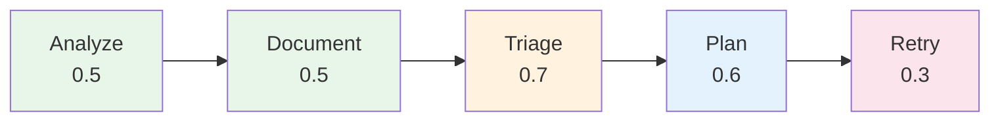
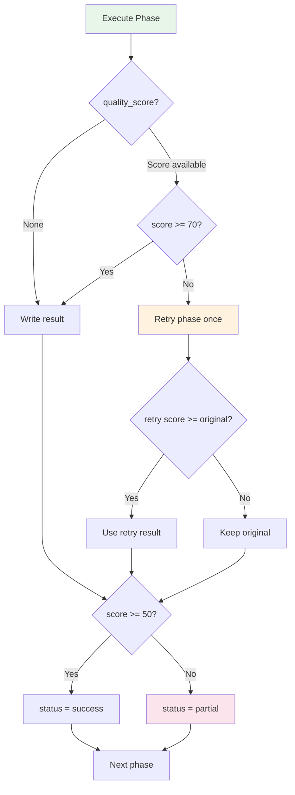

# Quality Architecture

Pipeline quality scoring, cross-phase Quality Gates, adaptive retry, and fact grounding.

> **Reference Diagrams:**
> - [quality-architecture.drawio](../diagrams/quality-architecture.drawio) — Quality Gates flow, Pipeline Quality Score, adaptive retry

> **Related Docs:**
> - [orchestration.md](./orchestration.md) — Quality Gates integration in phase execution loop
> - [pipeline-pattern.md](./pipeline-pattern.md) — Stage-based execution with quality stages

## Overview

The Quality Architecture provides 7 innovations that together target a Pipeline Quality Score of 95+:

| Innovation | Component | Impact |
|-----------|-----------|--------|
| Phase-specific LLM Temperature | `llm_factory.py`, `llm_generator.py` | Deterministic phases get lower temperatures for consistency |
| Cross-Phase Quality Gates | `orchestrator.py` | Auto-retry below threshold, mark partial below minimum |
| Adaptive Retry | `llm_generator.py` | Escalating feedback severity + decreasing temperature per attempt |
| Triage Validator | `triage/validator.py` | 9 structural checks before quality scoring |
| Plan Content Validator | `plan/validator_content.py` | 6 semantic checks against triage context and facts |
| Fact Grounding | `shared/utils/fact_grounding.py` | Shared utility detecting hallucinated components |
| Template-First Documents | `document/template_builder.py` | Deterministic skeletons reduce LLM hallucination scope |

## Phase-Specific LLM Temperatures

Each phase uses an optimal temperature. Lower temperatures produce more consistent, deterministic output. Higher temperatures allow more analytical depth.



**Resolution order:**
1. `LLM_TEMPERATURE_{PHASE}` env var (e.g., `LLM_TEMPERATURE_ANALYZE=0.5`)
2. Phase-specific default from `_PHASE_TEMPERATURE_DEFAULTS`
3. `LLM_TEMPERATURE` env var (global override)
4. `_DEFAULT_TEMPERATURE` (1.0)

**Files:** `shared/utils/llm_factory.py` → `get_phase_temperature(phase_id)`

## Cross-Phase Quality Gates

After each phase completes, the orchestrator checks `quality_score` (0-100) from the phase output:



**Environment Variables:**

| Variable | Default | Description |
|----------|---------|-------------|
| `QUALITY_GATE_THRESHOLD` | `70` | Retry phase once if quality score below this |
| `QUALITY_GATE_MINIMUM` | `50` | Mark phase as partial if still below this after retry |

**Files:** `orchestrator.py` → phase execution loop

## Pipeline Quality Score

Weighted aggregate of all phase quality scores:

| Phase | Weight | What it measures |
|-------|--------|-----------------|
| Extract | 10% | Fact completeness (currently always 100 if extract succeeds) |
| Analyze | 25% | Review report quality_score (0-100 from AnalysisReviewer) |
| Document | 35% | Chapter success rate (success chapters / total chapters * 100) |
| Triage | 15% | Triage quality scoring (_score_triage_quality output) |
| Deliver | 15% | Consistency report score |

Phases without scores are excluded and their weight redistributed proportionally.

**Logged as:** MLflow metric `pipeline_quality_score`
**Displayed:** Dashboard history table — color-coded badge (Q-score)

| Score | Level | Color |
|-------|-------|-------|
| 90-100 | Excellent | Green |
| 70-89 | Good | Blue |
| 50-69 | Fair | Yellow |
| 0-49 | Poor | Red |

**Files:** `orchestrator.py` → `_compute_pipeline_quality_score()`

## Adaptive Retry with Escalating Feedback

When validation fails, retry attempts use escalating severity and decreasing temperature:

| Attempt | Severity | Temperature | Message |
|---------|----------|-------------|---------|
| 1 | Normal | 0.30 | "Your previous output had these specific issues. Please fix them:" |
| 2 | Critical | 0.25 | "CRITICAL: Your previous attempt still had problems. Fix ONLY these specific issues:" |
| 3 | Final | 0.20 | "FINAL ATTEMPT: Focus exclusively on fixing these exact problems:" |

The base retry temperature comes from `LLM_TEMPERATURE_RETRY` (default: 0.3). Each subsequent attempt reduces it by 0.05 (minimum 0.2).

**Files:** `shared/llm_generator.py` → `retry_with_feedback(attempt=N)`

## Fact Grounding

Shared utility that validates LLM output against known architecture facts:

```python
grounder = FactGrounder(architecture_facts)
result = grounder.check(llm_output_text)
# result.score = 0-100 (ratio of found vs hallucinated names)
# result.found = {"UserService", "OrderService"}
# result.hallucinated = {"PhantomService"}
# result.passed = True/False
```

**Extraction sources:**
- `containers` → component names
- `technology_stack` → technology names
- `relations` → source/target names

**Detection method:** Extracts proper nouns (CamelCase, PascalCase, multi-word capitalized, kebab-case) from text and matches against known names (case-insensitive).

**Integration points:**
- Document phase: `ChapterValidator._check_fact_grounding()` uses `FactGrounder`
- Triage phase: `TriageValidator._check_source_facts_referenced()` validates boundaries
- Plan phase: `PlanContentValidator._check_no_phantom_components()` verifies components

**Files:** `shared/utils/fact_grounding.py` → `FactGrounder`

## Template-First Document Generation

Instead of giving the LLM a blank canvas, the `TemplateBuilder` creates a deterministic markdown skeleton:

```
1. TemplateBuilder creates skeleton (deterministic, 100% facts-based)
   ├── Chapter heading from recipe
   ├── Section headings from recipe.sections
   ├── Fact tables (containers, interfaces, relations, technologies)
   └── <!-- LLM_ENRICH: section_id --> placeholders

2. LLM fills ONLY the placeholders (controlled, smaller output)
   └── Temperature 0.5 for consistent enrichment

3. Validator checks:
   ├── All LLM_ENRICH placeholders filled?
   ├── Fact tables from template preserved?
   └── Standard structural checks (length, sections, banned phrases)

4. Reviewer checks content quality
   └── Score-based rewrite if needed
```

**Advantages:**
- LLM generates less text → fewer hallucinations
- Structure is guaranteed regardless of LLM quality
- Fact tables are deterministically correct
- Validator can verify template integrity

**Files:**
- `pipelines/document/template_builder.py` → `TemplateBuilder`
- `pipelines/document/template_builder.py` → `has_unfilled_placeholders()`, `check_fact_tables_intact()`

## Triage Validator

9 structural checks before quality scoring:

| Check | Threshold | What it catches |
|-------|-----------|----------------|
| `developer_context_structure` | Required keys present | Missing big_picture, scope_boundary, etc. |
| `customer_summary_structure` | Required keys present | Missing summary, impact_level |
| `big_picture_length` | >= 80 chars | Superficial "big picture" that doesn't orient the developer |
| `scope_boundaries_present` | IN + OUT mentioned | Missing scope definition |
| `context_boundaries_count` | >= 2 | Too few architectural constraints analyzed |
| `no_action_steps_leaked` | No imperatives | "Implement X" in analytical fields (Plan phase's job) |
| `anticipated_questions` | >= 2 | No developer onboarding questions |
| `no_file_paths` | No /path/to/file | Raw paths leak into developer context |
| `source_facts_referenced` | >50% boundaries cite sources | Boundaries without evidence |

**Files:** `pipelines/triage/validator.py` → `TriageValidator`

## Plan Content Validator

6 semantic checks after Pydantic schema validation:

| Check | What it validates |
|-------|-------------------|
| `has_implementation_steps` | Plan has at least one concrete step |
| `steps_have_details` | Each step has a meaningful description (>= 10 chars) |
| `affected_components_present` | Plan lists which components are affected |
| `no_phantom_components` | Referenced components exist in architecture_facts |
| `triage_components_addressed` | All triage-identified components appear in plan |
| `risk_awareness` | Blocking risks from triage context boundaries are addressed |

**Files:** `pipelines/plan/validator_content.py` → `PlanContentValidator`

---

© 2026 Aymen Mastouri. All rights reserved.
