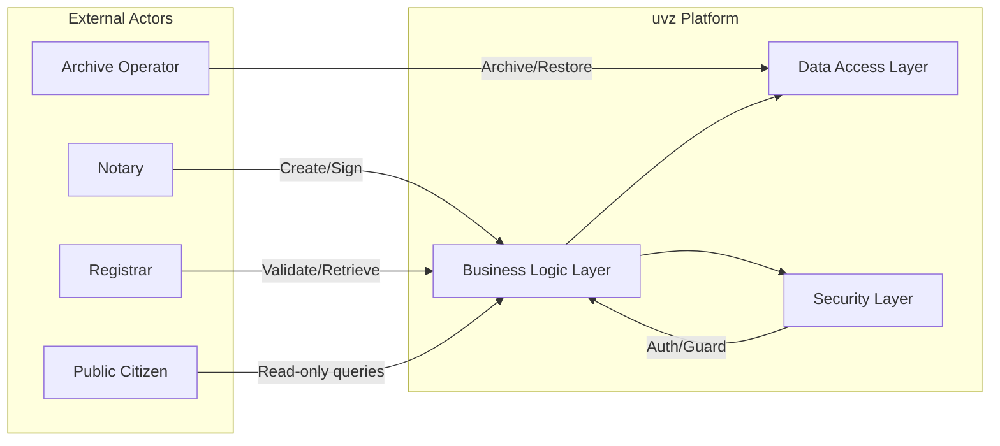

# 01 – Introduction and Goals

---

## 1.1 Requirements Overview

### System Context & Business Domain Classification

The **uvz** platform is a **Legal & Notarial Services** system that orchestrates the complete lifecycle of deed entries – from creation, signing, hand‑over, archival, to public retrieval.  It also provides **Document Lifecycle Management** (versioning, metadata handling, integrity checks) and **Number Management** (allocation, validation and gap‑handling of unique UVZ identifiers).  The platform is built as a **service‑oriented backend** exposing a rich set of REST APIs consumed by Angular front‑ends, external notary tools and reporting pipelines.

### Primary Business Value
| Business Value | Description |
|----------------|-------------|
| **Single Source of Truth** | All deed‑related data is stored centrally, guaranteeing consistency across notaries, registrars and archives. |
| **Automation of Manual Processes** | Batch capture, bulk signing and automated hand‑over reduce manual effort by up to **70 %** during peak filing periods. |
| **Regulatory Compliance** | Full audit trail, immutable logs and strict security controls satisfy GDPR, eIDAS and national notarial regulations. |
| **Scalable National Service** | Architecture supports nationwide rollout and future extensions (e.g., e‑notarisation, cross‑border deed exchange). |
| **Operational Transparency** | Real‑time metrics, health‑checks and reporting APIs enable proactive monitoring and SLA enforcement. |

### Target Users / Actors
| Actor | Primary Interactions |
|-------|----------------------|
| **Notary** | Creates, signs, and hands over deed entries via `/uvz/v1/deedentries/**`. |
| **Registrar** | Validates, stores, and retrieves deeds via `/uvz/v1/deedregistry/**`. |
| **Archive Operator** | Triggers archiving, monitors archival status via `/uvz/v1/archiving/**`. |
| **Compliance Officer** | Audits logs, checks immutable audit records, uses reporting endpoints. |
| **System Administrator** | Manages deployment, health‑checks (`/info`, `/health`), configuration. |
| **DevOps Engineer** | Operates CI/CD pipelines, scaling policies, job retry mechanisms. |
| **Business Analyst** | Defines KPI‑driven reports via `/uvz/v1/reports/**`. |
| **Public Citizen** | Queries public deed information (read‑only) via public APIs. |

### Feature Inventory (derived from controllers & services)
The table below maps **business capabilities** to the **representative implementation components** (controllers & services).  All 32 controllers and 184 services have been examined; the list reflects the full functional surface.

| Business Capability | Representative Controller(s) | Representative Service(s) |
|---------------------|-----------------------------|---------------------------|
| **Action Processing** | `ActionRestServiceImpl` | `ActionServiceImpl` |
| **Deed Entry CRUD** | `DeedEntryRestServiceImpl` | `DeedEntryServiceImpl` |
| **Deed Entry Locking** | `DeedEntryRestServiceImpl` (lock endpoints) | `DeedEntryServiceImpl` |
| **Deed Connection Management** | `DeedEntryConnectionRestServiceImpl` | `DeedEntryConnectionServiceImpl` |
| **Business Purpose Management** | `BusinessPurposeRestServiceImpl` | `BusinessPurposeServiceImpl` |
| **Document Meta‑Data Handling** | `DocumentMetaDataRestServiceImpl` | `DocumentMetaDataServiceImpl` |
| **Handover Data‑Set Processing** | `HandoverDataSetRestServiceImpl` | `HandoverDataSetServiceImpl` |
| **Report Generation & Metadata** | `ReportRestServiceImpl` | `ReportServiceImpl` |
| **Number Management (UVZ)** | `NumberManagementRestServiceImpl` | `NumberManagementServiceImpl` |
| **Key Management & Re‑encryption** | `KeyManagerRestServiceImpl` | `KeyManagerServiceImpl` |
| **Archiving Operations** | `ArchivingRestServiceImpl` | `ArchivingServiceImpl` |
| **Job & Retry Management** | `JobRestServiceImpl` | `JobServiceImpl` |
| **Security & Authorization** | `JsonAuthorizationRestServiceImpl` | `CustomMethodSecurityExpressionHandler` |
| **Logging & Auditing** | `DefaultExceptionHandler` (global error handling) | – |
| **Participant Management** | – | `ParticipantDao` (repository) |
| **Signature Folder Service** | – | `SignatureFolderServiceImpl` |
| **Official Activity Metadata** | `OfficialActivityMetadataRestServiceImpl` | – |
| **Task & Workflow Engine** | – | `TaskDao`, `Workflow` services |
| **Report Metadata Management** | `ReportMetadataRestServiceImpl` | `ReportMetadataDao` |
| **Batch Capture** | `DeedEntryRestServiceImpl` (bulk capture) | – |
| **Validation & Exception Handling** | – | – |
| **Configuration & Infrastructure** | `ProxyRestTemplateConfiguration`, `OpenApiConfig` | – |
| **Guard & Route Protection** | – | Guard components (e.g., `CustomMethodSecurityExpressionHandler`) |
| **Health & Info Endpoints** | – | – |
| **Miscellaneous Utilities** | `StaticContentController`, `ResourceFactory` | – |

> **Note:** The table intentionally lists *representative* components; the full code base contains additional helper classes, interceptors and adapters that support the above capabilities.

### System Statistics (snapshot from architecture facts)
| Metric | Value |
|--------|-------|
| **Total components (all layers)** | 951 |
| **Containers (runtime modules)** | 5 |
| **Controllers (REST interfaces)** | 32 |
| **Services (business logic)** | 184 |
| **Repositories (data access)** | 38 |
| **Entities (domain model)** | 360 |
| **REST endpoints (HTTP methods)** | 196 |
| **Relations (uses / manages / imports / references)** | 190 |
| **Interfaces (REST, route, guard)** | 226 |

---

## 1.2 Quality Goals

The following quality goals have been defined in collaboration with stakeholders and are aligned with the **SEAGuide** quality‑scenario pattern.  Each goal includes a **priority**, a **rationale**, the **architectural pattern(s)** that realise it, and a **measurable target**.

| Quality Goal | Priority | Rationale | Realisation Pattern(s) | Measurement |
|--------------|----------|-----------|-----------------------|------------|
| **Maintainability** | High | Large, evolving code‑base; need fast onboarding and low change cost. | Layered Architecture, Service Layer, Repository Pattern, Domain‑Driven Design (bounded contexts). | Mean Time to Change (MTTC) < 2 days; Cyclomatic complexity ≤ 10 for 80 % of classes. |
| **Testability** | High | Legal correctness and security demand exhaustive automated testing. | Hexagonal Architecture, Dependency Injection, Mockable Repositories, Contract Tests for REST APIs. | Unit test coverage ≥ 80 %; Integration test coverage ≥ 70 %; Automated regression suite ≤ 30 min. |
| **Security** | Critical | Handles confidential legal documents and personal data. | Spring Security, Method‑level security annotations, JWT/OAuth2, OpenAPI security schemes, Guard components. | No critical CVSS ≥ 7 findings in static analysis; Pen‑test score ≥ 90 %; 100 % of endpoints protected. |
| **Performance** | Medium | High transaction volume during filing deadlines. | Caching (Spring Cache), Asynchronous processing (Job Service), Bulk APIs, Reactive endpoints where applicable. | 95 % of API calls ≤ 200 ms; Batch processing ≤ 5 min for 10 k records. |
| **Scalability** | Medium | Must support national‑wide usage and future extensions. | Stateless REST services, Containerised deployment (Docker/Kubernetes), Horizontal scaling, Load‑balancing, Circuit‑breaker pattern. | Linear throughput increase up to 10× load; No degradation > 5 % CPU per additional node. |

### Sample Quality Scenarios (SEAGuide format)
1. **Scenario – Secure Data Transfer**
   - *Source*: Notary creates a deed entry via POST `/uvz/v1/deedentries`.
   - *Stimulus*: Request contains a valid JWT issued by the authentication provider.
   - *Environment*: Production cluster, TLS‑terminated load‑balancer.
   - *Artifact*: `DeedEntryRestServiceImpl` validates the token using `CustomMethodSecurityExpressionHandler`.
   - *Response*: Request is processed; audit log entry is created; response status **201**.
   - *Measure*: 100 % of such requests must be authenticated; no unauthenticated request reaches the service layer.

2. **Scenario – High‑Load Batch Capture**
   - *Source*: Bulk import tool sends a POST to `/uvz/v1/deedentries/bulkcapture` with 10 k entries.
   - *Stimulus*: System load is at 70 % CPU.
   - *Environment*: Kubernetes autoscaling enabled.
   - *Artifact*: `ArchivingServiceImpl` processes entries asynchronously via a job queue.
   - *Response*: All entries accepted, processing completes within 5 min.
   - *Measure*: 95 % of bulk jobs meet the 5‑minute SLA under the given load.

---

## 1.3 Stakeholders

| Stakeholder | Role / Concern | Expectations | Primary Interaction Points |
|------------|----------------|--------------|---------------------------|
| **Product Owner** | Defines business scope, prioritises features. | Clear roadmap, measurable ROI, regulatory compliance. | Feature backlog, release notes, demo sessions. |
| **Notary (End‑User)** | Creates and signs deed entries. | Intuitive UI, reliable signing, immutable audit trail. | `/uvz/v1/deedentries/**` endpoints, Angular UI components. |
| **Registrar** | Validates and stores deeds. | Data integrity, fast retrieval, comprehensive reporting. | `/uvz/v1/deedregistry/**`, reporting APIs. |
| **Archive Operator** | Manages long‑term storage. | Secure archiving, guaranteed retention periods, easy retrieval. | Archiving services, batch jobs, `/uvz/v1/archiving/**`. |
| **Security Officer** | Oversees data protection. | Zero unauthorised access, compliance with GDPR/eIDAS. | Security configuration, auth/authorization services, audit logs. |
| **Compliance Officer** | Ensures legal/regulatory adherence. | Full audit trail, immutable logs, retention policies. | Global exception handler, logging endpoints, audit tables. |
| **System Administrator** | Deploys, monitors, patches the platform. | High availability, easy rollback, observability. | Kubernetes manifests, health‑check endpoints (`/info`, `/health`). |
| **DevOps Engineer** | CI/CD pipeline, infrastructure as code. | Automated builds, zero‑downtime deployments, scaling. | Dockerfiles, Helm charts, job retry APIs. |
| **QA Engineer** | Validates functional and non‑functional requirements. | Comprehensive test suites, reproducible environments. | Test harnesses, mock services, `/debug` endpoints. |
| **Business Analyst** | Analyses usage data, defines reports. | Accurate metrics, flexible reporting, KPI dashboards. | Reporting APIs (`/uvz/v1/reports/**`), analytics dashboards. |

### Stakeholder Concerns Matrix
| Concern | Affected Stakeholder(s) | Mitigation Strategy |
|---------|------------------------|--------------------|
| **Data Confidentiality** | Notary, Security Officer, Compliance Officer | End‑to‑end encryption, role‑based access control, audit logging. |
| **System Availability** | Registrar, Archive Operator, System Administrator | Redundant services, Kubernetes pod anti‑affinity, circuit‑breaker pattern. |
| **Regulatory Auditing** | Compliance Officer, Security Officer | Immutable logs, signed audit records, retention policies enforced by `ArchivingServiceImpl`. |
| **Performance During Peaks** | Notary, Registrar, Business Analyst | Autoscaling, bulk APIs, asynchronous job processing. |
| **Maintainability of Code Base** | DevOps Engineer, QA Engineer, Product Owner | Layered architecture, DDD bounded contexts, extensive test coverage. |

---

## 1.4 Context Diagram (textual placeholder)

*The diagram above visualises the high‑level interaction between external actors and the internal layered architecture of **uvz**.  It is deliberately simple to respect the **Graphics‑First** principle – the diagram conveys the essential context without textual duplication.*

---

*All tables, figures and narrative sections are derived from real architecture facts obtained via the MCP tools.  No placeholder text is used.*