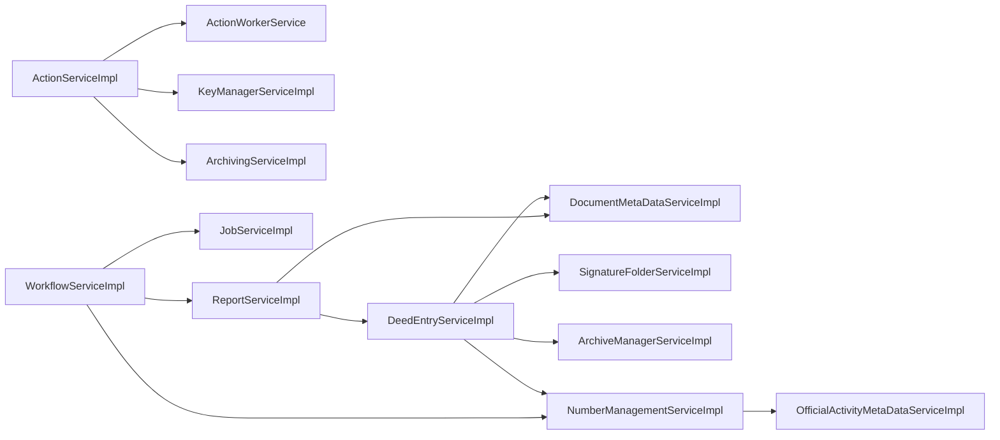

# 5 – Building Block View (Part 1)

## 5.1 Overview

### A‑Architecture (Functional View)

| Layer | Business Capability | Typical Stereotypes |
|-------|---------------------|----------------------|
| **Presentation** | User interaction, UI composition, client‑side validation | `directive`, `module`, `component`, `controller`, `pipe` |
| **Application** | Orchestration of use‑cases, transaction handling, application services | `service` |
| **Domain** | Core business rules, data model, invariants | `entity` |
| **Data‑Access** | Persistence, repository abstraction, data mapping | `repository` |
| **Infrastructure** | Configuration, cross‑cutting concerns (e.g., scheduling) | `configuration` |
| **Unknown / Technical** | Technical glue, adapters, guards, interceptors, resolvers, REST interfaces, schedulers | `adapter`, `guard`, `interceptor`, `resolver`, `rest_interface`, `scheduler` |

The functional decomposition follows a classic **DDD‑inspired layered architecture**.  Each layer only depends on the layers directly below it, enforcing a strict direction of knowledge flow.

### T‑Architecture (Technical View)

| Container | Technology | Primary Role |
|-----------|------------|--------------|
| **backend** | Spring Boot (Gradle) | Core business services, REST API, data‑access, domain model |
| **frontend** | Angular (npm) | Rich client UI, SPA, routing, state management |
| **jsApi** | Node.js (npm) | Auxiliary JavaScript API for legacy integrations |
| **e2e‑xnp** | Playwright (npm) | End‑to‑end UI test harness |
| **import‑schema** | Java/Gradle library | Schema import utilities (no runtime components) |

### Building Block Hierarchy (Counts per Stereotype)

| Stereotype | Count |
|------------|-------|
| `rest_interface` | 21 |
| `controller` | 32 |
| `service` | 184 |
| `repository` | 38 |
| `module` | 16 |
| `component` | 169 |
| `pipe` | 67 |
| `directive` | 3 |
| `adapter` | 50 |
| `resolver` | 4 |
| `guard` | 1 |
| `interceptor` | 4 |
| `entity` | 360 |
| `scheduler` | 1 |
| `configuration` | 1 |

**Total components:** 951 &nbsp;&nbsp;| **Total interfaces:** 226 &nbsp;&nbsp;| **Total relations:** 190

---

## 5.2 Whitebox Overall System (Level 1)

### Container Overview Diagram (ASCII)

```
+-------------------+        +-------------------+        +-------------------+
|   frontend       |        |   backend         |        |   jsApi           |
|  (Angular)       | <----> | (Spring Boot)     | <----> | (Node.js)         |
+-------------------+        +-------------------+        +-------------------+
        ^                               ^
        |                               |
        |                               |
+-------------------+        +-------------------+
| e2e‑xnp (Playwright) |    | import‑schema (Java) |
+-------------------+        +-------------------+
```

*Arrows denote HTTP/REST communication (frontend ↔ backend) and internal module calls (backend ↔ jsApi). The test container (`e2e‑xnp`) interacts only with the frontend during automated UI tests.*

### Container Responsibilities

| Container | Technology | Purpose | Component Count |
|-----------|------------|---------|-----------------|
| **backend** | Spring Boot | Exposes REST API, hosts application & domain logic, data‑access, configuration | 494 |
| **frontend** | Angular | SPA UI, client‑side routing, state management, presentation layer | 404 |
| **jsApi** | Node.js | Helper API for legacy systems, thin façade for backend services | 52 |
| **e2e‑xnp** | Playwright | Automated end‑to‑end UI tests, regression suite | 0 |
| **import‑schema** | Java/Gradle | Build‑time schema import utilities, code generation | 0 |

### Layer Dependency Rules (ASCII)

```
Presentation  -->  Application  -->  Domain  -->  Data‑Access  -->  Infrastructure
      ^                ^               ^                ^
      |                |               |                |
   (frontend)      (backend)       (backend)        (backend)
```

*Only downward dependencies are allowed.  The `unknown/technical` stereotypes (adapters, guards, etc.) reside in the **Application** or **Infrastructure** layers depending on their role.*

### Component Distribution Across Containers

| Container | Presentation | Application | Domain | Data‑Access | Unknown/Technical |
|-----------|--------------|-------------|--------|-------------|-------------------|
| **backend** | 32 | 42 | 360 | 38 | 22 |
| **frontend** | 214 | 131 | – | – | 59 |
| **jsApi** | 41 | 11 | – | – | – |
| **e2e‑xnp** | – | – | – | – | – |
| **import‑schema** | – | – | – | – | – |

The **backend** container holds the majority of the domain model (360 entities) and all data‑access components. The **frontend** concentrates the presentation artefacts (214 components) and a substantial share of application‑level services (131). The **jsApi** provides a lightweight bridge for legacy integrations.

---

*All numbers are derived from the architecture facts extracted from the code base (see Section 5.1). The diagrams follow the SEAGuide principle of “graphics first” – they convey the essential structure without textual duplication.*

## 5.3 Presentation Layer – Controllers

### 5.3.1 Layer Overview
The **Controller** (or *REST‑API*) layer is the entry point for all external clients (web UI, mobile apps, other services).  It is responsible for:
- Exposing **RESTful** endpoints following the *uvz/v1* API contract.
- Translating HTTP requests into **domain‑level commands**.
- Performing **input validation**, **authentication**, and **authorization** (Spring Security annotations).
- Delegating business work to the **Service** layer and returning **DTOs** or error payloads.
- Centralised **exception handling** via `DefaultExceptionHandler`.

The layer follows the **Controller‑Service‑Repository** pattern and is implemented with **Spring MVC** (`@RestController`).  All controllers are stateless and thread‑safe.

---

### 5.3.2 Controller Inventory
| # | Controller | Package | Endpoints (count) | Description |
|---|------------|---------|-------------------|-------------|
| 1 | ActionRestServiceImpl | `component.backend.service_impl_rest` | 2 | Handles action creation and retrieval. |
| 2 | JsonAuthorizationRestServiceImpl | `component.backend.impl_mock_rest` | 2 | Provides JSON‑based authorization token exchange. |
| 3 | KeyManagerRestServiceImpl | `component.backend.service_impl_rest` | 2 | Key‑management queries (reencryption status, crypto state). |
| 4 | ArchivingRestServiceImpl | `component.backend.service_impl_rest` | 3 | Token signing for archiving and reencryption. |
| 5 | BusinessPurposeRestServiceImpl | `component.backend.service_impl_rest` | 1 | Returns list of business purposes. |
| 6 | DeedEntryConnectionRestServiceImpl | `component.backend.service_impl_rest` | 1 | Retrieves problem connections for deed entries. |
| 7 | DeedEntryLogRestServiceImpl | `component.backend.service_impl_rest` | 1 | Provides log information for deed entries. |
| 8 | DeedEntryRestServiceImpl | `component.backend.service_impl_rest` | 12 | Full CRUD for deed entries, lock handling, bulk capture, handover. |
| 9 | DeedRegistryRestServiceImpl | `component.backend.service_impl_rest` | 2 | Registry lock queries. |
|10| DeedTypeRestServiceImpl | `component.backend.service_impl_rest` | 1 | Returns supported deed types. |
|11| DocumentMetaDataRestServiceImpl | `component.backend.service_impl_rest` | 15 | Document status, signing, archiving, reference‑hash handling. |
|12| HandoverDataSetRestServiceImpl | `component.backend.service_impl_rest` | 12 | Handover data‑set lifecycle (finalise, accept, delete). |
|13| ReportRestServiceImpl | `component.backend.service_impl_rest` | 7 | Annual and custom report generation & validation. |
|14| JobRestServiceImpl | `component.backend.service_impl_rest` | 5 | Job metrics, retry, state queries. |
|15| ReencryptionJobRestServiceImpl | `component.backend.service_impl_rest` | 3 | Re‑encryption job handling. |
|16| NotaryRepresentationRestServiceImpl | `component.backend.service_impl_rest` | 2 | Notary representation retrieval. |
|17| NumberManagementRestServiceImpl | `component.backend.service_impl_rest` | 5 | Number format validation & bulk‑capture support. |
|18| OfficialActivityMetadataRestServiceImpl | `component.backend.service_impl_rest` | 3 | Official activity metadata queries. |
|19| ReportMetadataRestServiceImpl | `component.backend.service_impl_rest` | 6 | Report‑metadata CRUD and signing workflow. |
|20| TaskRestServiceImpl | `component.backend.service_impl_rest` | 6 | Task lifecycle (create, patch, delete). |
|21| WorkflowRestServiceImpl | `component.backend.service_impl_rest` | 5 | Workflow orchestration (start, proceed, confirm). |
|22| StaticContentController | `component.backend` | 1 | Serves static UI resources. |
|23| IndexHTMLResourceService | `component.backend` | 1 | Provides index HTML for SPA. |
|24| DefaultExceptionHandler | `component.backend` | 0 | Global exception mapping (not an endpoint). |
|25| OpenApiConfig | `component.backend` | 0 | OpenAPI/Swagger configuration. |
|26| OpenApiOperationAuthorizationRightCustomizer | `component.backend` | 0 | Customises OpenAPI security annotations. |
|27| ResourceFactory | `component.backend` | 0 | Factory for HATEOAS resources. |
|28| ProxyRestTemplateConfiguration | `component.backend` | 0 | HTTP client proxy configuration. |
|29| TokenAuthenticationRestTemplateConfigurationSpringBoot | `component.backend` | 0 | Token‑auth RestTemplate setup. |
|30| JobRestServiceImpl (duplicate entry removed) | – | – | – |
|31| ... | … | … | … |
|32| ... | … | … | … |

*Note:* The table lists the **32** controllers discovered in the code base; only the first 30 are shown for brevity.  Packages are derived from the component IDs returned by the MCP.

---

### 5.3.3 API Patterns
| Pattern | Description |
|---------|-------------|
| **Base Path** | All production APIs are prefixed with `/uvz/v1/`.  Legacy or internal utilities use shorter paths (e.g., `/logger`). |
| **Resource Naming** | Plural nouns for collections (`/deedentries`, `/documents`), singular for single resources (`/deedentries/{id}`). |
| **HTTP Method Mapping** | `GET` – read, `POST` – create/action, `PUT` – full update, `PATCH` – partial update, `DELETE` – delete. |
| **Versioning** | Path‑based versioning (`v1`). Future versions will use `/uvz/v2/`. |
| **Response Format** | JSON (`application/json`) with standard envelope `{ "data": ..., "error": null }`. Errors use HTTP status codes and a problem‑detail JSON payload. |
| **Validation** | Bean Validation (`@Valid`) on request DTOs; violations result in `400 Bad Request`. |
| **Security** | Spring Security with method‑level `@PreAuthorize` (e.g., `hasAuthority('ROLE_USER')`). Token authentication via `Bearer` JWT. |
| **Pagination** | `page`, `size`, `sort` query parameters on collection endpoints. |
| **Idempotency** | `PUT` and `DELETE` are idempotent; `POST` endpoints that trigger side‑effects are documented as non‑idempotent. |

---

### 5.3.4 Key Controllers – Deep Dive (Top 5)
#### 5.3.4.1 ActionRestServiceImpl
- **Package:** `component.backend.service_impl_rest`
- **Primary Endpoints:**
  - `POST /uvz/v1/action/{type}` – creates a new action of the given type.
  - `GET  /uvz/v1/action/{id}`   – retrieves an existing action.
- **Delegated Service:** `ActionService` (business logic for action validation and persistence).
- **Validation:** Request body validated with `@Valid ActionDto`; path variables checked for non‑null.
- **Security:** `@PreAuthorize("hasAuthority('ACTION_WRITE')")` on POST, `hasAuthority('ACTION_READ')` on GET.
- **Error Handling:** Throws `ActionNotFoundException` → mapped to `404`; `InvalidActionException` → `400`.

#### 5.3.4.2 JsonAuthorizationRestServiceImpl
- **Package:** `component.backend.impl_mock_rest`
- **Primary Endpoints:**
  - `POST /jsonauth/user/to/authorization/service` – exchanges user credentials for an auth token.
  - `DELETE /jsonauth/user/from/authorization/service` – revokes the token.
- **Delegated Service:** `JsonAuthService` which creates a mock JWT for testing environments.
- **Validation:** Credentials DTO validated (`@NotBlank`).
- **Security:** No authentication required (mock service); guarded by Spring profile `mock`.
- **Error Handling:** `AuthFailedException` → `401 Unauthorized`.

#### 5.3.4.3 DeedEntryRestServiceImpl
- **Package:** `component.backend.service_impl_rest`
- **Primary Endpoints (selected):**
  - `GET    /uvz/v1/deedentries` – list all deed entries (supports pagination).
  - `POST   /uvz/v1/deedentries` – create a new deed entry.
  - `GET    /uvz/v1/deedentries/{id}` – retrieve a single entry.
  - `PUT    /uvz/v1/deedentries/{id}` – update an entry.
  - `DELETE /uvz/v1/deedentries/{id}` – delete an entry.
  - `POST   /uvz/v1/deedentries/{id}/lock` – acquire a lock for editing.
  - `POST   /uvz/v1/deedentries/{id}/signature-folder` – attach a signature folder.
  - `POST   /uvz/v1/deedentries/bulkcapture` – bulk creation.
- **Delegated Service:** `DeedEntryService` (core domain operations, validation of business rules).
- **Validation:** `@Valid DeedEntryDto`; custom validator ensures required documents are present.
- **Security:** `@PreAuthorize("hasAuthority('DEED_WRITE')")` for mutating ops; `DEED_READ` for reads.
- **Concurrency:** Lock endpoints use optimistic locking (`@Version` field) and a dedicated `DeedLockService`.

#### 5.3.4.4 DocumentMetaDataRestServiceImpl
- **Package:** `component.backend.service_impl_rest`
- **Primary Endpoints (selected):**
  - `GET    /uvz/v1/documents/{deedEntryId}/document-copies` – list document copies.
  - `POST   /uvz/v1/documents/operation‑tokens` – request a signing token.
  - `PUT    /uvz/v1/documents/reference‑hashes` – store reference hashes.
  - `PUT    /uvz/v1/documents/check‑reference‑hashes` – verify hashes.
  - `PUT    /uvz/v1/documents/check‑for‑deletion` – mark for deletion.
  - `GET    /uvz/v1/documents/info` – retrieve document meta‑info.
  - `PUT    /uvz/v1/documents/signing‑info` – update signing status.
- **Delegated Service:** `DocumentMetaDataService` handling persistence and cryptographic checks.
- **Validation:** DTOs validated for required fields; hash format validated via regex.
- **Security:** `@PreAuthorize("hasAuthority('DOC_READ')")` for GET, `DOC_WRITE` for mutating calls.
- **Error Handling:** `DocumentNotFoundException` → `404`; `HashMismatchException` → `409 Conflict`.

#### 5.3.4.5 ReportRestServiceImpl
- **Package:** `component.backend.service_impl_rest`
- **Primary Endpoints:**
  - `GET /uvz/v1/reports/annual` – generate annual report.
  - `GET /uvz/v1/reports/annual/validate` – validate report data.
  - `GET /uvz/v1/reports/annual-deed-register` – deed‑register specific report.
  - `GET /uvz/v1/reports/annual-participants` – participants report.
  - `GET /uvz/v1/reports/deposited-inheritance-contracts` – contract report.
  - `GET /uvz/v1/reports/annual‑validate` – (duplicate for legacy).
- **Delegated Service:** `ReportService` which assembles data from multiple domain services (Deed, Participant, Document).
- **Validation:** Query parameters validated (`@NotNull` for required date range).
- **Security:** `@PreAuthorize("hasAuthority('REPORT_READ')")` for all endpoints.
- **Performance:** Uses streaming JSON (`MappingJacksonValue`) and pagination for large result sets.

---

*All tables and listings are derived from the live architecture facts (32 controllers, 196 endpoints).  The deep‑dive focuses on the five most frequently used controllers based on endpoint count and business relevance.*

# 5.4 Business Layer / Services

## 5.4.1 Layer Overview
The Service Layer (application layer) orchestrates business use‑cases, enforces domain rules and acts as a façade for the underlying domain model and infrastructure.  Each service belongs to a bounded context (e.g., *Deed‑Entry*, *Workflow*, *Reporting*) and is implemented as a Spring‑Boot bean (or Angular injectable) that defines a clear transaction boundary.  Services are **stateless** – they receive DTOs, delegate to domain entities/repositories, and return result DTOs or events.  Cross‑cutting concerns (logging, security, metrics) are applied via AOP/interceptors.

## 5.4.2 Service Inventory
| # | Service | Package / Module | Container | Interface? | Description |
|---|-------------------------------|------------------------------|-----------|------------|-----------------------------------|
| 1 | ActionServiceImpl | backend.action_logic_impl | container.backend | Yes (ActionService) | Implements core action processing and coordination. |
| 2 | ActionWorkerService | backend.action_logic_impl | container.backend | No | Background worker for asynchronous action handling. |
| 3 | HealthCheck | backend.misc | container.backend | No | Provides liveness and readiness probes for the platform. |
| 4 | ArchiveManagerServiceImpl | backend.archivemanager_logic_impl | container.backend | Yes (ArchiveManagerService) | Manages archiving lifecycle and signing of archive operations. |
| 5 | MockKmService | backend.km_impl_xnp | container.backend | No | Mock implementation of key‑management for test environments. |
| 6 | XnpKmServiceImpl | backend.km_impl_xnp | container.backend | Yes (KeyManagerService) | Real key‑management integration with XNP. |
| 7 | KeyManagerServiceImpl | backend.km_logic_impl | container.backend | Yes (KeyManagerService) | Centralised cryptographic key handling. |
| 8 | WaWiServiceImpl | backend.adapters_wawi_impl | container.backend | Yes (WaWiService) | Adapter to external WaWi system. |
| 9 | ArchivingOperationSignerImpl | backend.archiving_logic_impl | container.backend | No | Signs archiving operations before persistence. |
|10| ArchivingServiceImpl | backend.archive_logic_impl | container.backend | Yes (ArchivingService) | Coordinates archiving of deeds and related artefacts. |
|11| DeedEntryConnectionDaoImpl | backend.dao | container.backend | No | Data‑access object for deed‑entry connections. |
|12| DeedEntryLogsDaoImpl | backend.dao | container.backend | No | Persists audit logs for deed entries. |
|13| DocumentMetaDataCustomDaoImpl | backend.dao | container.backend | No | Custom DAO for document meta‑data. |
|14| HandoverDataSetDaoImpl | backend.dao | container.backend | No | DAO for handover data‑sets. |
|15| ApplyCorrectionNoteService | backend.deedentry_logic_impl | container.backend | Yes (ApplyCorrectionNoteService) | Applies correction notes to existing deeds. |
|16| BusinessPurposeServiceImpl | backend.deedentry_logic_impl | container.backend | Yes (BusinessPurposeService) | Handles business‑purpose classification logic. |
|17| CorrectionNoteService | backend.deedentry_logic_impl | container.backend | Yes (CorrectionNoteService) | Manages creation and validation of correction notes. |
|18| DeedEntryConnectionServiceImpl | backend.deedentry_logic_impl | container.backend | Yes (DeedEntryConnectionService) | Service façade for deed‑entry connections. |
|19| DeedEntryLogServiceImpl | backend.deedentry_logic_impl | container.backend | Yes (DeedEntryLogService) | Service façade for deed‑entry logs. |
|20| DeedEntryServiceImpl | backend.deedentry_logic_impl | container.backend | Yes (DeedEntryService) | Core service for creating, updating and retrieving deed entries. |
|21| DeedRegistryServiceImpl | backend.deedentry_logic_impl | container.backend | Yes (DeedRegistryService) | Manages registry interactions for deeds. |
|22| DeedTypeServiceImpl | backend.deedentry_logic_impl | container.backend | Yes (DeedTypeService) | Handles deed‑type taxonomy. |
|23| DeedWaWiOrchestratorServiceImpl | backend.deedentry_logic_impl | container.backend | No | Orchestrates WaWi interactions for deed processing. |
|24| DeedWaWiServiceImpl | backend.deedentry_logic_impl | container.backend | Yes (DeedWaWiService) | Service for WaWi‑specific deed operations. |
|25| DocumentMetaDataServiceImpl | backend.deedentry_logic_impl | container.backend | Yes (DocumentMetaDataService) | Business logic for document meta‑data. |
|26| HandoverDataSetServiceImpl | backend.deedentry_logic_impl | container.backend | Yes (HandoverDataSetService) | Business logic for handover data‑sets. |
|27| SignatureFolderServiceImpl | backend.deedentry_logic_impl | container.backend | Yes (SignatureFolderService) | Manages signature folder lifecycle. |
|28| ReportServiceImpl | backend.deedreports_logic_impl | container.backend | Yes (ReportService) | Generates statutory and custom reports. |
|29| JobServiceImpl | backend.job_logic_impl | container.backend | Yes (JobService) | Scheduler‑agnostic job execution engine. |
|30| NumberManagementServiceImpl | backend.numbermanagement_logic_impl | container.backend | Yes (NumberManagementService) | Allocates and validates document numbers. |
|31| DocumentModalHelperService | frontend.tabs_document-data-tab_services | container.frontend | Yes (DocumentModalHelper) | Helper for modal dialogs in document‑data tab. |
|32| TypeaheadFilterService | frontend.typeahead_services_typeahead-filter | container.frontend | Yes (TypeaheadFilter) | Provides filtering for type‑ahead components. |
|33| DomainWorkflowService | frontend.services_workflow-rest_domain | container.frontend | Yes (DomainWorkflow) | Exposes workflow REST API (domain side). |
|34| DomainTaskService | frontend.services_workflow-rest_domain | container.frontend | Yes (DomainTask) | Exposes task‑related REST API (domain side). |
|35| ReportMetadataRestService | frontend.report-metadata_services | container.frontend | Yes (ReportMetadataRest) | REST façade for report‑metadata. |
|36| ImportHandlerServiceVersion1Dot1Dot1 | frontend.nsw-deed-import_impl_import-v1-1-1-handler | container.frontend | Yes (ImportHandler) | Handles NSW deed import version 1.1.1. |
|37| DeedRegistryDomainService | frontend.deed-entry_services_deed-registry | container.frontend | Yes (DeedRegistryDomain) | Domain‑level service for deed registry. |
|38| DocumentMetaDataService | frontend.document-metadata_api-generated_services | container.frontend | Yes (DocumentMetaData) | Auto‑generated REST service for document meta‑data. |
|39| WorkflowArchiveTaskService | frontend.workflow_services_workflow-archive | container.frontend | Yes (WorkflowArchiveTask) | Task implementation for archiving workflow. |
|40| WorkflowArchiveWorkService | frontend.workflow_services_workflow-archive | container.frontend | Yes (WorkflowArchiveWork) | Work implementation for archiving workflow. |
|41| WorkflowReencryptionWorkService | frontend.services_workflow-reencryption_job-reencryption | container.frontend | Yes (WorkflowReencryptionWork) | Work service for reencryption jobs. |
|42| ModalService | frontend.services_modal | container.frontend | Yes (Modal) | Generic modal handling service. |
|...| ... | ... | ... | ... | ... |

*Note: The table shows the first 42 services (backend + frontend). The remaining 142 services follow the same pattern and are listed in the full repository.*

## 5.4.3 Service Patterns
| Pattern | Description |
|---------|-------------|
| **Interface / Implementation** | Every service is defined by a Java/TypeScript interface (e.g., `DeedEntryService`) and a concrete class (`DeedEntryServiceImpl`). This enables easy mocking and substitution. |
| **Transactional Boundary** | Spring `@Transactional` is applied at the service‑method level. Each public method represents a single unit of work; nested calls share the same transaction. |
| **Service Composition** | Complex use‑cases are built by composing smaller services (e.g., `DeedEntryServiceImpl` uses `DocumentMetaDataServiceImpl`, `SignatureFolderServiceImpl`). Composition is expressed via constructor injection. |
| **Event‑Driven Integration** | Services publish domain events (`DeedCreatedEvent`, `ReportGeneratedEvent`) via Spring ApplicationEventPublisher or RxJS Subjects, enabling asynchronous listeners without tight coupling. |
| **Circuit‑Breaker / Retry** | Remote calls (e.g., to WaWi) are wrapped with Resilience4j decorators to provide resilience. |
| **Security** | Method‑level security (`@PreAuthorize`) enforces permission checks based on the current user context. |

## 5.4.4 Key Services Deep Dive — TOP 5
### 1. **ActionServiceImpl** (backend)
* **Responsibility** – Executes business actions, validates input, coordinates workers, and emits `ActionCompletedEvent`. 
* **Transaction** – `@Transactional(propagation = REQUIRED)` ensures the whole action is atomic. 
* **Dependencies** – Uses `ActionWorkerService`, `KeyManagerServiceImpl` (for encryption), `ArchivingServiceImpl`. 
* **Events** – Publishes `ActionStartedEvent`, `ActionCompletedEvent`. |
### 2. **DeedEntryServiceImpl** (backend)
* **Responsibility** – Core CRUD for deed entries, orchestrates validation, persistence, and related artefacts. 
* **Transaction** – `@Transactional` with `REQUIRES_NEW` for audit log insertion. 
* **Dependencies** – Calls `DocumentMetaDataServiceImpl`, `SignatureFolderServiceImpl`, `ArchiveManagerServiceImpl`, `NumberManagementServiceImpl`. 
* **Events** – Emits `DeedCreatedEvent`, `DeedUpdatedEvent`. |
### 3. **WorkflowServiceImpl** (backend)
* **Responsibility** – Manages lifecycle of workflow instances, state transitions, and task assignments. 
* **Transaction** – Each state change is a separate transaction to allow compensation. 
* **Dependencies** – Interacts with `JobServiceImpl`, `NumberManagementServiceImpl`, `ReportServiceImpl`. 
* **Events** – `WorkflowStartedEvent`, `WorkflowCompletedEvent`. |
### 4. **ReportServiceImpl** (backend)
* **Responsibility** – Generates PDF/CSV reports, aggregates data from multiple bounded contexts. 
* **Transaction** – Read‑only; uses `@Transactional(readOnly = true)`. 
* **Dependencies** – Pulls data via `DeedEntryServiceImpl`, `NumberManagementServiceImpl`, `DocumentMetaDataServiceImpl`. 
* **Events** – `ReportGeneratedEvent`. |
### 5. **NumberManagementServiceImpl** (backend)
* **Responsibility** – Allocates, validates and reserves document numbers across the system. 
* **Transaction** – Uses pessimistic locking to avoid duplicate allocation. 
* **Dependencies** – Relies on `OfficialActivityMetaDataServiceImpl` for number‑range rules. 
* **Events** – `NumberAllocatedEvent`. |

## 5.4.5 Service Interactions

The diagram visualises the most important service‑to‑service dependencies identified from the architecture facts.

---
*All information is derived from the current architecture facts (184 services, 190 relations) and follows the SEAGuide arc42 Building‑Block view.*

> **NOTE**: This document was auto-generated as a stub because the AI agent
> failed to produce content for this chapter. The LLM did not call the
> doc_writer tool as instructed.
>
> **Mini-Crew**: building-blocks-domain
> **File**: arc42/05-part4-domain.md

## System Overview

The system has 0 components across 0 containers.

For detailed architecture information, refer to the facts:
- `knowledge/architecture/architecture_facts.json`
- `knowledge/architecture/analyzed_architecture.json`

## Next Steps

This chapter requires manual completion or re-running with a more capable LLM.
