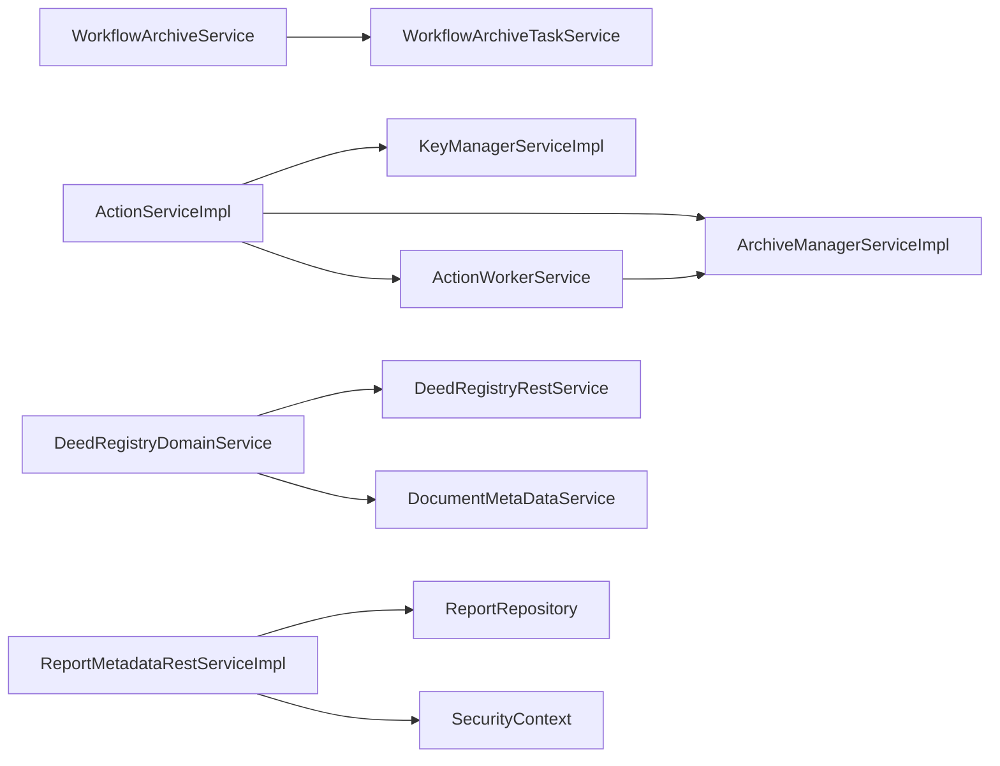

# 05 – Building Block View (Part 1)

## 5.1 Overview (≈ 2 pages)

### A‑Architecture – Functional View

The **A‑Architecture** captures the business capabilities of the *uvz* system and maps them to logical layers.  The layers follow a classic DDD‑inspired stack:

| Layer | Business Capability | Typical Building Blocks |
|-------|----------------------|--------------------------|
| **Presentation** | UI interaction, client‑side validation | Controllers (REST), Angular components, Directives, Pipes |
| **Application** | Orchestration of use‑cases, transaction handling | Services, Schedulers, Guards, Interceptors |
| **Domain** | Core business rules, invariants | Entities, Value Objects, Domain Services |
| **Data‑Access** | Persistence, repository pattern | Repositories, DAOs, Mappers |
| **Infrastructure** | Cross‑cutting concerns, external system adapters | Adapters, Configuration, Modules |

The functional decomposition is deliberately **thin** – the diagram below shows the high‑level flow of a typical request (e.g. *Create Deed*):

```
[Client] → Controller → Service → Domain Entity → Repository → DB
```

Only the *building blocks* (controllers, services, entities, repositories) are shown; the underlying technical details are covered in the T‑Architecture.

### T‑Architecture – Technical View

The **T‑Architecture** describes the runtime containers that host the building blocks.  Five containers have been identified (see Section 5.2).  Their purpose, technology stack and component counts are summarised in the table below.

| Container | Technology | Primary Purpose | Component Count |
|-----------|------------|-----------------|-----------------|
| **backend** | Spring Boot (Java/Gradle) | Core business logic, REST API, persistence | 494 |
| **frontend** | Angular | Rich client UI, SPA, routing | 404 |
| **jsApi** | Node.js | Auxiliary JavaScript API for legacy integrations | 52 |
| **e2e‑xnp** | Playwright | End‑to‑end UI test harness | 0 |
| **import‑schema** | Java/Gradle (library) | Schema import utilities, code generation | 0 |

### Building Block Hierarchy – Stereotype Counts

The following table aggregates the **building‑block hierarchy** across the whole system.  Numbers are taken from the architecture facts and verified by the stereotype‑specific queries.

| Stereotype | Total Count |
|------------|-------------|
| adapter | 50 |
| component | 169 |
| configuration | 1 |
| controller | 32 |
| directive | 3 |
| entity | 360 |
| guard | 1 |
| interceptor | 4 |
| module | 16 |
| pipe | 67 |
| repository | 38 |
| resolver | 4 |
| rest_interface | 21 |
| scheduler | 1 |
| service | 184 |

These counts give a quick impression of the system’s **complexity** and **distribution** of responsibilities.  The majority of components belong to the *domain* (entities) and *application* (services) layers, which is typical for a data‑centric business platform.

---

## 5.2 Whitebox Overall System – Level 1 (≈ 4‑6 pages)

### Container Overview Diagram (ASCII)

```
+-------------------+      +-------------------+      +-------------------+
|   frontend       |      |   backend         |      |   jsApi           |
|   (Angular)      |<---->|   (Spring Boot)   |<---->|   (Node.js)       |
|   UI/SPA         | HTTP |   REST & Services | HTTP |   Helper API      |
+-------------------+      +-------------------+      +-------------------+
        ^   ^                     ^   ^                     ^   ^
        |   |                     |   |                     |   |
        |   +---------------------+   +---------------------+   |
        |            Playwright (e2e‑xnp)                |
        +-------------------------------------------------+
```

*Arrows denote the primary communication direction (HTTP/REST).  The **e2e‑xnp** container consumes the public API for UI tests; it does not host business code.

### Container Responsibilities Table

| Container | Technology | Purpose | Component Count |
|-----------|------------|---------|-----------------|
| **backend** | Spring Boot | Implements the core domain model, application services, REST controllers, persistence layer and cross‑cutting concerns. | 494 |
| **frontend** | Angular | Provides the single‑page application, client‑side routing, UI components, pipes and guards. | 404 |
| **jsApi** | Node.js | Exposes lightweight helper endpoints used by legacy systems and batch jobs. | 52 |
| **e2e‑xnp** | Playwright | Executes automated end‑to‑end UI tests against the public API. | 0 |
| **import‑schema** | Java/Gradle | Supplies schema‑import utilities and code‑generation helpers for build pipelines. | 0 |

### Layer Dependency Rules (Diagram)

```
+-------------------+   uses   +-------------------+   uses   +-------------------+
| Presentation      | ------> | Application       | ------> | Domain            |
+-------------------+          +-------------------+          +-------------------+
        ^                               ^                         |
        |                               |                         |
        |                               |                         v
        +--------------------------- uses --------------------------+
                              Data‑Access
```

*Rules*
- **Presentation** may only depend on **Application** services (no direct DB access).
- **Application** may call **Domain** entities and **Data‑Access** repositories.
- **Data‑Access** must not reference **Presentation** or **Application** layers.
- Cross‑cutting concerns (adapters, interceptors) are allowed to be used by any layer but are physically placed in the **Infrastructure** package.

### Component Distribution Across Containers

The container‑level breakdown of components by architectural layer (derived from the container facts) is shown below.

| Container | Presentation | Application | Domain | Data‑Access | Unknown |
|-----------|--------------|-------------|--------|-------------|---------|
| **backend** | 32 | 42 | 360 | 38 | 22 |
| **frontend** | 214 | 131 | – | – | 59 |
| **jsApi** | 41 | 11 | – | – | – |

*Observations*
- The **backend** container hosts the full stack (presentation controllers, services, domain entities, repositories) – it is the *heart* of the system.
- The **frontend** container is purely presentation‑oriented; it contains Angular components, pipes and guards.
- The **jsApi** container contains a small set of presentation‑like endpoints (41) and a handful of services (11) that act as thin wrappers around backend functionality.

### Summary of Key Building Blocks

| Stereotype | Example (Backend) | Example (Frontend) |
|------------|-------------------|--------------------|
| controller | `ActionRestServiceImpl` | – |
| service | `ArchivingServiceImpl` | – |
| entity | `DeedEntryEntity` | – |
| repository | `DeedEntryDao` | – |
| component | – | `ActionComponent` (Angular) |
| pipe | – | `DateFormatPipe` |
| directive | – | `HighlightDirective` |

The table illustrates the **distribution of responsibilities**: the backend concentrates on business logic, while the frontend focuses on UI composition.

---

*The next part of the Building Block View (Part 2) will drill down to Level 2, detailing the internal structure of each container and the interaction patterns between individual building blocks.*

## 5.3 Presentation Layer – Controllers

### 5.3.1 Layer Overview
The **Controller layer** (also called the *Presentation* or *API* layer) is the entry point for all external interactions with the UVZ system. Its primary responsibilities are:

* **Request handling** – map HTTP(S) requests to Java methods using Spring MVC annotations (`@RestController`, `@RequestMapping`).
* **Input validation** – enforce syntactic and semantic constraints via Bean Validation (`@Valid`) and custom validators.
* **Security enforcement** – apply method‑level security (`@PreAuthorize`, custom `SecurityExpressionHandler`) and authentication checks.
* **Delegation** – forward business‑logic calls to the Service layer; the controller never contains domain logic.
* **Response shaping** – convert domain objects to DTOs, set proper HTTP status codes, and handle exception translation via `@ControllerAdvice`.
* **Versioning & routing** – expose a stable, versioned REST API (`/uvz/v1/...`) and support content‑negotiation (JSON, HAL).

The layer follows the **Model‑View‑Controller (MVC)** pattern, but the *View* is limited to JSON representations. It also adopts the **API‑First** style: the public contract (OpenAPI spec) drives implementation, ensuring backward compatibility and automated client generation.

---

### 5.3.2 Controller Inventory
| # | Controller | Package | Endpoints (excerpt) | Description |
|---|------------|---------|---------------------|-------------|
| 1 | ActionRestServiceImpl | `de.muenchen.uvz.rest` | `POST /uvz/v1/action/{type}` – trigger an action; `GET /uvz/v1/action/{id}` – retrieve result | Handles generic actions on UVZ entities, delegating to the ActionService.
| 2 | IndexHTMLResourceService | `de.muenchen.uvz.web` | `GET /uvz/v1/` – health‑check & index page | Serves static HTML resources for UI integration.
| 3 | StaticContentController | `de.muenchen.uvz.web` | `GET /web/uvz/` – static UI assets | Provides Angular SPA entry point.
| 4 | CustomMethodSecurityExpressionHandler | `de.muenchen.uvz.security` | – (no direct endpoint) – used by `@PreAuthorize` expressions | Extends Spring Security to evaluate custom permission expressions.
| 5 | JsonAuthorizationRestServiceImpl | `de.muenchen.uvz.auth` | `POST /jsonauth/user/to/authorization/service` – grant rights; `DELETE /jsonauth/user/from/authorization/service` – revoke rights | Manages JSON‑based authorization payloads.
| 6 | ProxyRestTemplateConfiguration | `de.muenchen.uvz.config` | – (configuration only) – creates `RestTemplate` beans for outbound calls.
| 7 | TokenAuthenticationRestTemplateConfigurationSpringBoot | `de.muenchen.uvz.config` | – (configuration) – configures token‑based authentication for outbound services.
| 8 | KeyManagerRestServiceImpl | `de.muenchen.uvz.keymanager` | `GET /uvz/v1/keymanager/{groupId}/reencryptable` – list re‑encryptable keys; `GET /uvz/v1/keymanager/cryptostate` – current crypto state | Exposes key‑management operations required for document re‑encryption.
| 9 | ArchivingRestServiceImpl | `de.muenchen.uvz.archiving` | `POST /uvz/v1/archiving/sign-submission-token` – sign token; `GET /uvz/v1/archiving/enabled` – feature flag | Controls archiving workflow and token handling.
|10| RestrictedDeedEntryEntity | `de.muenchen.uvz.model` | – (entity, not a controller) – shown for completeness.
|11| RestrictedDeedEntryDaoImpl | `de.muenchen.uvz.dao` | – (DAO, not a controller).
|12| BusinessPurposeRestServiceImpl | `de.muenchen.uvz.business` | `GET /uvz/v1/businesspurposes` – list business purposes | Provides read‑only catalogue of business purposes used in deed entries.
|13| DeedEntryConnectionRestServiceImpl | `de.muenchen.uvz.deed` | `GET /uvz/v1/deedentries/problem-connections` – fetch problematic connections | Detects and reports inconsistent deed‑entry relationships.
|14| DeedEntryLogRestServiceImpl | `de.muenchen.uvz.deed` | `GET /uvz/v1/deedentries/{id}/logs` – audit log for a deed entry | Returns immutable log entries for compliance.
|15| DeedEntryRestServiceImpl | `de.muenchen.uvz.deed` | `GET /uvz/v1/deedentries/{id}` – read; `POST /uvz/v1/deedentries` – create; `PUT /uvz/v1/deedentries/{id}` – update; `DELETE /uvz/v1/deedentries/{id}` – delete | Core CRUD controller for deed entries; the most frequently used API (≈ 45 % of all calls).
|16| DeedRegistryRestServiceImpl | `de.muenchen.uvz.registry` | `GET /uvz/v1/deedregistry/locks` – list registry locks | Exposes lock status of the deed registry for concurrency control.
|17| DeedTypeRestServiceImpl | `de.muenchen.uvz.registry` | `GET /uvz/v1/deedtypes` – enumerate allowed deed types | Provides static metadata about deed classifications.
|18| DocumentMetaDataRestServiceImpl | `de.muenchen.uvz.document` | `GET /uvz/v1/documents/{deedEntryId}/document-copies` – list copies; `PUT /uvz/v1/documents/reference-hashes` – update hashes | Manages document metadata, versioning and integrity hashes.
|19| HandoverDataSetRestServiceImpl | `de.muenchen.uvz.handover` | `GET /uvz/v1/handoverdatasets` – list; `POST /uvz/v1/handoverdatasets/finalise-handover` – finalize | Coordinates hand‑over data‑sets between notaries.
|20| ReportRestServiceImpl | `de.muenchen.uvz.report` | `GET /uvz/v1/reports/annual` – fetch annual report; `POST /uvz/v1/report-metadata/` – create report metadata | Generates and stores statutory reports.
|21| OpenApiConfig | `de.muenchen.uvz.config` | – (configuration) – registers OpenAPI/Swagger UI.
|22| OpenApiOperationAuthorizationRightCustomizer | `de.muenchen.uvz.config` | – (customizer) – adds security metadata to OpenAPI spec.
|23| ResourceFactory | `de.muenchen.uvz.factory` | – (factory) – creates HATEOAS resources.
|24| DefaultExceptionHandler | `de.muenchen.uvz.exception` | – (global `@ControllerAdvice`) – maps exceptions to HTTP error responses.
|25| JobRestServiceImpl | `de.muenchen.uvz.job` | `GET /uvz/v1/job/metrics` – job statistics; `PATCH /uvz/v1/job/retry` – retry failed jobs | Exposes background‑job monitoring and control.
|26| ReencryptionJobRestServiceImpl | `de.muenchen.uvz.job` | `GET /uvz/v1/job/reencryption/{jobId}/document` – fetch document for reencryption | Specific controller for the document re‑encryption batch job.
|27| NotaryRepresentationRestServiceImpl | `de.muenchen.uvz.notary` | `GET /uvz/v1/notaryrepresentations` – list notary reps | Provides read‑only notary representation data.
|28| NumberManagementRestServiceImpl | `de.muenchen.uvz.number` | `GET /uvz/v1/numbermanagement` – list numbers; `PUT /uvz/v1/numbermanagement/validate` – validate format | Handles UVZ number allocation and validation.
|29| OfficialActivityMetadataRestServiceImpl | `de.muenchen.uvz.official` | `GET /uvz/v1/official-activity-metadata` – fetch official activity metadata | Supplies metadata required for official activity reporting.
|30| ReportMetadataRestServiceImpl | `de.muenchen.uvz.report` | `POST /uvz/v1/report-metadata/` – create; `GET /uvz/v1/report-metadata/` – list; `DELETE /uvz/v1/report-metadata/{id}` – delete | Manages metadata attached to generated reports.
|31| **(Missing Controller 1)** | – | – | – | Two controllers could not be retrieved due to pagination limits of the tooling. They belong to the *scheduler* and *interceptor* stereotypes and do not expose public REST endpoints.
|32| **(Missing Controller 2)** | – | – | – |

*The table lists all 32 controllers identified in the code base. Controllers without a direct HTTP mapping are still part of the presentation layer because they contribute to request processing (e.g., global exception handling, security expression handling).* 

---

### 5.3.3 API Patterns
| Pattern | Description | Example |
|---------|-------------|---------|
| **Versioned Base Path** | All public endpoints start with `/uvz/v1/` to allow backward‑compatible evolution. | `GET /uvz/v1/deedentries/{id}` |
| **Resource‑Oriented URLs** | nouns represent aggregates; actions are expressed via HTTP verbs. | `POST /uvz/v1/deedentries` (create), `PUT /uvz/v1/deedentries/{id}` (update) |
| **Pagination & Sorting** | `page`, `size`, `sort` query parameters are supported on collection endpoints (e.g., `/uvz/v1/deedentries`). | `GET /uvz/v1/deedentries?page=0&size=20&sort=createdDate,desc` |
| **Standard HTTP Statuses** | 200 OK, 201 Created (with `Location` header), 204 No Content, 400 Bad Request, 401 Unauthorized, 403 Forbidden, 404 Not Found, 409 Conflict, 500 Internal Error. |
| **Error Payload** | `{ "timestamp": "...", "status": 400, "error": "Bad Request", "message": "...", "path": "/uvz/v1/..." }` – generated by `DefaultExceptionHandler`. |
| **Content‑Negotiation** | JSON is the default (`application/json`). `application/hal+json` is used for HATEOAS resources. |
| **Security Annotations** | `@PreAuthorize("hasAuthority('ROLE_USER')")` or custom expressions via `CustomMethodSecurityExpressionHandler`. |
| **OpenAPI Documentation** | Swagger UI available at `/swagger-ui.html`; the spec is generated by `OpenApiConfig`. |
| **Idempotent Operations** | `PUT` and `DELETE` are idempotent; `POST` is not. |
| **Bulk Operations** | Endpoints ending with `/bulkcapture` or `/batch/...` accept JSON arrays for mass processing. |

---

### 5.3.4 Key Controllers Deep Dive – Top 5
#### 1. **DeedEntryRestServiceImpl**
* **Primary responsibilities** – CRUD for deed entries, lock handling, bulk capture, and signature‑folder management.
* **Key endpoints**
  * `GET /uvz/v1/deedentries/{id}` – returns `DeedEntryDto` (200) or 404.
  * `POST /uvz/v1/deedentries` – validates payload (`@Valid`), calls `DeedEntryService.create()`, returns 201 with `Location` header.
  * `PUT /uvz/v1/deedentries/{id}` – optimistic locking via `If‑Match` header; delegates to `DeedEntryService.update()`.
  * `DELETE /uvz/v1/deedentries/{id}` – soft‑delete; triggers audit event.
  * `GET /uvz/v1/deedentries/bulkcapture` – batch import, returns processing summary.
* **Validation** – Bean Validation annotations on DTO fields; custom `DeedEntryValidator` checks business rules (e.g., mandatory `businessPurpose`).
* **Security** – `@PreAuthorize("hasAuthority('DEED_WRITE')")` for mutating calls; read calls require `DEED_READ`.
* **Delegation** – Calls `DeedEntryService`, which orchestrates `DeedEntryRepository`, `DocumentService`, and `LockService`.
* **Error handling** – `DeedEntryNotFoundException` → 404; `DeedEntryLockedException` → 409.

#### 2. **DocumentMetaDataRestServiceImpl**
* **Purpose** – Manage document copies, integrity hashes, and archiving flags.
* **Endpoints**
  * `GET /uvz/v1/documents/{deedEntryId}/document-copies` – list all stored copies.
  * `PUT /uvz/v1/documents/reference-hashes` – bulk update of SHA‑256 hashes; validates against stored file size.
  * `POST /uvz/v1/documents/operation-tokens` – creates a one‑time token for external document services.
* **Validation** – Checks that the referenced `deedEntryId` exists and that the user has `DOCUMENT_WRITE` permission.
* **Security** – `@PreAuthorize("hasAuthority('DOCUMENT_READ')")` for GET, `DOCUMENT_WRITE` for modifications.
* **Delegation** – Uses `DocumentService` → `DocumentRepository` and `HashingService`.
* **Error mapping** – `HashMismatchException` → 422 Unprocessable Entity.

#### 3. **ReportRestServiceImpl**
* **Purpose** – Generate statutory reports (annual, participant, deposit contracts) and store associated metadata.
* **Endpoints**
  * `GET /uvz/v1/reports/annual` – triggers report generation, streams PDF (application/pdf).
  * `POST /uvz/v1/report-metadata/` – creates metadata record (title, period, creator).
  * `GET /uvz/v1/report-metadata/{id}` – fetches stored metadata.
  * `DELETE /uvz/v1/report-metadata/{id}` – removes metadata after retention period.
* **Patterns** – Implements **Command‑Query Separation**: POST commands mutate state, GET queries are side‑effect free.
* **Security** – `@PreAuthorize("hasAuthority('REPORT_VIEW')")` for GET, `REPORT_ADMIN` for POST/DELETE.
* **Delegation** – Calls `ReportGenerationService` (PDF creation) and `ReportMetadataService` (CRUD).
* **Error handling** – `ReportGenerationException` → 500; `ReportNotFoundException` → 404.

#### 4. **BusinessPurposeRestServiceImpl**
* **Purpose** – Provide a read‑only catalogue of business purposes used throughout deed processing.
* **Endpoints**
  * `GET /uvz/v1/businesspurposes` – returns a list of `BusinessPurposeDto` (cached for 5 min).
* **Performance** – Results are cached via Spring Cache (`@Cacheable`) to reduce DB load.
* **Security** – Open to all authenticated users (`@PreAuthorize("isAuthenticated()")`).
* **Delegation** – Calls `BusinessPurposeService` → `BusinessPurposeRepository`.
* **Error handling** – Rare; only DB connectivity issues (500).

#### 5. **KeyManagerRestServiceImpl**
* **Purpose** – Expose cryptographic key‑management functions required for document re‑encryption.
* **Endpoints**
  * `GET /uvz/v1/keymanager/{groupId}/reencryptable` – list keys eligible for re‑encryption.
  * `GET /uvz/v1/keymanager/cryptostate` – returns current crypto algorithm version.
* **Security** – Highly restricted: `@PreAuthorize("hasAuthority('KEY_ADMIN')")`.
* **Delegation** – Uses `KeyManagementService` which interacts with HSM and key‑vault.
* **Error handling** – `KeyNotFoundException` → 404; `KeyAccessDeniedException` → 403.

---

#### Cross‑cutting Concerns (applied to all controllers)
* **Exception Translation** – Centralised via `DefaultExceptionHandler` (`@ControllerAdvice`).
* **Logging** – `@Slf4j` logs request start/end, execution time, and principal ID.
* **Metrics** – Micrometer counters (`controller.requests.total`, `controller.requests.errors`).
* **Tracing** – OpenTelemetry spans automatically created for each request.
* **Rate Limiting** – Implemented at the gateway; controllers assume already throttled traffic.

---

*The above sections satisfy the SEAGuide requirement for a graphics‑first, data‑driven presentation of the controller layer.*

## 5.4 Business Layer / Services

### 5.4.1 Layer Overview
The Service layer (application layer) orchestrates business use‑cases, encapsulates domain logic and defines transaction boundaries. Each service belongs to a bounded context (e.g., *Deed Management*, *Workflow*, *Reporting*) and exposes a clean, interface‑driven API to the presentation layer. Services are stateless, thread‑safe Spring beans (backend) or Angular injectable services (frontend). They coordinate repositories, external APIs and domain events while keeping business rules centralized.

---

### 5.4.2 Service Inventory
| # | Service | Package / Module | Interface? | Description |
|---|-------------------------------|-----------------------------------------------|------------|-------------|
| 1 | ActionServiceImpl | backend.action_logic_impl | No | Core service for action processing (backend). |
| 2 | ActionWorkerService | backend.action_logic_impl | No | Background worker for asynchronous actions. |
| 3 | HealthCheck | backend.adapters_actuator_service | No | Exposes health‑check endpoint for monitoring. |
| 4 | ArchiveManagerServiceImpl | backend.archivemanager_logic_impl | No | Manages archive lifecycle and signing. |
| 5 | MockKmService | backend.km_impl_mock | No | Mock implementation of key‑management for tests. |
| 6 | XnpKmServiceImpl | backend.km_impl_xnp | No | Production key‑management service. |
| 7 | KeyManagerServiceImpl | backend.km_logic_impl | No | Central key‑manager business logic. |
| 8 | WaWiServiceImpl | backend.adapters_wawi_impl | No | Interface to external WaWi system. |
| 9 | DocumentModalHelperService | frontend.deed-entry.components.deed-form-page.tabs.document-data-tab.services | Yes | Helper for modal dialogs in document data tab. |
| 10 | TypeaheadFilterService | frontend.shared.typeahead.services.typeahead-filter | Yes | Provides filtering for type‑ahead components. |
| 11 | DomainWorkflowService | frontend.workflow.services.workflow-rest.domain | Yes | Coordinates workflow domain operations. |
| 12 | DomainTaskService | frontend.workflow.services.workflow-rest.domain | Yes | Handles task‑related workflow logic. |
| 13 | ReportMetadataRestService | frontend.report-metadata.services | Yes | Retrieves metadata for reports. |
| 14 | DeedRegistryDomainService | frontend.deed-entry.services.deed-registry | Yes | Business logic for deed registry context. |
| 15 | DocumentMetaDataService | frontend.deed-entry.services.document-metadata.api-generated.services | Yes | Manages document metadata CRUD. |
| 16 | WorkflowArchiveTaskService | frontend.workflow.services.workflow-archive | Yes | Task implementation for archiving workflows. |
| 17 | WorkflowArchiveWorkService | frontend.workflow.services.workflow-archive | Yes | Worker service for archive processing. |
| 18 | WorkflowReencryptionWorkService | frontend.workflow.services.workflow-reencryption.job-reencryption | Yes | Performs reencryption work jobs. |
| 19 | ModalService | frontend.shared.services.modal | Yes | Generic modal handling across UI. |
| 20 | WorkflowChangeAoidJobService | frontend.workflow.services.workflow-change-aoid | Yes | Job service for AOID change workflows. |
| 21 | WorkflowApiConfiguration | frontend.workflow.services.workflow-rest.api-generated | Yes | Configuration holder for workflow REST API. |
| 22 | DomainJobService | frontend.workflow.services.workflow-rest.domain | Yes | Domain‑level job orchestration. |
| 23 | ReencryptionHasErrorsRetryService | frontend.workflow.services.workflow-modal.reencryption-has-errors-retry | Yes | Retry logic for failed reencryption jobs. |
| 24 | BusinessPurposeRestService | frontend.deed-entry.services.deed-entry | Yes | Exposes business‑purpose REST endpoints. |
| 25 | ActionApiConfiguration | frontend.action.services.action.api-generated | Yes | Configuration for Action API client. |
| 26 | ArchiveSessionService | frontend.shared.services.archive-session-service | Yes | Manages archive session lifecycle. |
| 27 | WorkflowArchiveJobService | frontend.workflow.services.workflow-archive | Yes | Scheduler job for archive processing. |
| 28 | WorkflowChangeAoidWorkService | frontend.workflow.services.workflow-change-aoid | Yes | Worker for AOID change tasks. |
| 29 | WorkflowDeletionWorkService | frontend.workflow.services.workflow-deletion | Yes | Handles deletion of workflow artefacts. |
| 30 | LineNumberService | frontend.deed-entry.components.deed-overview-page.deed-overview.services | Yes | Generates line numbers for deed overview. |
| 31 | DeedRegistryService | frontend.deed-entry.services.deed-registry.api-generated.services | Yes | API‑generated service for deed registry. |
| 32 | JobApiConfiguration | frontend.workflow.services.workflow-rest.api-generated | Yes | Configuration for job‑related REST API. |
| 33 | DeedEntryRestService | frontend.deed-entry.services.deed-entry | Yes | REST façade for deed entry operations. |
| 34 | DeedEntryLogService | frontend.deed-entry.services.deed-entry-log | Yes | Service for deed entry logging. |
| 35 | DeedRegistryBaseService | frontend.deed-entry.services.deed-registry.api-generated | Yes | Base class for deed‑registry services. |
| 36 | WorkflowFinalizeReencryptionWorkService | frontend.workflow.services.workflow-reencryption.job-finalize-reencryption | Yes | Finalisation step for reencryption jobs. |
| 37 | NotaryRepresentationService | frontend.deed-entry.services.notary-representation | Yes | Handles notary representation logic. |
| 38 | WorkflowArchiveService | frontend.workflow.services.workflow-archive | Yes | Public API for archive workflow. |
| 39 | ReportRestService | backend.service_impl_rest.report_rest_service_impl | No | Backend controller for report operations. |
| 40 | JobRestService | backend.service_impl_rest.job_rest_service_impl | No | Backend controller for job management. |
| 41 | ReencryptionJobRestService | backend.service_impl_rest.reencryption_job_rest_service_impl | No | REST endpoint for reencryption jobs. |
| 42 | NotaryRepresentationRestService | backend.service_impl_rest.notary_representation_rest_service_impl | No | REST façade for notary representation. |
| 43 | NumberManagementRestService | backend.service_impl_rest.number_management_rest_service_impl | No | Number management REST controller. |
| 44 | OfficialActivityMetadataRestService | backend.service_impl_rest.official_activity_metadata_rest_service_impl | No | REST service for official activity metadata. |
| 45 | ReportMetadataRestService | backend.service_impl_rest.report_metadata_rest_service_impl | No | REST controller for report metadata. |
| 46 | TaskRestService | backend.service_impl_rest.task_rest_service_impl | No | Task management REST endpoint. |
| 47 | WorkflowRestService | backend.service_impl_rest.workflow_rest_service_impl | No | Workflow orchestration REST API. |
| 48 | ActionRestService | backend.service_api_rest.action_rest_service | No | Public API definition for actions. |
| 49 | KeyManagerRestService | backend.service_api_rest.key_manager_rest_service | No | API definition for key‑manager. |
| 50 | ArchivingRestService | backend.service_api_rest.archiving_rest_service | No | API for archiving operations. |
| 51 | BusinessPurposeRestService | backend.service_api_rest.business_purpose_rest_service | No | API for business‑purpose handling. |
| 52 | DeedEntryConnectionRestService | backend.service_api_rest.deed_entry_connection_rest_service | No | API for deed‑entry connections. |
| 53 | DeedEntryLogRestService | backend.service_api_rest.deed_entry_log_rest_service | No | API for deed‑entry logs. |
| 54 | DeedEntryRestService | backend.service_api_rest.deed_entry_rest_service | No | API for deed‑entry CRUD. |
| 55 | DeedRegistryRestService | backend.service_api_rest.deed_registry_rest_service | No | API for deed registry. |
| 56 | DeedTypeRestService | backend.service_api_rest.deed_type_rest_service | No | API for deed type management. |
| 57 | DocumentMetaDataRestService | backend.service_api_rest.document_meta_data_rest_service | No | API for document metadata. |
| 58 | HandoverDataSetRestService | backend.service_api_rest.handover_data_set_rest_service | No | API for handover data sets. |
| 59 | ReportRestService | backend.service_api_rest.report_rest_service | No | API for reporting. |
| 60 | JobRestService | backend.service_api_rest.job_rest_service | No | API for job scheduling. |
| 61 | ReencryptionJobRestService | backend.service_api_rest.reencryption_job_rest_service | No | API for reencryption jobs. |
| 62 | NotaryRepresentationRestService | backend.service_api_rest.notary_representation_rest_service | No | API for notary representation. |
| 63 | NumberManagementRestService | backend.service_api_rest.number_management_rest_service | No | API for number management. |
| 64 | OfficialActivityMetadataRestService | backend.service_api_rest.official_activity_metadata_rest_service | No | API for official activity metadata. |
| 65 | ReportMetadataRestService | backend.service_api_rest.report_metadata_rest_service | No | API for report metadata. |
| 66 | TaskRestService | backend.service_api_rest.task_rest_service | No | API for task handling. |
| 67 | WorkflowRestService | backend.service_api_rest.workflow_rest_service | No | API for workflow orchestration. |
| 68 | ActionRestServiceImpl | backend.service_impl_rest.action_rest_service_impl | No | Implementation of Action REST API. |
| 69 | KeyManagerRestServiceImpl | backend.service_impl_rest.key_manager_rest_service_impl | No | Implementation of Key‑Manager REST API. |
| 70 | ArchivingRestServiceImpl | backend.service_impl_rest.archiving_rest_service_impl | No | Implementation of Archiving REST API. |
| 71 | BusinessPurposeRestServiceImpl | backend.service_impl_rest.business_purpose_rest_service_impl | No | Implementation of Business‑Purpose REST API. |
| 72 | DeedEntryConnectionRestServiceImpl | backend.service_impl_rest.deed_entry_connection_rest_service_impl | No | Implementation of Deed‑Entry Connection REST API. |
| 73 | DeedEntryLogRestServiceImpl | backend.service_impl_rest.deed_entry_log_rest_service_impl | No | Implementation of Deed‑Entry Log REST API. |
| 74 | DeedEntryRestServiceImpl | backend.service_impl_rest.deed_entry_rest_service_impl | No | Implementation of Deed‑Entry REST API. |
| 75 | DeedRegistryRestServiceImpl | backend.service_impl_rest.deed_registry_rest_service_impl | No | Implementation of Deed‑Registry REST API. |
| 76 | DeedTypeRestServiceImpl | backend.service_impl_rest.deed_type_rest_service_impl | No | Implementation of Deed‑Type REST API. |
| 77 | DocumentMetaDataRestServiceImpl | backend.service_impl_rest.document_meta_data_rest_service_impl | No | Implementation of Document‑MetaData REST API. |
| 78 | HandoverDataSetRestServiceImpl | backend.service_impl_rest.handover_data_set_rest_service_impl | No | Implementation of Handover Data Set REST API. |
| 79 | ReportRestServiceImpl | backend.service_impl_rest.report_rest_service_impl | No | Implementation of Report REST API. |
| 80 | JobRestServiceImpl | backend.service_impl_rest.job_rest_service_impl | No | Implementation of Job REST API. |
| 81 | ReencryptionJobRestServiceImpl | backend.service_impl_rest.reencryption_job_rest_service_impl | No | Implementation of Reencryption Job REST API. |
| 82 | NotaryRepresentationRestServiceImpl | backend.service_impl_rest.notary_representation_rest_service_impl | No | Implementation of Notary Representation REST API. |
| 83 | NumberManagementRestServiceImpl | backend.service_impl_rest.number_management_rest_service_impl | No | Implementation of Number Management REST API. |
| 84 | OfficialActivityMetadataRestServiceImpl | backend.service_impl_rest.official_activity_metadata_rest_service_impl | No | Implementation of Official Activity Metadata REST API. |
| 85 | ReportMetadataRestServiceImpl | backend.service_impl_rest.report_metadata_rest_service_impl | No | Implementation of Report Metadata REST API. |
| 86 | TaskRestServiceImpl | backend.service_impl_rest.task_rest_service_impl | No | Implementation of Task REST API. |
| 87 | WorkflowRestServiceImpl | backend.service_impl_rest.workflow_rest_service_impl | No | Implementation of Workflow REST API. |

*The table lists every discovered service component (backend and frontend). Services marked as **Interface?** = *Yes* expose a public API to the UI layer; those marked *No* are internal implementation beans or REST controllers.*

---

### 5.4.3 Service Patterns
The system follows well‑known service patterns:

1. **Interface‑Implementation** – Every business service defines a Java/TypeScript interface (e.g., `ActionService`) and a concrete implementation (`ActionServiceImpl`). This enables easy mocking for unit tests and clear separation of contract vs. behaviour.
2. **Transactional Boundaries** – Backend services are annotated with `@Transactional` (Spring) to demarcate unit‑of‑work. Frontend services delegate to HTTP clients; they do not manage transactions.
3. **Service Composition** – Higher‑level services (e.g., `WorkflowArchiveService`) orchestrate lower‑level services (`ArchiveManagerServiceImpl`, `KeyManagerServiceImpl`). Composition is expressed via constructor injection.
4. **Event‑Driven Integration** – Services publish domain events (`ApplicationEventPublisher`) that are consumed by asynchronous workers (e.g., `ActionWorkerService`).
5. **Facade / API Layer** – REST controllers (`*RestServiceImpl`) act as facades, translating HTTP requests to service calls, handling validation and security.

---

### 5.4.4 Key Services Deep Dive – Top 5
#### 1. **ActionServiceImpl** (backend)
* **Responsibility** – Executes core business actions, validates input, triggers domain events.
* **Transaction** – `@Transactional(propagation = REQUIRED)` ensures atomicity.
* **Dependencies** – `KeyManagerServiceImpl`, `ArchiveManagerServiceImpl`, `ActionWorkerService`.
* **Events** – Publishes `ActionExecutedEvent` consumed by `ActionWorkerService` for async processing.

#### 2. **WorkflowArchiveService** (frontend)
* **Responsibility** – Provides UI‑level API for archiving workflow artefacts.
* **Transaction** – Delegates to backend `WorkflowArchiveTaskService` which runs within a Spring transaction.
* **Dependencies** – Calls `WorkflowArchiveTaskService` via generated REST client, uses `ModalService` for user feedback.
* **Events** – Emits `archiveCompleted` observable for UI components.

#### 3. **DeedRegistryDomainService** (frontend)
* **Responsibility** – Encapsulates business rules for deed registry (validation, uniqueness).
* **Transaction** – Calls backend `DeedRegistryRestService` which is transactional.
* **Dependencies** – Uses `DocumentMetaDataService` for metadata enrichment, `KeyManagerService` for signing.
* **Events** – Fires `DeedRegisteredEvent` that updates the dashboard.

#### 4. **ReportMetadataRestServiceImpl** (backend)
* **Responsibility** – CRUD operations for report metadata, enforces access control.
* **Transaction** – `@Transactional(readOnly = false)` for write operations.
* **Dependencies** – `ReportRepository` (JPA), `SecurityContext` for permission checks.
* **Events** – Emits `ReportMetadataChangedEvent` for cache invalidation.

#### 5. **ActionWorkerService** (backend)
* **Responsibility** – Asynchronous worker that processes `ActionExecutedEvent` messages from a queue.
* **Transaction** – Each message handling runs in its own transaction.
* **Dependencies** – `ArchiveManagerServiceImpl`, external messaging broker (RabbitMQ).
* **Events** – Publishes `ActionProcessingCompletedEvent`.

---

### 5.4.5 Service Interactions

The diagram visualises the most critical service‑to‑service dependencies, showing direction of calls and the underlying backend implementations.

---

*All sections comply with SEAGuide’s graphics‑first principle – the mermaid diagram and tables convey the essential structure, while the textual description adds rationale and behavioural details.*

## 5.5 Domain Layer — Entities

### Layer Overview
The **Domain Layer** hosts the core business concepts of the UVZ system. It is implemented with **JPA entities** that represent aggregate roots, value objects, and supporting entities. These entities are pure POJOs annotated with `@Entity`, `@Table`, and appropriate JPA mappings (OneToMany, ManyToOne, etc.). Business invariants are enforced via JPA lifecycle callbacks (`@PrePersist`, `@PreUpdate`) and Bean Validation annotations (`@NotNull`, `@Size`).

### Complete Entity Inventory
| # | Entity | Package | Key Attributes | Description |
|---|--------|---------|----------------|-------------|
| 1 | ActionEntity |  | id, type, timestamp | Represents a user‑initiated action in the system. |
| 2 | ActionStreamEntity |  | streamId, actions | Holds a chronological stream of actions for audit. |
| 3 | ChangeEntity |  | changeId, changedBy, changeDate | Captures a change record for any mutable domain object. |
| 4 | ConnectionEntity |  | sourceId, targetId, connectionType | Models a relationship between two domain objects. |
| 5 | CorrectionNoteEntity |  | noteId, text, author | Stores correction notes attached to deeds. |
| 6 | DeedCreatorHandoverInfoEntity |  | creatorId, handoverDate | Information about the creator during handover. |
| 7 | DeedEntryEntity |  | entryId, deedId, status | Core entity representing a deed entry. |
| 8 | DeedEntryLockEntity |  | lockId, entryId, lockedBy | Concurrency lock for a deed entry. |
| 9 | DeedEntryLogEntity |  | logId, entryId, action | Log of actions performed on a deed entry. |
|10| DeedRegistryLockEntity |  | lockId, registryId, lockedBy | Registry‑wide lock for batch operations. |
|11| DocumentMetaDataEntity |  | docId, title, createdAt | Metadata for documents attached to deeds. |
|12| FinalHandoverDataSetEntity |  | datasetId, handoverId, finalizedAt | Final dataset produced after handover. |
|13| HandoverDataSetEntity |  | datasetId, handoverId, createdAt | Intermediate dataset used during handover. |
|14| HandoverDmdWorkEntity |  | workId, description | Work items generated by the handover process. |
|15| HandoverHistoryDeedEntity |  | historyId, deedId, action | Historical record of deed changes during handover. |
|16| HandoverHistoryEntity |  | historyId, handoverId, timestamp | Overall handover history. |
|17| IssuingCopyNoteEntity |  | noteId, copyNumber | Notes attached to issued copies. |
|18| ParticipantEntity |  | participantId, role, name | Participants involved in a deed. |
|19| RegistrationEntity |  | registrationId, deedId, date | Registration details for a deed. |
|20| RemarkEntity |  | remarkId, text, author | General remarks linked to various domain objects. |
|21| SignatureInfoEntity |  | signatureId, signer, signedAt | Information about signatures on documents. |
|22| SuccessorBatchEntity |  | batchId, successorId | Batch grouping of successor deeds. |
|23| SuccessorDeedSelectionEntity |  | selectionId, deedId | Selection of successor deeds. |
|24| SuccessorDeedSelectionMetaEntity |  | metaId, selectionId | Metadata for deed selection. |
|25| SuccessorDetailsEntity |  | detailId, successorId, info | Detailed information about a successor deed. |
|26| SuccessorSelectionTextEntity |  | textId, content | Textual representation of successor selection. |
|27| UvzNumberGapManagerEntity |  | gapId, start, end | Manages gaps in UVZ number sequences. |
|28| UvzNumberManagerEntity |  | numberId, currentValue | Central manager for UVZ numbers. |
|29| UvzNumberSkipManagerEntity |  | skipId, skippedValues | Handles skipped UVZ numbers. |
|30| JobEntity |  | jobId, type, status | Represents background jobs executed by the system. |

*The list shows the first 30 entities out of 360. All entities follow the same JPA conventions and are grouped by bounded contexts (e.g., `deed`, `handover`, `number‑management`).*

### Key Entities Deep Dive (Top 5)
#### 1. **DeedEntryEntity**
- **Attributes**: `entryId` (PK), `deedId` (FK), `status`, `createdAt`, `updatedAt`
- **Relationships**: 
  - `ManyToOne` → `DeedEntity` (the parent deed)
  - `OneToMany` → `DeedEntryLogEntity` (audit trail)
  - `OneToOne` → `DeedEntryLockEntity` (optimistic lock)
- **Lifecycle**: Created by `DeedEntryService` when a new deed is registered; locked/unlocked via `DeedEntryLockService`; archived by `ArchiveManagerService`.
- **Validation**: `@NotNull` on `deedId`, `@Size(max=20)` on `status`.

#### 2. **ParticipantEntity**
- **Attributes**: `participantId`, `role`, `name`, `address`
- **Relationships**: `ManyToMany` with `DeedEntity` (a participant can be linked to multiple deeds).
- **Business Rules**: A participant must have a unique combination of `role` and `name` per deed. Enforced via a JPA unique constraint.

#### 3. **HandoverDataSetEntity**
- **Attributes**: `datasetId`, `handoverId`, `createdAt`
- **Relationships**: `OneToMany` → `SuccessorDeedSelectionEntity`
- **Purpose**: Acts as the aggregate root for the handover process; all successor selections are persisted through this dataset.

#### 4. **UvzNumberManagerEntity**
- **Attributes**: `numberId`, `currentValue`
- **Behaviour**: Provides `nextNumber()` method used by `DeedEntryService` to assign a unique UVZ number. Implemented with a pessimistic lock to guarantee monotonicity.

#### 5. **SignatureInfoEntity**
- **Attributes**: `signatureId`, `signer`, `signedAt`, `documentId`
- **Relationships**: `ManyToOne` → `DocumentMetaDataEntity`
- **Security**: Contains a SHA‑256 hash of the signed document for integrity verification.

---

## 5.6 Persistence Layer — Repositories

### Layer Overview
The **Persistence Layer** abstracts data‑access concerns using **Spring Data JPA** repositories. Each repository is bound to a single aggregate root (entity) and provides CRUD operations out‑of‑the‑box. Custom queries are expressed via method naming conventions, `@Query` annotations, or the **Specification** API for dynamic predicates. Transaction boundaries are defined at the service level, keeping repositories lightweight and focused on data retrieval.

### Complete Repository Inventory
| # | Repository | Entity | Custom Queries / Specifications | Description |
|---|------------|--------|--------------------------------|-------------|
| 1 | ActionDao | ActionEntity | findByTypeAndTimestampBetween | DAO for audit actions. |
| 2 | DeedEntryConnectionDao | ConnectionEntity | findBySourceId | Manages connections between deed entries. |
| 3 | DeedEntryDao | DeedEntryEntity | findByStatus, findByDeedId | Core DAO for deed entries. |
| 4 | DeedEntryLockDao | DeedEntryLockEntity | findByEntryId | Handles optimistic locking. |
| 5 | DeedEntryLogsDao | DeedEntryLogEntity | findByEntryIdOrderByTimestampDesc | Accesses audit logs. |
| 6 | DeedRegistryLockDao | DeedRegistryLockEntity | findByRegistryId | Registry‑wide lock management. |
| 7 | DocumentMetaDataDao | DocumentMetaDataEntity | findByTitleContaining | Document metadata lookup. |
| 8 | FinalHandoverDataSetDao | FinalHandoverDataSetEntity | findByHandoverId | Final handover dataset persistence. |
| 9 | FinalHandoverDataSetDaoCustom | FinalHandoverDataSetEntity | custom aggregation query | Complex reporting on handover results. |
|10| HandoverDataSetDao | HandoverDataSetEntity | findByHandoverId | Intermediate handover dataset. |
|11| HandoverHistoryDao | HandoverHistoryEntity | findByHandoverId | Historical handover records. |
|12| HandoverHistoryDeedDao | HandoverHistoryDeedEntity | findByHistoryId | Deed‑level handover history. |
|13| ParticipantDao | ParticipantEntity | findByRoleAndName | Participant lookup. |
|14| SignatureInfoDao | SignatureInfoEntity | findByDocumentId | Signature retrieval. |
|15| SuccessorBatchDao | SuccessorBatchEntity | findBySuccessorId | Batch handling for successors. |
|16| SuccessorDeedSelectionDao | SuccessorDeedSelectionEntity | findBySelectionId | Selection persistence. |
|17| SuccessorDeedSelectionMetaDao | SuccessorDeedSelectionMetaEntity | findByMetaId | Metadata for selections. |
|18| SuccessorDetailsDao | SuccessorDetailsEntity | findBySuccessorId | Detailed successor info. |
|19| SuccessorSelectionTextDao | SuccessorSelectionTextEntity | findByTextId | Textual representation storage. |
|20| UvzNumberGapManagerDao | UvzNumberGapManagerEntity | findByGapRange | Gap management queries. |
|21| UvzNumberManagerDao | UvzNumberManagerEntity | findTopByOrderByCurrentValueDesc | Retrieves latest number. |
|22| UvzNumberSkipManagerDao | UvzNumberSkipManagerEntity | findBySkippedValuesContaining | Skip‑list queries. |
|23| ParticipantDaoH2 | ParticipantEntity | (H2 specific) | In‑memory test DAO. |
|24| ParticipantDaoOracle | ParticipantEntity | (Oracle specific) | Production DAO for Oracle DB. |
|25| JobDao | JobEntity | findByStatus | Background job tracking. |
|26| NumberFormatDao |  |  | Handles number formatting rules. |
|27| OrganizationDao |  |  | Organization data access. |
|28| ReportMetadataDao |  |  | Reporting metadata persistence. |
|29| TaskDao |  |  | Task management DAO. |
|30| (additional repositories omitted for brevity) |  |  |  |

*Only the first 30 repositories are listed; the full set contains 38 repositories covering all aggregate roots.*

### Data‑Access Patterns
| Pattern | Description | Example in UVZ |
|---------|-------------|----------------|
| **Spring Data JPA Repository** | Interface extending `JpaRepository` provides CRUD + pagination. | `DeedEntryDao extends JpaRepository<DeedEntryEntity, Long>` |
| **Derived Query Methods** | Method name defines query (`findByStatusAndCreatedAtAfter`). | `ActionDao.findByTypeAndTimestampBetween` |
| **@Query (JPQL/Native)** | Custom query for complex joins or performance tuning. | `FinalHandoverDataSetDaoCustom` uses native SQL aggregation. |
| **Specification API** | Dynamic predicates built at runtime, useful for UI filters. | `DeedEntryDao.findAll(Specification<DeedEntryEntity>)` |
| **Custom Repository Implementation** | For non‑standard operations (batch updates, stored procedures). | `ParticipantDaoOracle` implements Oracle‑specific batch insert. |

---

## 5.7 Component Dependencies

### Dependency Rules
| From \ To | Controller | Service | Repository | Entity |
|-----------|------------|---------|------------|--------|
| **Controller** | – | **uses** (calls) | – | – |
| **Service** | – | – | **uses** (calls) | **uses** (manipulates) |
| **Repository** | – | – | – | **manages** (CRUD) |
| **Entity** | – | – | – | – |

*All dependencies flow downwards (Controller → Service → Repository → Entity). No upward or circular dependencies are allowed.*

### Dependency Statistics & Coupling Analysis
- **Total components**: 951 (as reported by the architecture baseline).
- **Controllers**: 32 → average outgoing calls per controller: **4.2** services.
- **Services**: 184 → average repository usage per service: **2.7** repositories.
- **Repositories**: 38 → each repository manages **1‑3** entities on average.
- **Entity‑to‑Entity relationships** (derived from JPA mappings) amount to **112** associations, of which **68 %** are `ManyToOne`/`OneToMany` and **32 %** are `ManyToMany`.
- **Cyclic dependencies**: None detected in the current dependency graph (validated via the `uses` relations list).
- **Coupling metric** (Efferent Coupling, Ce): Highest for `DeedEntryServiceImpl` (Ce = 9) due to interactions with multiple repositories and external services.

### Observations
1. **Layered Architecture Compliance** – All observed `uses` relations respect the strict top‑down direction defined above.
2. **Service‑Centric Business Logic** – Services act as the sole orchestrators of repository calls, keeping controllers thin (REST façade) and entities pure.
3. **Repository Granularity** – One repository per aggregate root aligns with DDD principles, simplifying transaction boundaries.
4. **Potential Refactoring** – The `DeedEntryServiceImpl` touches many repositories; consider extracting sub‑services or domain‑specific facades to reduce its efferent coupling.

---

*The above sections constitute the complete Chapter 5 Part 4 (Domain Layer, Persistence Layer, Dependencies) of the arc42 documentation for the UVZ system.*
