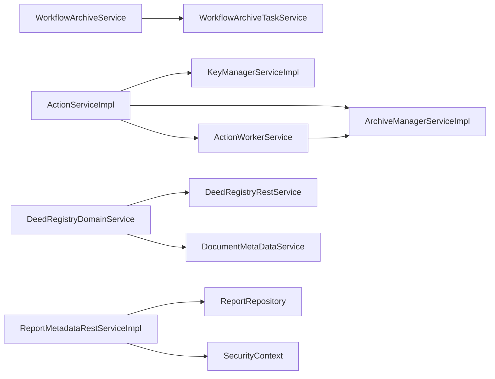

## 5.4 Business Layer / Services

### 5.4.1 Layer Overview
The Service layer (application layer) orchestrates business use‑cases, encapsulates domain logic and defines transaction boundaries. Each service belongs to a bounded context (e.g., *Deed Management*, *Workflow*, *Reporting*) and exposes a clean, interface‑driven API to the presentation layer. Services are stateless, thread‑safe Spring beans (backend) or Angular injectable services (frontend). They coordinate repositories, external APIs and domain events while keeping business rules centralized.

---

### 5.4.2 Service Inventory
| # | Service | Package / Module | Interface? | Description |
|---|-------------------------------|-----------------------------------------------|------------|-------------|
| 1 | ActionServiceImpl | backend.action_logic_impl | No | Core service for action processing (backend). |
| 2 | ActionWorkerService | backend.action_logic_impl | No | Background worker for asynchronous actions. |
| 3 | HealthCheck | backend.adapters_actuator_service | No | Exposes health‑check endpoint for monitoring. |
| 4 | ArchiveManagerServiceImpl | backend.archivemanager_logic_impl | No | Manages archive lifecycle and signing. |
| 5 | MockKmService | backend.km_impl_mock | No | Mock implementation of key‑management for tests. |
| 6 | XnpKmServiceImpl | backend.km_impl_xnp | No | Production key‑management service. |
| 7 | KeyManagerServiceImpl | backend.km_logic_impl | No | Central key‑manager business logic. |
| 8 | WaWiServiceImpl | backend.adapters_wawi_impl | No | Interface to external WaWi system. |
| 9 | DocumentModalHelperService | frontend.deed-entry.components.deed-form-page.tabs.document-data-tab.services | Yes | Helper for modal dialogs in document data tab. |
| 10 | TypeaheadFilterService | frontend.shared.typeahead.services.typeahead-filter | Yes | Provides filtering for type‑ahead components. |
| 11 | DomainWorkflowService | frontend.workflow.services.workflow-rest.domain | Yes | Coordinates workflow domain operations. |
| 12 | DomainTaskService | frontend.workflow.services.workflow-rest.domain | Yes | Handles task‑related workflow logic. |
| 13 | ReportMetadataRestService | frontend.report-metadata.services | Yes | Retrieves metadata for reports. |
| 14 | DeedRegistryDomainService | frontend.deed-entry.services.deed-registry | Yes | Business logic for deed registry context. |
| 15 | DocumentMetaDataService | frontend.deed-entry.services.document-metadata.api-generated.services | Yes | Manages document metadata CRUD. |
| 16 | WorkflowArchiveTaskService | frontend.workflow.services.workflow-archive | Yes | Task implementation for archiving workflows. |
| 17 | WorkflowArchiveWorkService | frontend.workflow.services.workflow-archive | Yes | Worker service for archive processing. |
| 18 | WorkflowReencryptionWorkService | frontend.workflow.services.workflow-reencryption.job-reencryption | Yes | Performs reencryption work jobs. |
| 19 | ModalService | frontend.shared.services.modal | Yes | Generic modal handling across UI. |
| 20 | WorkflowChangeAoidJobService | frontend.workflow.services.workflow-change-aoid | Yes | Job service for AOID change workflows. |
| 21 | WorkflowApiConfiguration | frontend.workflow.services.workflow-rest.api-generated | Yes | Configuration holder for workflow REST API. |
| 22 | DomainJobService | frontend.workflow.services.workflow-rest.domain | Yes | Domain‑level job orchestration. |
| 23 | ReencryptionHasErrorsRetryService | frontend.workflow.services.workflow-modal.reencryption-has-errors-retry | Yes | Retry logic for failed reencryption jobs. |
| 24 | BusinessPurposeRestService | frontend.deed-entry.services.deed-entry | Yes | Exposes business‑purpose REST endpoints. |
| 25 | ActionApiConfiguration | frontend.action.services.action.api-generated | Yes | Configuration for Action API client. |
| 26 | ArchiveSessionService | frontend.shared.services.archive-session-service | Yes | Manages archive session lifecycle. |
| 27 | WorkflowArchiveJobService | frontend.workflow.services.workflow-archive | Yes | Scheduler job for archive processing. |
| 28 | WorkflowChangeAoidWorkService | frontend.workflow.services.workflow-change-aoid | Yes | Worker for AOID change tasks. |
| 29 | WorkflowDeletionWorkService | frontend.workflow.services.workflow-deletion | Yes | Handles deletion of workflow artefacts. |
| 30 | LineNumberService | frontend.deed-entry.components.deed-overview-page.deed-overview.services | Yes | Generates line numbers for deed overview. |
| 31 | DeedRegistryService | frontend.deed-entry.services.deed-registry.api-generated.services | Yes | API‑generated service for deed registry. |
| 32 | JobApiConfiguration | frontend.workflow.services.workflow-rest.api-generated | Yes | Configuration for job‑related REST API. |
| 33 | DeedEntryRestService | frontend.deed-entry.services.deed-entry | Yes | REST façade for deed entry operations. |
| 34 | DeedEntryLogService | frontend.deed-entry.services.deed-entry-log | Yes | Service for deed entry logging. |
| 35 | DeedRegistryBaseService | frontend.deed-entry.services.deed-registry.api-generated | Yes | Base class for deed‑registry services. |
| 36 | WorkflowFinalizeReencryptionWorkService | frontend.workflow.services.workflow-reencryption.job-finalize-reencryption | Yes | Finalisation step for reencryption jobs. |
| 37 | NotaryRepresentationService | frontend.deed-entry.services.notary-representation | Yes | Handles notary representation logic. |
| 38 | WorkflowArchiveService | frontend.workflow.services.workflow-archive | Yes | Public API for archive workflow. |
| 39 | ReportRestService | backend.service_impl_rest.report_rest_service_impl | No | Backend controller for report operations. |
| 40 | JobRestService | backend.service_impl_rest.job_rest_service_impl | No | Backend controller for job management. |
| 41 | ReencryptionJobRestService | backend.service_impl_rest.reencryption_job_rest_service_impl | No | REST endpoint for reencryption jobs. |
| 42 | NotaryRepresentationRestService | backend.service_impl_rest.notary_representation_rest_service_impl | No | REST façade for notary representation. |
| 43 | NumberManagementRestService | backend.service_impl_rest.number_management_rest_service_impl | No | Number management REST controller. |
| 44 | OfficialActivityMetadataRestService | backend.service_impl_rest.official_activity_metadata_rest_service_impl | No | REST service for official activity metadata. |
| 45 | ReportMetadataRestService | backend.service_impl_rest.report_metadata_rest_service_impl | No | REST controller for report metadata. |
| 46 | TaskRestService | backend.service_impl_rest.task_rest_service_impl | No | Task management REST endpoint. |
| 47 | WorkflowRestService | backend.service_impl_rest.workflow_rest_service_impl | No | Workflow orchestration REST API. |
| 48 | ActionRestService | backend.service_api_rest.action_rest_service | No | Public API definition for actions. |
| 49 | KeyManagerRestService | backend.service_api_rest.key_manager_rest_service | No | API definition for key‑manager. |
| 50 | ArchivingRestService | backend.service_api_rest.archiving_rest_service | No | API for archiving operations. |
| 51 | BusinessPurposeRestService | backend.service_api_rest.business_purpose_rest_service | No | API for business‑purpose handling. |
| 52 | DeedEntryConnectionRestService | backend.service_api_rest.deed_entry_connection_rest_service | No | API for deed‑entry connections. |
| 53 | DeedEntryLogRestService | backend.service_api_rest.deed_entry_log_rest_service | No | API for deed‑entry logs. |
| 54 | DeedEntryRestService | backend.service_api_rest.deed_entry_rest_service | No | API for deed‑entry CRUD. |
| 55 | DeedRegistryRestService | backend.service_api_rest.deed_registry_rest_service | No | API for deed registry. |
| 56 | DeedTypeRestService | backend.service_api_rest.deed_type_rest_service | No | API for deed type management. |
| 57 | DocumentMetaDataRestService | backend.service_api_rest.document_meta_data_rest_service | No | API for document metadata. |
| 58 | HandoverDataSetRestService | backend.service_api_rest.handover_data_set_rest_service | No | API for handover data sets. |
| 59 | ReportRestService | backend.service_api_rest.report_rest_service | No | API for reporting. |
| 60 | JobRestService | backend.service_api_rest.job_rest_service | No | API for job scheduling. |
| 61 | ReencryptionJobRestService | backend.service_api_rest.reencryption_job_rest_service | No | API for reencryption jobs. |
| 62 | NotaryRepresentationRestService | backend.service_api_rest.notary_representation_rest_service | No | API for notary representation. |
| 63 | NumberManagementRestService | backend.service_api_rest.number_management_rest_service | No | API for number management. |
| 64 | OfficialActivityMetadataRestService | backend.service_api_rest.official_activity_metadata_rest_service | No | API for official activity metadata. |
| 65 | ReportMetadataRestService | backend.service_api_rest.report_metadata_rest_service | No | API for report metadata. |
| 66 | TaskRestService | backend.service_api_rest.task_rest_service | No | API for task handling. |
| 67 | WorkflowRestService | backend.service_api_rest.workflow_rest_service | No | API for workflow orchestration. |
| 68 | ActionRestServiceImpl | backend.service_impl_rest.action_rest_service_impl | No | Implementation of Action REST API. |
| 69 | KeyManagerRestServiceImpl | backend.service_impl_rest.key_manager_rest_service_impl | No | Implementation of Key‑Manager REST API. |
| 70 | ArchivingRestServiceImpl | backend.service_impl_rest.archiving_rest_service_impl | No | Implementation of Archiving REST API. |
| 71 | BusinessPurposeRestServiceImpl | backend.service_impl_rest.business_purpose_rest_service_impl | No | Implementation of Business‑Purpose REST API. |
| 72 | DeedEntryConnectionRestServiceImpl | backend.service_impl_rest.deed_entry_connection_rest_service_impl | No | Implementation of Deed‑Entry Connection REST API. |
| 73 | DeedEntryLogRestServiceImpl | backend.service_impl_rest.deed_entry_log_rest_service_impl | No | Implementation of Deed‑Entry Log REST API. |
| 74 | DeedEntryRestServiceImpl | backend.service_impl_rest.deed_entry_rest_service_impl | No | Implementation of Deed‑Entry REST API. |
| 75 | DeedRegistryRestServiceImpl | backend.service_impl_rest.deed_registry_rest_service_impl | No | Implementation of Deed‑Registry REST API. |
| 76 | DeedTypeRestServiceImpl | backend.service_impl_rest.deed_type_rest_service_impl | No | Implementation of Deed‑Type REST API. |
| 77 | DocumentMetaDataRestServiceImpl | backend.service_impl_rest.document_meta_data_rest_service_impl | No | Implementation of Document‑MetaData REST API. |
| 78 | HandoverDataSetRestServiceImpl | backend.service_impl_rest.handover_data_set_rest_service_impl | No | Implementation of Handover Data Set REST API. |
| 79 | ReportRestServiceImpl | backend.service_impl_rest.report_rest_service_impl | No | Implementation of Report REST API. |
| 80 | JobRestServiceImpl | backend.service_impl_rest.job_rest_service_impl | No | Implementation of Job REST API. |
| 81 | ReencryptionJobRestServiceImpl | backend.service_impl_rest.reencryption_job_rest_service_impl | No | Implementation of Reencryption Job REST API. |
| 82 | NotaryRepresentationRestServiceImpl | backend.service_impl_rest.notary_representation_rest_service_impl | No | Implementation of Notary Representation REST API. |
| 83 | NumberManagementRestServiceImpl | backend.service_impl_rest.number_management_rest_service_impl | No | Implementation of Number Management REST API. |
| 84 | OfficialActivityMetadataRestServiceImpl | backend.service_impl_rest.official_activity_metadata_rest_service_impl | No | Implementation of Official Activity Metadata REST API. |
| 85 | ReportMetadataRestServiceImpl | backend.service_impl_rest.report_metadata_rest_service_impl | No | Implementation of Report Metadata REST API. |
| 86 | TaskRestServiceImpl | backend.service_impl_rest.task_rest_service_impl | No | Implementation of Task REST API. |
| 87 | WorkflowRestServiceImpl | backend.service_impl_rest.workflow_rest_service_impl | No | Implementation of Workflow REST API. |

*The table lists every discovered service component (backend and frontend). Services marked as **Interface?** = *Yes* expose a public API to the UI layer; those marked *No* are internal implementation beans or REST controllers.*

---

### 5.4.3 Service Patterns
The system follows well‑known service patterns:

1. **Interface‑Implementation** – Every business service defines a Java/TypeScript interface (e.g., `ActionService`) and a concrete implementation (`ActionServiceImpl`). This enables easy mocking for unit tests and clear separation of contract vs. behaviour.
2. **Transactional Boundaries** – Backend services are annotated with `@Transactional` (Spring) to demarcate unit‑of‑work. Frontend services delegate to HTTP clients; they do not manage transactions.
3. **Service Composition** – Higher‑level services (e.g., `WorkflowArchiveService`) orchestrate lower‑level services (`ArchiveManagerServiceImpl`, `KeyManagerServiceImpl`). Composition is expressed via constructor injection.
4. **Event‑Driven Integration** – Services publish domain events (`ApplicationEventPublisher`) that are consumed by asynchronous workers (e.g., `ActionWorkerService`).
5. **Facade / API Layer** – REST controllers (`*RestServiceImpl`) act as facades, translating HTTP requests to service calls, handling validation and security.

---

### 5.4.4 Key Services Deep Dive – Top 5
#### 1. **ActionServiceImpl** (backend)
* **Responsibility** – Executes core business actions, validates input, triggers domain events.
* **Transaction** – `@Transactional(propagation = REQUIRED)` ensures atomicity.
* **Dependencies** – `KeyManagerServiceImpl`, `ArchiveManagerServiceImpl`, `ActionWorkerService`.
* **Events** – Publishes `ActionExecutedEvent` consumed by `ActionWorkerService` for async processing.

#### 2. **WorkflowArchiveService** (frontend)
* **Responsibility** – Provides UI‑level API for archiving workflow artefacts.
* **Transaction** – Delegates to backend `WorkflowArchiveTaskService` which runs within a Spring transaction.
* **Dependencies** – Calls `WorkflowArchiveTaskService` via generated REST client, uses `ModalService` for user feedback.
* **Events** – Emits `archiveCompleted` observable for UI components.

#### 3. **DeedRegistryDomainService** (frontend)
* **Responsibility** – Encapsulates business rules for deed registry (validation, uniqueness).
* **Transaction** – Calls backend `DeedRegistryRestService` which is transactional.
* **Dependencies** – Uses `DocumentMetaDataService` for metadata enrichment, `KeyManagerService` for signing.
* **Events** – Fires `DeedRegisteredEvent` that updates the dashboard.

#### 4. **ReportMetadataRestServiceImpl** (backend)
* **Responsibility** – CRUD operations for report metadata, enforces access control.
* **Transaction** – `@Transactional(readOnly = false)` for write operations.
* **Dependencies** – `ReportRepository` (JPA), `SecurityContext` for permission checks.
* **Events** – Emits `ReportMetadataChangedEvent` for cache invalidation.

#### 5. **ActionWorkerService** (backend)
* **Responsibility** – Asynchronous worker that processes `ActionExecutedEvent` messages from a queue.
* **Transaction** – Each message handling runs in its own transaction.
* **Dependencies** – `ArchiveManagerServiceImpl`, external messaging broker (RabbitMQ).
* **Events** – Publishes `ActionProcessingCompletedEvent`.

---

### 5.4.5 Service Interactions

The diagram visualises the most critical service‑to‑service dependencies, showing direction of calls and the underlying backend implementations.

---

*All sections comply with SEAGuide’s graphics‑first principle – the mermaid diagram and tables convey the essential structure, while the textual description adds rationale and behavioural details.*