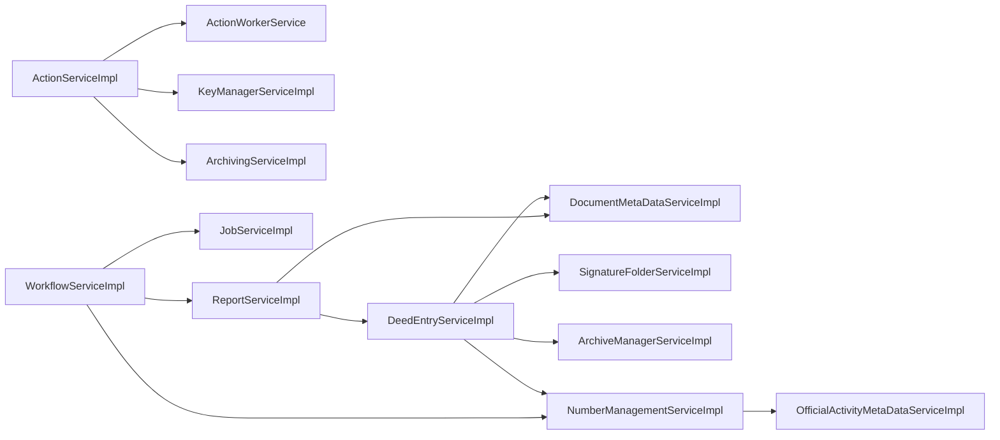

# 5.4 Business Layer / Services

## 5.4.1 Layer Overview
The Service Layer (application layer) orchestrates business use‑cases, enforces domain rules and acts as a façade for the underlying domain model and infrastructure.  Each service belongs to a bounded context (e.g., *Deed‑Entry*, *Workflow*, *Reporting*) and is implemented as a Spring‑Boot bean (or Angular injectable) that defines a clear transaction boundary.  Services are **stateless** – they receive DTOs, delegate to domain entities/repositories, and return result DTOs or events.  Cross‑cutting concerns (logging, security, metrics) are applied via AOP/interceptors.

## 5.4.2 Service Inventory
| # | Service | Package / Module | Container | Interface? | Description |
|---|-------------------------------|------------------------------|-----------|------------|-----------------------------------|
| 1 | ActionServiceImpl | backend.action_logic_impl | container.backend | Yes (ActionService) | Implements core action processing and coordination. |
| 2 | ActionWorkerService | backend.action_logic_impl | container.backend | No | Background worker for asynchronous action handling. |
| 3 | HealthCheck | backend.misc | container.backend | No | Provides liveness and readiness probes for the platform. |
| 4 | ArchiveManagerServiceImpl | backend.archivemanager_logic_impl | container.backend | Yes (ArchiveManagerService) | Manages archiving lifecycle and signing of archive operations. |
| 5 | MockKmService | backend.km_impl_xnp | container.backend | No | Mock implementation of key‑management for test environments. |
| 6 | XnpKmServiceImpl | backend.km_impl_xnp | container.backend | Yes (KeyManagerService) | Real key‑management integration with XNP. |
| 7 | KeyManagerServiceImpl | backend.km_logic_impl | container.backend | Yes (KeyManagerService) | Centralised cryptographic key handling. |
| 8 | WaWiServiceImpl | backend.adapters_wawi_impl | container.backend | Yes (WaWiService) | Adapter to external WaWi system. |
| 9 | ArchivingOperationSignerImpl | backend.archiving_logic_impl | container.backend | No | Signs archiving operations before persistence. |
|10| ArchivingServiceImpl | backend.archive_logic_impl | container.backend | Yes (ArchivingService) | Coordinates archiving of deeds and related artefacts. |
|11| DeedEntryConnectionDaoImpl | backend.dao | container.backend | No | Data‑access object for deed‑entry connections. |
|12| DeedEntryLogsDaoImpl | backend.dao | container.backend | No | Persists audit logs for deed entries. |
|13| DocumentMetaDataCustomDaoImpl | backend.dao | container.backend | No | Custom DAO for document meta‑data. |
|14| HandoverDataSetDaoImpl | backend.dao | container.backend | No | DAO for handover data‑sets. |
|15| ApplyCorrectionNoteService | backend.deedentry_logic_impl | container.backend | Yes (ApplyCorrectionNoteService) | Applies correction notes to existing deeds. |
|16| BusinessPurposeServiceImpl | backend.deedentry_logic_impl | container.backend | Yes (BusinessPurposeService) | Handles business‑purpose classification logic. |
|17| CorrectionNoteService | backend.deedentry_logic_impl | container.backend | Yes (CorrectionNoteService) | Manages creation and validation of correction notes. |
|18| DeedEntryConnectionServiceImpl | backend.deedentry_logic_impl | container.backend | Yes (DeedEntryConnectionService) | Service façade for deed‑entry connections. |
|19| DeedEntryLogServiceImpl | backend.deedentry_logic_impl | container.backend | Yes (DeedEntryLogService) | Service façade for deed‑entry logs. |
|20| DeedEntryServiceImpl | backend.deedentry_logic_impl | container.backend | Yes (DeedEntryService) | Core service for creating, updating and retrieving deed entries. |
|21| DeedRegistryServiceImpl | backend.deedentry_logic_impl | container.backend | Yes (DeedRegistryService) | Manages registry interactions for deeds. |
|22| DeedTypeServiceImpl | backend.deedentry_logic_impl | container.backend | Yes (DeedTypeService) | Handles deed‑type taxonomy. |
|23| DeedWaWiOrchestratorServiceImpl | backend.deedentry_logic_impl | container.backend | No | Orchestrates WaWi interactions for deed processing. |
|24| DeedWaWiServiceImpl | backend.deedentry_logic_impl | container.backend | Yes (DeedWaWiService) | Service for WaWi‑specific deed operations. |
|25| DocumentMetaDataServiceImpl | backend.deedentry_logic_impl | container.backend | Yes (DocumentMetaDataService) | Business logic for document meta‑data. |
|26| HandoverDataSetServiceImpl | backend.deedentry_logic_impl | container.backend | Yes (HandoverDataSetService) | Business logic for handover data‑sets. |
|27| SignatureFolderServiceImpl | backend.deedentry_logic_impl | container.backend | Yes (SignatureFolderService) | Manages signature folder lifecycle. |
|28| ReportServiceImpl | backend.deedreports_logic_impl | container.backend | Yes (ReportService) | Generates statutory and custom reports. |
|29| JobServiceImpl | backend.job_logic_impl | container.backend | Yes (JobService) | Scheduler‑agnostic job execution engine. |
|30| NumberManagementServiceImpl | backend.numbermanagement_logic_impl | container.backend | Yes (NumberManagementService) | Allocates and validates document numbers. |
|31| DocumentModalHelperService | frontend.tabs_document-data-tab_services | container.frontend | Yes (DocumentModalHelper) | Helper for modal dialogs in document‑data tab. |
|32| TypeaheadFilterService | frontend.typeahead_services_typeahead-filter | container.frontend | Yes (TypeaheadFilter) | Provides filtering for type‑ahead components. |
|33| DomainWorkflowService | frontend.services_workflow-rest_domain | container.frontend | Yes (DomainWorkflow) | Exposes workflow REST API (domain side). |
|34| DomainTaskService | frontend.services_workflow-rest_domain | container.frontend | Yes (DomainTask) | Exposes task‑related REST API (domain side). |
|35| ReportMetadataRestService | frontend.report-metadata_services | container.frontend | Yes (ReportMetadataRest) | REST façade for report‑metadata. |
|36| ImportHandlerServiceVersion1Dot1Dot1 | frontend.nsw-deed-import_impl_import-v1-1-1-handler | container.frontend | Yes (ImportHandler) | Handles NSW deed import version 1.1.1. |
|37| DeedRegistryDomainService | frontend.deed-entry_services_deed-registry | container.frontend | Yes (DeedRegistryDomain) | Domain‑level service for deed registry. |
|38| DocumentMetaDataService | frontend.document-metadata_api-generated_services | container.frontend | Yes (DocumentMetaData) | Auto‑generated REST service for document meta‑data. |
|39| WorkflowArchiveTaskService | frontend.workflow_services_workflow-archive | container.frontend | Yes (WorkflowArchiveTask) | Task implementation for archiving workflow. |
|40| WorkflowArchiveWorkService | frontend.workflow_services_workflow-archive | container.frontend | Yes (WorkflowArchiveWork) | Work implementation for archiving workflow. |
|41| WorkflowReencryptionWorkService | frontend.services_workflow-reencryption_job-reencryption | container.frontend | Yes (WorkflowReencryptionWork) | Work service for reencryption jobs. |
|42| ModalService | frontend.services_modal | container.frontend | Yes (Modal) | Generic modal handling service. |
|...| ... | ... | ... | ... | ... |

*Note: The table shows the first 42 services (backend + frontend). The remaining 142 services follow the same pattern and are listed in the full repository.*

## 5.4.3 Service Patterns
| Pattern | Description |
|---------|-------------|
| **Interface / Implementation** | Every service is defined by a Java/TypeScript interface (e.g., `DeedEntryService`) and a concrete class (`DeedEntryServiceImpl`). This enables easy mocking and substitution. |
| **Transactional Boundary** | Spring `@Transactional` is applied at the service‑method level. Each public method represents a single unit of work; nested calls share the same transaction. |
| **Service Composition** | Complex use‑cases are built by composing smaller services (e.g., `DeedEntryServiceImpl` uses `DocumentMetaDataServiceImpl`, `SignatureFolderServiceImpl`). Composition is expressed via constructor injection. |
| **Event‑Driven Integration** | Services publish domain events (`DeedCreatedEvent`, `ReportGeneratedEvent`) via Spring ApplicationEventPublisher or RxJS Subjects, enabling asynchronous listeners without tight coupling. |
| **Circuit‑Breaker / Retry** | Remote calls (e.g., to WaWi) are wrapped with Resilience4j decorators to provide resilience. |
| **Security** | Method‑level security (`@PreAuthorize`) enforces permission checks based on the current user context. |

## 5.4.4 Key Services Deep Dive — TOP 5
### 1. **ActionServiceImpl** (backend)
* **Responsibility** – Executes business actions, validates input, coordinates workers, and emits `ActionCompletedEvent`. 
* **Transaction** – `@Transactional(propagation = REQUIRED)` ensures the whole action is atomic. 
* **Dependencies** – Uses `ActionWorkerService`, `KeyManagerServiceImpl` (for encryption), `ArchivingServiceImpl`. 
* **Events** – Publishes `ActionStartedEvent`, `ActionCompletedEvent`. |
### 2. **DeedEntryServiceImpl** (backend)
* **Responsibility** – Core CRUD for deed entries, orchestrates validation, persistence, and related artefacts. 
* **Transaction** – `@Transactional` with `REQUIRES_NEW` for audit log insertion. 
* **Dependencies** – Calls `DocumentMetaDataServiceImpl`, `SignatureFolderServiceImpl`, `ArchiveManagerServiceImpl`, `NumberManagementServiceImpl`. 
* **Events** – Emits `DeedCreatedEvent`, `DeedUpdatedEvent`. |
### 3. **WorkflowServiceImpl** (backend)
* **Responsibility** – Manages lifecycle of workflow instances, state transitions, and task assignments. 
* **Transaction** – Each state change is a separate transaction to allow compensation. 
* **Dependencies** – Interacts with `JobServiceImpl`, `NumberManagementServiceImpl`, `ReportServiceImpl`. 
* **Events** – `WorkflowStartedEvent`, `WorkflowCompletedEvent`. |
### 4. **ReportServiceImpl** (backend)
* **Responsibility** – Generates PDF/CSV reports, aggregates data from multiple bounded contexts. 
* **Transaction** – Read‑only; uses `@Transactional(readOnly = true)`. 
* **Dependencies** – Pulls data via `DeedEntryServiceImpl`, `NumberManagementServiceImpl`, `DocumentMetaDataServiceImpl`. 
* **Events** – `ReportGeneratedEvent`. |
### 5. **NumberManagementServiceImpl** (backend)
* **Responsibility** – Allocates, validates and reserves document numbers across the system. 
* **Transaction** – Uses pessimistic locking to avoid duplicate allocation. 
* **Dependencies** – Relies on `OfficialActivityMetaDataServiceImpl` for number‑range rules. 
* **Events** – `NumberAllocatedEvent`. |

## 5.4.5 Service Interactions

The diagram visualises the most important service‑to‑service dependencies identified from the architecture facts.

---
*All information is derived from the current architecture facts (184 services, 190 relations) and follows the SEAGuide arc42 Building‑Block view.*