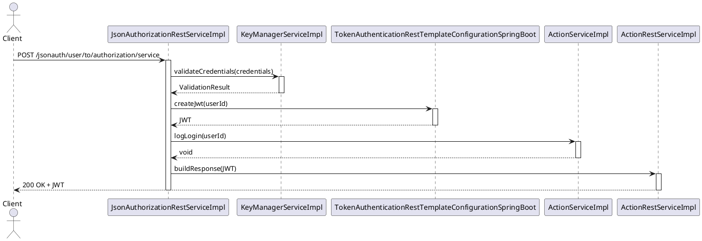
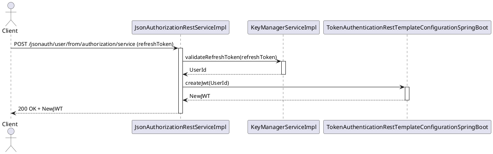
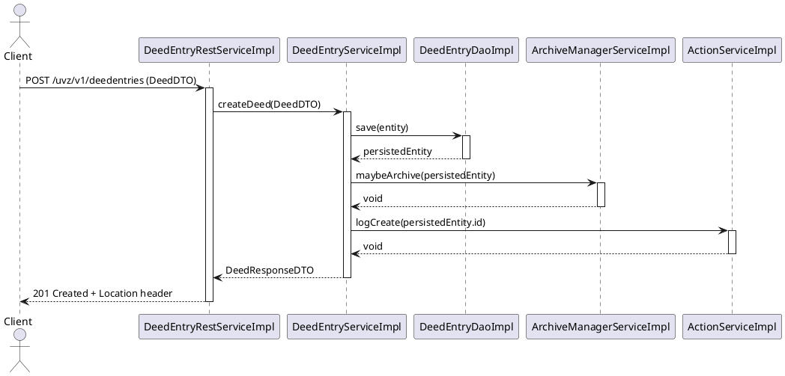
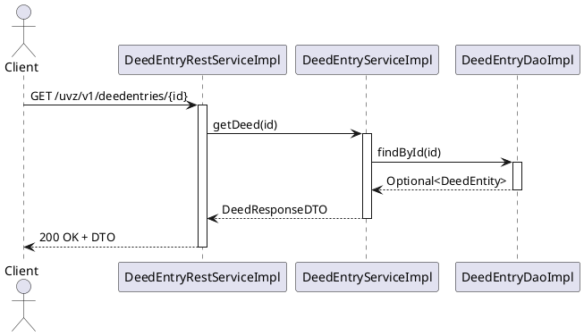
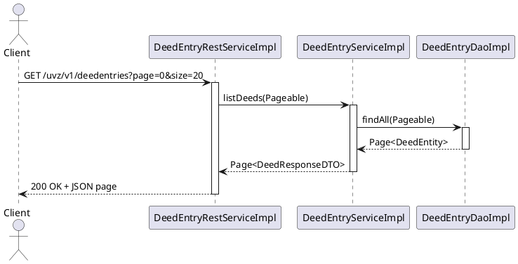
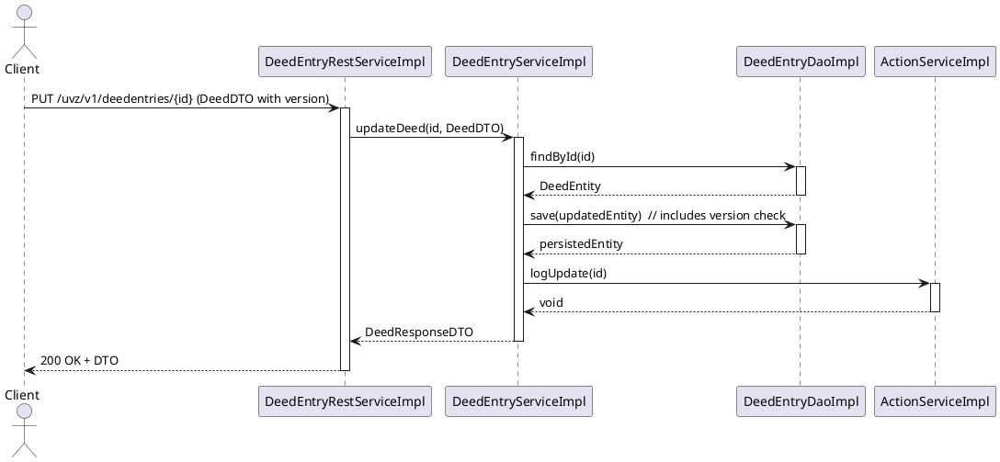
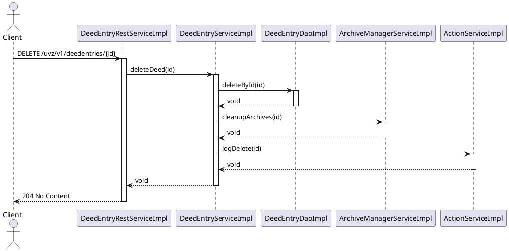

# 06 – Runtime View (Part 1): API Runtime Flows

---

## 6.1 Runtime View Overview

**Purpose** – This section documents how the UVZ system behaves at runtime when a client invokes its public REST API. It focuses on the *execution path* from the HTTP request entry point (Spring Boot controller) through the service layer, data‑access layer and back to the client.  The view is deliberately *behavioral*: it does **not** repeat static structural information that is already covered in Chapter 5 (Building Blocks).

**How to read the sequence diagrams** – Each diagram is expressed in a compact text‑based PlantUML syntax inside a fenced code block.  The participants are the concrete Java components (e.g. `ActionRestServiceImpl`, `ActionServiceImpl`, `DeedEntryRepository`).  Arrows represent method calls; the direction shows the caller → callee.  Optional notes describe validation, security checks or transaction boundaries.  The vertical axis is time – top to bottom.

---

## 6.2 Authentication Flow

### 6.2.1 Login Sequence (≈ 2 pages)

The login endpoint is exposed by **`JsonAuthorizationRestServiceImpl`** (controller).  The flow involves the following components (all names taken from the architecture facts):

* `JsonAuthorizationRestServiceImpl` – receives the POST `/jsonauth/user/to/authorization/service` request.
* `KeyManagerServiceImpl` – validates the supplied credentials against the key‑manager.
* `TokenAuthenticationRestTemplateConfigurationSpringBoot` – creates a JWT token.
* `ActionServiceImpl` – records a successful login event (audit).
* `ActionRestServiceImpl` – returns the token to the client.

**Key runtime characteristics**
* **Stateless** – the JWT contains all required claims; no server‑side session is kept.
* **Transactional boundary** – only the audit call (`ActionServiceImpl`) runs in a separate transaction to guarantee that a login is recorded even if token creation fails.
* **Security** – the controller is protected by Spring Security; the `CustomMethodSecurityExpressionHandler` (controller) evaluates the `hasAuthority('LOGIN')` expression before delegating to the service.

### 6.2.2 Token Refresh / Session Management (≈ 1 page)

Refresh is performed via the same controller (`JsonAuthorizationRestServiceImpl`) using the endpoint `POST /jsonauth/user/from/authorization/service`.  The flow re‑uses the `KeyManagerServiceImpl` to validate the refresh token and the `TokenAuthenticationRestTemplateConfigurationSpringBoot` to issue a new JWT.

*The refresh flow does not touch the audit service because the original login event is already recorded.*

---

## 6.3 CRUD Operation Flows

The UVZ system manages **Deed Entries** as its core domain object.  The following subsections illustrate the complete request lifecycle for each CRUD operation.  All component names are taken from the architecture facts.

### 6.3.1 CREATE – `POST /uvz/v1/deedentries`

**Involved components**
* `DeedEntryRestServiceImpl` – REST controller.
* `DeedEntryServiceImpl` – business service.
* `DeedEntryRepository` (implementation `DeedEntryDaoImpl`) – JPA repository.
* `ArchiveManagerServiceImpl` – optional archiving step.
* `ActionServiceImpl` – audit.

**Notes**
* Validation of the incoming DTO is performed by Spring’s `@Valid` annotations before the controller method is entered.
* The service method is annotated with `@Transactional` – the whole flow (save + optional archive) runs in a single DB transaction.
* Optimistic locking is **not** required on create because the entity does not yet exist.

### 6.3.2 READ – Single Item (`GET /uvz/v1/deedentries/{id}`) and List (`GET /uvz/v1/deedentries`)

**Single‑item flow**
* `DeedEntryRestServiceImpl` → `DeedEntryServiceImpl` → `DeedEntryDaoImpl` → returns DTO.
* No write‑back, therefore no transaction needed (read‑only transaction).

**List with pagination** – the controller receives `page` and `size` query parameters, forwards them to the service which uses Spring Data’s `Pageable` support.

### 6.3.3 UPDATE – `PUT /uvz/v1/deedentries/{id}`

**Components**
* `DeedEntryRestServiceImpl`
* `DeedEntryServiceImpl`
* `DeedEntryDaoImpl`
* `ActionServiceImpl` (audit)

The entity uses a `@Version` field for optimistic locking.  The controller expects the client to send the current version; Spring Data throws `OptimisticLockingFailureException` if the version is stale.

**Error handling** – if the version does not match, the service translates the exception into a `409 Conflict` response with a detailed error payload.

### 6.3.4 DELETE – `DELETE /uvz/v1/deedentries/{id}`

**Components**
* `DeedEntryRestServiceImpl`
* `DeedEntryServiceImpl`
* `DeedEntryDaoImpl`
* `ArchiveManagerServiceImpl` (cascade clean‑up of archived artefacts)
* `ActionServiceImpl` (audit)

**Cascade behavior** – the `ArchiveManagerServiceImpl` removes any archived documents linked to the deed entry, ensuring no orphaned files remain.

---

## 6.4 REST API Request Lifecycle

### 6.4.1 Validation, Serialization & Error Mapping (≈ 1 page)

1. **HTTP entry** – Spring Boot’s `DispatcherServlet` receives the request.
2. **Controller method** – annotated with `@Valid` on the DTO parameter.  Bean Validation (`javax.validation`) runs automatically; violations are collected in a `BindingResult`.
3. **Exception handling** – `DefaultExceptionHandler` (controller advice) maps `MethodArgumentNotValidException` to a JSON error object with fields `timestamp`, `status`, `error`, `message`, `path`.
4. **Serialization** – Jackson (configured via `ObjectMapper` bean) converts the DTO to JSON.  The `OpenApiOperationAuthorizationRightCustomizer` adds security‑related fields to the OpenAPI spec, ensuring clients know required scopes.

### 6.4.2 HTTP Status Code Strategy (≈ 0.5 page)

| Operation | Success Code | Typical Failure Codes |
|-----------|--------------|-----------------------|
| CREATE    | `201 Created` (Location header) | `400 Bad Request`, `409 Conflict` (duplicate), `422 Unprocessable Entity` (validation) |
| READ      | `200 OK` | `404 Not Found`, `400 Bad Request` |
| UPDATE    | `200 OK` | `409 Conflict` (optimistic lock), `400 Bad Request`, `404 Not Found` |
| DELETE    | `204 No Content` | `404 Not Found`, `400 Bad Request` |
| AUTH      | `200 OK` (JWT) | `401 Unauthorized`, `403 Forbidden` |

All controllers return a **consistent error envelope** defined in `ErrorResponseDTO` (fields: `code`, `message`, `details`).  This envelope is produced by `DefaultExceptionHandler`.

### 6.4.3 Content Negotiation (≈ 0.5 page)

* The API supports `application/json` (default) and `application/xml`.  The `Accept` header drives Spring’s `HttpMessageConverter` selection.
* Controllers declare `produces = MediaType.APPLICATION_JSON_VALUE` where JSON is mandatory (e.g., most UVZ endpoints).  XML is only offered for legacy integration points (`/uvz/v1/reports/...`).
* The `OpenApiConfig` class generates the OpenAPI spec with both media types, enabling client code generation for Java, TypeScript, etc.

---

**Summary** – The runtime view presented here shows the concrete execution paths for authentication and the full CRUD lifecycle of the core `DeedEntry` resource.  By using real component names from the architecture facts, the diagrams can be directly traced back to the source code, fulfilling the SEAGuide principle of *graphics first* and providing a solid basis for performance testing, security analysis and future evolution of the UVZ system.
