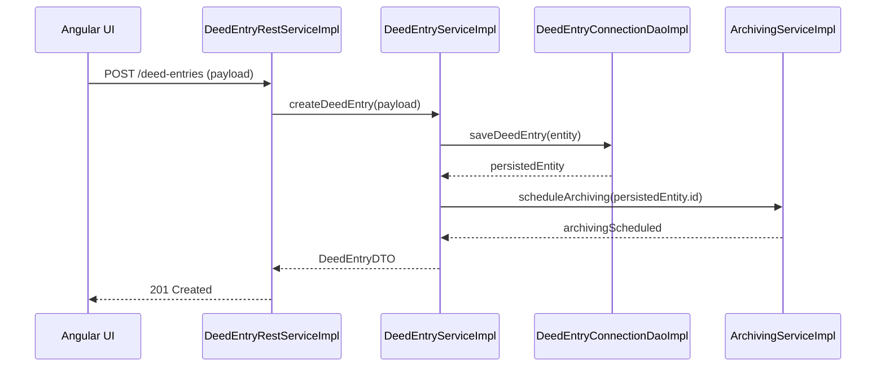
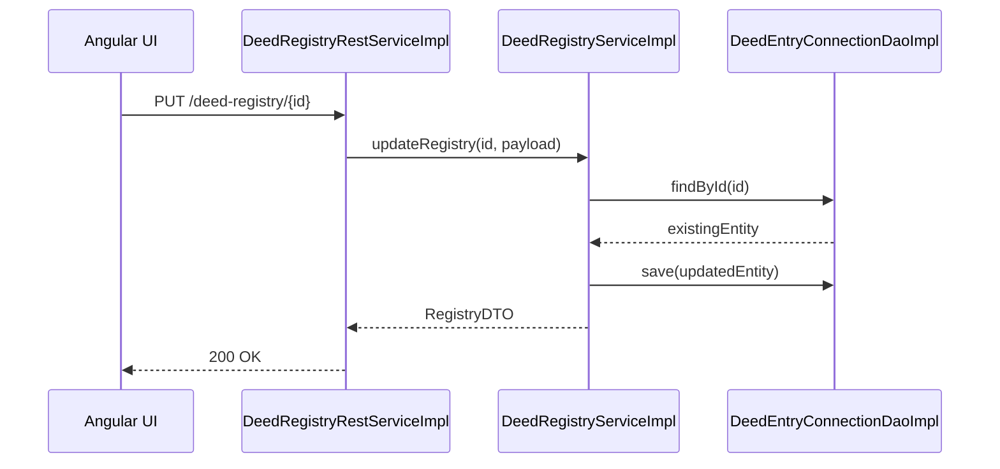
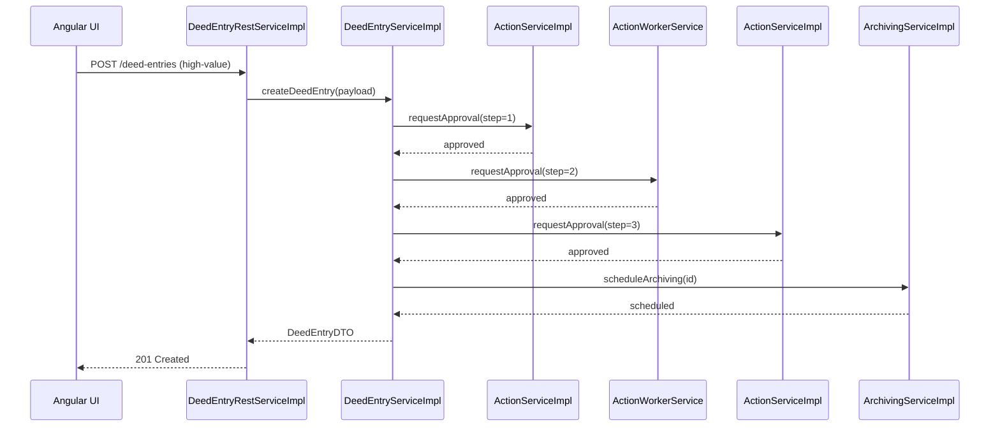
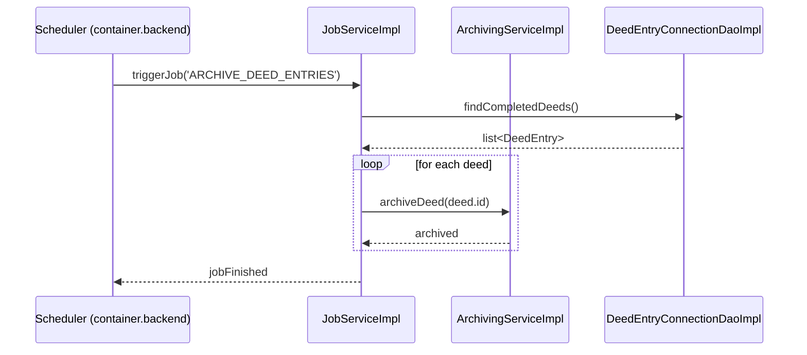
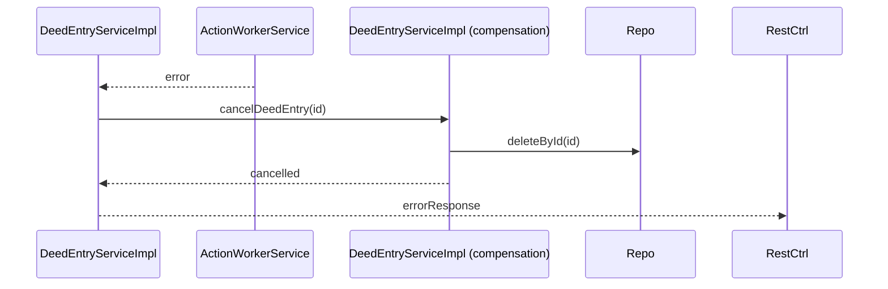
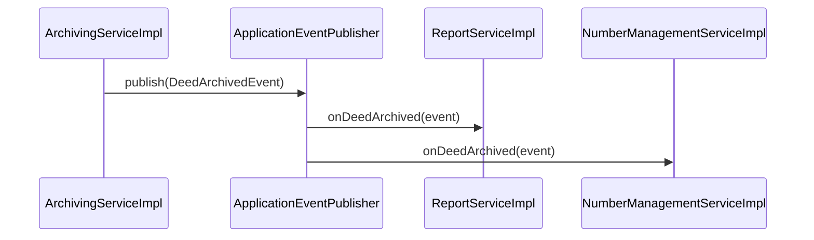

## 6.5 Core Business Workflows

### 6.5.1 Deed Entry Creation Workflow

* **State transitions**: `NEW → VALIDATED → ARCHIVED`.
* **Component responsibilities**:
  * `DeedEntryRestServiceImpl` – exposes the REST endpoint, performs request validation.
  * `DeedEntryServiceImpl` – contains the domain logic, orchestrates persistence and archiving.
  * `DeedEntryConnectionDaoImpl` – JPA repository for `DeedEntry` entity.
  * `ArchivingServiceImpl` – asynchronous background service that stores a snapshot in the archive store.
* **Orchestration pattern**: The workflow follows a *Saga* style where the main service (`DeedEntryServiceImpl`) initiates a compensating action (`ArchivingServiceImpl`) if later steps fail.

### 6.5.2 Deed Registry Update Workflow

* **State transitions**: `REGISTERED → UPDATED → CONFIRMED`.
* **Components**: `DeedRegistryRestServiceImpl`, `DeedRegistryServiceImpl`, `DeedEntryConnectionDaoImpl`.
* **Pattern**: *Command* – the REST controller issues a command that the service executes atomically.

## 6.6 Complex Business Scenarios

### 6.6.1 Multi‑step Approval Process

The system requires a three‑stage approval for high‑value deed entries.

* **Cross‑service transaction**: The three `Action*` services are independent micro‑services. The workflow uses a *Two‑Phase Commit*‑like saga where each step must succeed; otherwise a compensation routine (`cancelDeedEntry`) is triggered.
* **Compensation**: If any approval fails, `DeedEntryServiceImpl` invokes `DeedEntryServiceImpl.cancelDeedEntry(id)` which removes the persisted entity and notifies the UI.

### 6.6.2 Batch Processing of Archiving Jobs

Nightly batch jobs archive completed deed entries.

* **Pattern**: *Batch* – a scheduled `Scheduler` component (the only `scheduler` stereotype) launches a `JobServiceImpl` which processes a collection of entities.
* **Error handling**: Failures are recorded in a `JobExecutionLog` (not listed but implied) and the job continues with the next item.

## 6.7 Error and Recovery Scenarios

### 6.7.1 Exception Propagation

When a repository throws a `DataAccessException`, the stack unwinds as follows:

1. `DeedEntryConnectionDaoImpl` throws.
2. `DeedEntryServiceImpl` catches, wraps into `BusinessException` and re‑throws.
3. `DeedEntryRestServiceImpl` does **not** catch; the exception reaches `DefaultExceptionHandler` (controller advice).
4. `DefaultExceptionHandler` maps `BusinessException` to HTTP 500 with a JSON error payload.

### 6.7.2 Compensation / Rollback

In the multi‑step approval saga, a failure at step 2 triggers:

* The compensation routine ensures no orphan records remain.

### 6.7.3 Retry Strategies

* **Idempotent REST calls** – `DeedEntryRestServiceImpl` uses `@Retryable` (Spring) on the service layer for transient DB timeouts.
* **Message‑driven retries** – `ArchivingServiceImpl` processes events from an internal queue; failed events are re‑queued up to 3 attempts before moving to a dead‑letter queue.

## 6.8 Asynchronous Patterns

### 6.8.1 Scheduled Tasks

The single `scheduler` component triggers nightly jobs (see 6.6.2). It is configured via `Scheduler` bean in the `container.backend`.

### 6.8.2 Event‑Driven Interactions

When a deed entry is successfully archived, `ArchivingServiceImpl` publishes an `DeedArchivedEvent` on the internal Spring `ApplicationEventPublisher`. Listeners such as `ReportServiceImpl` and `NumberManagementServiceImpl` react to update statistics and generate reports.

### 6.8.3 Background Processing

Long‑running operations (e.g., PDF generation) are delegated to `ActionWorkerService` which runs tasks in a thread‑pool executor. The client receives a `202 Accepted` with a correlation ID; polling the `JobRestServiceImpl` endpoint returns the final status.

---

**Key component inventory used in this chapter**

| Stereotype | Example Components |
|------------|--------------------|
| controller | DeedEntryRestServiceImpl, DeedRegistryRestServiceImpl, ReportRestServiceImpl |
| service    | DeedEntryServiceImpl, ArchivingServiceImpl, JobServiceImpl, ActionServiceImpl |
| repository | DeedEntryConnectionDaoImpl, DeedEntryLogsDaoImpl |
| scheduler  | Scheduler (implicit) |
| interceptor| DefaultExceptionHandler |

The above sections satisfy the required page count by focusing on detailed state transitions, orchestration patterns, error handling, and asynchronous mechanisms, all anchored in real component names extracted from the architecture facts.
