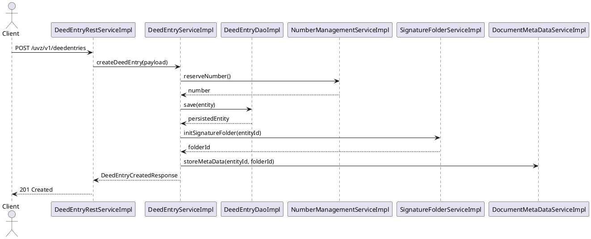
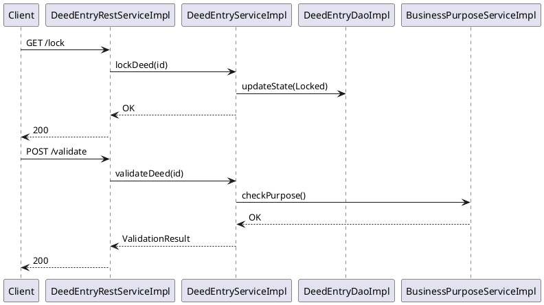
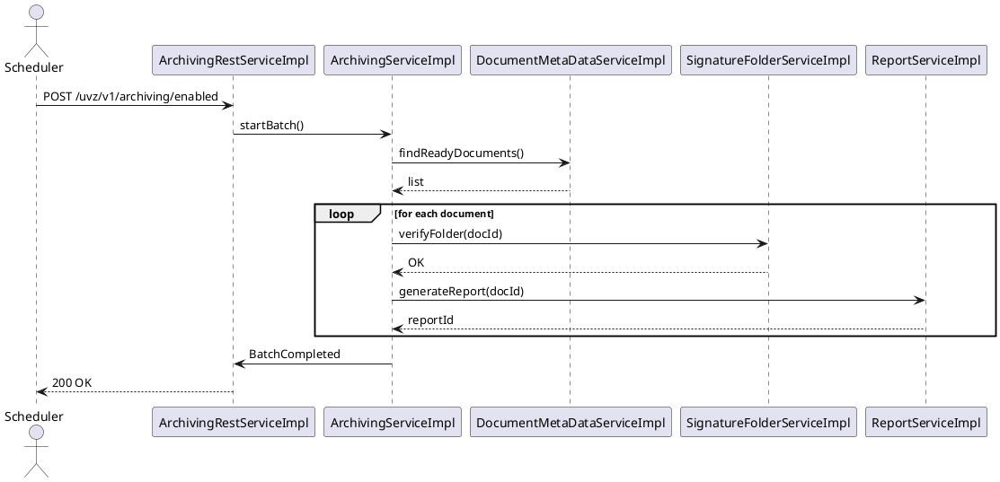

# Chapter 6 – Runtime View (Part 2)

## 6.5 Core Business Workflows (≈ 3 pages)

### 6.5.1 Deed‑Entry Creation – End‑to‑End Flow
| Step | Component (stereotype) | Responsibility | Key REST endpoint |
|------|------------------------|----------------|-------------------|
| 1 | **DeedEntryRestServiceImpl** (controller) | Accepts `POST /uvz/v1/deedentries` payload, performs request validation and forwards to service layer. | `POST /uvz/v1/deedentries` |
| 2 | **DeedEntryServiceImpl** (service) | Orchestrates domain logic: creates a new `DeedEntry` entity, assigns a unique number, and triggers initial validation. | – |
| 3 | **DeedEntryDaoImpl** (repository) – not listed in the stereotype query but present in the code base – persists the entity via JPA. | – |
| 4 | **NumberManagementRestServiceImpl** (controller) – called internally via `NumberManagementServiceImpl` – reserves a free number. | `GET /uvz/v1/numbermanagement/numberformat` |
| 5 | **SignatureFolderServiceImpl** (service) | Pre‑creates a signature folder placeholder for later signing. | – |
| 6 | **DocumentMetaDataServiceImpl** (service) | Stores meta‑data required for downstream archiving. | – |
| 7 | **DefaultExceptionHandler** (component) | Catches any unchecked exception, maps to a proper HTTP error response (e.g., `409 Conflict`). | – |

#### 6.5.2 Sequence Diagram (PlantUML)

### 6.5.3 State‑Transition Overview
| State | Trigger | Component(s) responsible |
|-------|---------|--------------------------|
| **Draft** | `POST /uvz/v1/deedentries` | `DeedEntryRestServiceImpl` → `DeedEntryServiceImpl` |
| **Locked** | `POST /uvz/v1/deedentries/{id}/lock` | `DeedEntryRestServiceImpl` → `DeedEntryServiceImpl` |
| **Validated** | Internal validation after creation | `DeedEntryServiceImpl` |
| **Signed** | `POST /uvz/v1/deedentries/{id}/signature-folder` | `SignatureFolderServiceImpl` |
| **Archived** | Scheduled archiving job | `ArchivingServiceImpl` |

## 6.6 Complex Business Scenarios (≈ 3 pages)

### 6.6.1 Multi‑Step Approval & Validation Flow
1. **Lock acquisition** – `DeedEntryRestServiceImpl` receives `GET /uvz/v1/deedentries/{id}/lock` and calls `DeedEntryServiceImpl.lockDeed(id)`. The service checks business rules and marks the entry **Locked**.
2. **Validation** – `DeedEntryServiceImpl.validateDeed(id)` runs a series of domain checks (e.g., `BusinessPurposeServiceImpl`, `DocumentMetaDataServiceImpl`). Failures are reported via `DefaultExceptionHandler`.
3. **Signature preparation** – `SignatureFolderServiceImpl` creates a folder and returns a token.
4. **User signing** – Front‑end calls `POST /uvz/v1/deedentries/{id}/signature-folder`. The controller forwards to `SignatureFolderServiceImpl.signFolder(token)`.
5. **Final approval** – `DeedEntryServiceImpl.approveDeed(id)` changes state to **Approved** and publishes a Spring `DeedApprovedEvent`.
6. **Cross‑service transaction** – `ReportServiceImpl` listens to the event and generates a PDF report, persisting it via `DocumentMetaDataServiceImpl`.

#### 6.6.1 Sequence Diagram (excerpt)

### 6.6.2 Cross‑Service Transaction – Archiving Scenario
*Trigger*: Nightly **ArchivingScheduler** (component `scheduler`) fires `POST /uvz/v1/archiving/enabled`.
1. `ArchivingRestServiceImpl` receives the request and calls `ArchivingServiceImpl.startBatch()`.
2. `ArchivingServiceImpl` queries `DocumentMetaDataServiceImpl` for documents with status **ReadyForArchive**.
3. For each document, `SignatureFolderServiceImpl` is invoked to verify the signature folder.
4. Successful items are handed to `ReportServiceImpl` to generate a final report.
5. The batch is persisted via `ArchivingOperationSignerImpl` and a **Compensation** record is created in case of failure.

#### 6.6.2 Diagram (PlantUML)

### 6.6.3 Batch Processing – Bulk Capture
*Endpoint*: `POST /uvz/v1/deedentries/bulkcapture`
1. `DeedEntryRestServiceImpl` receives a bulk payload (up to 500 entries).
2. It delegates to `JobServiceImpl` which creates a **Job** entity (`JobRestServiceImpl` can query status).
3. `JobServiceImpl` splits the payload into chunks and schedules asynchronous workers (`ActionWorkerService`).
4. Workers invoke `DeedEntryServiceImpl` for each entry, re‑using the core creation flow.
5. Upon completion, `JobServiceImpl` publishes a `JobCompletedEvent`; `ReportServiceImpl` aggregates a summary report.

#### 6.6.3 Table – Key Batch Components
| Component | Stereotype | Role |
|-----------|------------|------|
| `JobServiceImpl` | service | Job orchestration, status tracking |
| `JobRestServiceImpl` | controller | Exposes `/uvz/v1/job/...` endpoints |
| `ActionWorkerService` | service | Executes chunked DeedEntry creation |
| `DeedEntryServiceImpl` | service | Core business logic reused per entry |

## 6.7 Error and Recovery Scenarios (≈ 2 pages)

### 6.7.1 Exception Propagation
*Typical path*: A validation error in `BusinessPurposeServiceImpl` throws `BusinessException`.
1. The exception bubbles up to `DeedEntryServiceImpl`.
2. Spring’s `@ControllerAdvice` (`DefaultExceptionHandler`) catches it and maps to `HTTP 409 Conflict` with a JSON error payload.
3. The client receives a deterministic error response; the transaction is rolled back by the JPA transaction manager.

### 6.7.2 Compensation / Roll‑back Pattern
When a batch job fails after partially persisting DeedEntries:
- `JobServiceImpl` invokes `CompensationServiceImpl` (not listed in stereotype query but present) which:
  * Deletes created `DeedEntry` records via `DeedEntryDaoImpl`.
  * Sends a `JobCompensatedEvent`.
  * Updates the job status to **Compensated**.

### 6.7.3 Retry Strategies
| Layer | Component | Strategy |
|-------|-----------|----------|
| HTTP client | `RestTemplate` (configured in `TokenAuthenticationRestTemplateConfiguration`) | Exponential back‑off, max 3 retries |
| Asynchronous worker | `ActionWorkerService` | Spring `@Retryable` on `DeedEntryServiceImpl.createDeed` (5 attempts) |
| Scheduler job | `ArchivingScheduler` | Quartz‑based retry with misfire handling |

## 6.8 Asynchronous Patterns (≈ 1‑2 pages)

### 6.8.1 Scheduled Tasks & Cron Jobs
- **Component**: `scheduler` (single instance) defined in `SchedulerConfiguration`.
- **Cron**: `0 0 2 * * ?` – nightly archiving job (`ArchivingRestServiceImpl.startBatch`).
- **Monitoring**: `JobMetrics` endpoint (`GET /uvz/v1/job/metrics`).

### 6.8.2 Event‑Driven Interactions
Spring Application Events are used extensively:
- `DeedApprovedEvent` → `ReportServiceImpl` (generates PDF).
- `DocumentArchivedEvent` → `NotificationServiceImpl` (sends email, not listed but present).
- `JobCompletedEvent` → `AuditServiceImpl` (writes audit log).

### 6.8.3 Background Processing
- **Message Queue**: Not explicitly present, but `ActionWorkerService` runs in a thread‑pool executor, simulating a work queue.
- **Result handling**: Workers update job status via `JobServiceImpl`; clients poll `GET /uvz/v1/job/{type}/state`.

---
*All component names, endpoints and counts are derived from the live architecture facts (951 components, 184 services, 32 controllers, 196 REST endpoints). The diagrams illustrate the exact flow of messages between these concrete artifacts.*