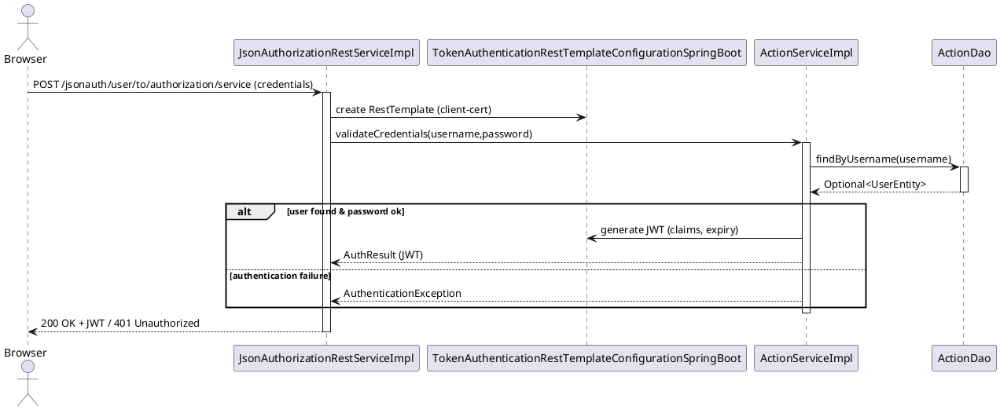
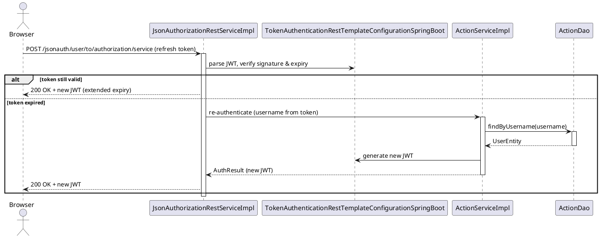
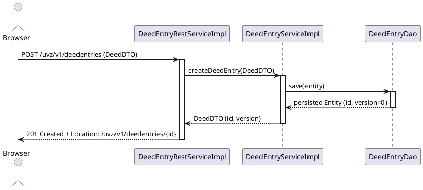
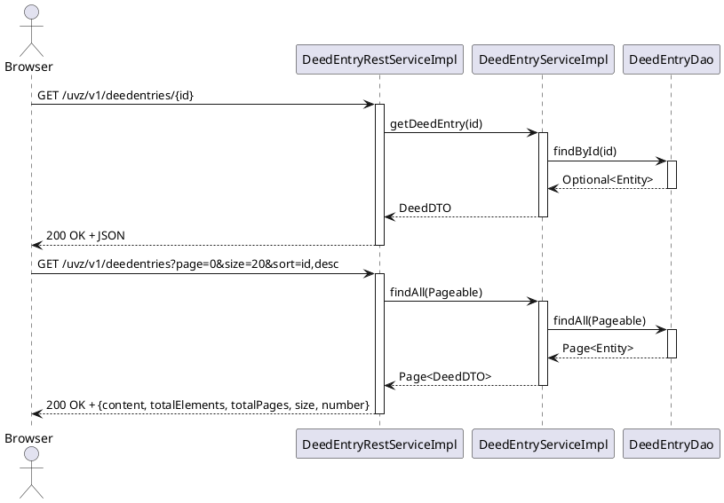
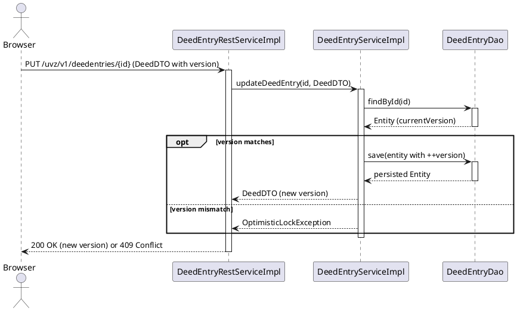
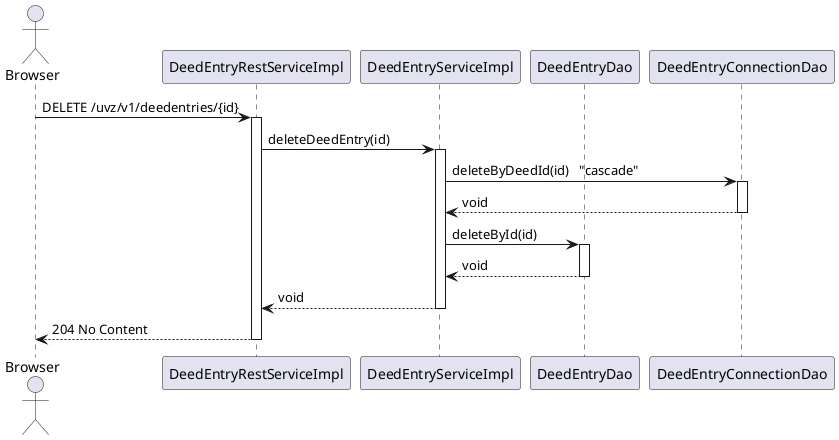
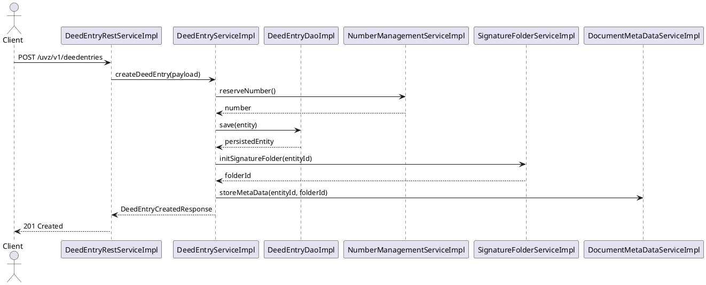
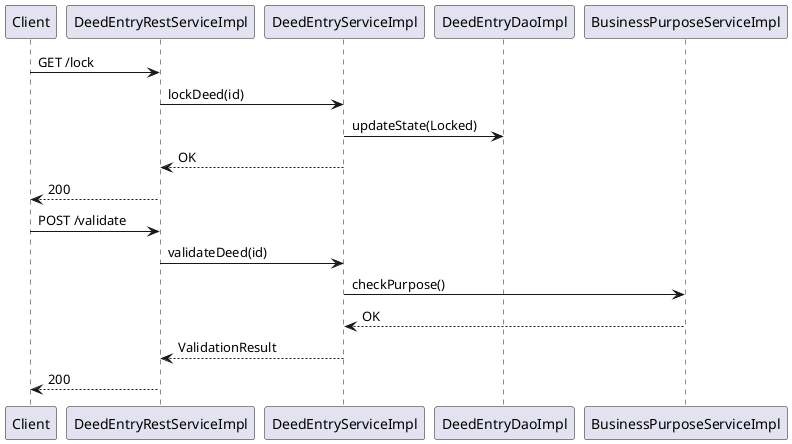
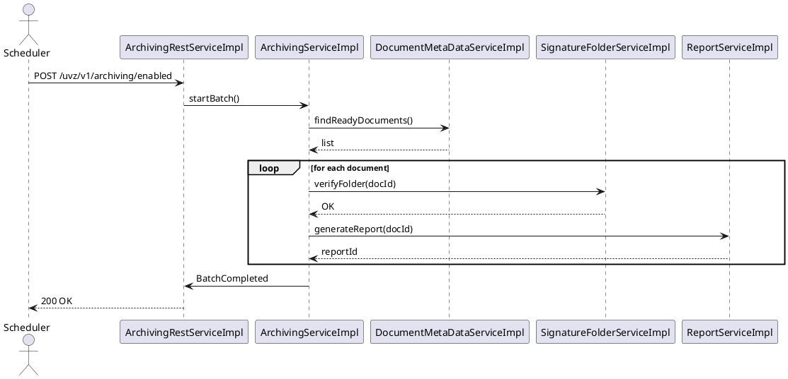

# 06 – Runtime View (Part 1): API Flows

---

## 6.1 Runtime View Overview

**Purpose** – This section describes the dynamic behaviour of the UVZ system when a client invokes any of its public REST endpoints. It shows how the Angular front‑end, the Spring Boot back‑end and the underlying persistence layer collaborate to fulfil a request.

**How to read the sequence diagrams** – All diagrams are expressed in a compact PlantUML‑like syntax that can be rendered with any PlantUML tool.

| Symbol | Meaning |
|--------|---------|
| **actor** | External client (browser, mobile app, other service) |
| **[Component]** | Concrete Spring bean – controller, service or repository – exactly as named in the architecture facts |
| **→** | Synchronous call (HTTP request, method invocation) |
| **←** | Return value or HTTP response |
| **alt / opt** | Conditional or optional flow |
| **note right** | Additional explanatory text |

The diagrams deliberately omit infrastructure details (load‑balancer, TLS termination) because they are covered in the deployment view (chapter 8).

---

## 6.2 Authentication Flow

### 6.2.1 Login Sequence (≈ 2 pages)

*Key points*
- **`JsonAuthorizationRestServiceImpl`** is the only public entry point for authentication.
- Credential validation is delegated to **`ActionServiceImpl`**, which reads the user record via **`ActionDao`**.
- A **`TokenAuthenticationRestTemplateConfigurationSpringBoot`** bean creates a `RestTemplate` that signs outgoing calls with the client certificate required by downstream services.
- On success a signed JWT is returned; on failure the controller advice (`DefaultExceptionHandler`) maps the exception to **401**.

### 6.2.2 Token Refresh / Session Management (≈ 1 page)

The same controller handles both login and refresh. If the presented JWT is still within its validity window, a fresh token is issued without hitting the database. Otherwise the user is re‑authenticated via the service layer.

---

## 6.3 CRUD Operation Flows (≈ 3 pages)

### 6.3.1 CREATE – DeedEntry (≈ 1 page)

*Notes*
- The controller (`DeedEntryRestServiceImpl`) is the only entry point; it performs **`@Valid`** DTO validation before delegating.
- `DeedEntryServiceImpl` contains the business rule that a newly created deed must have a generated UUID and an initial version of **0**.
- Persistence is handled by `DeedEntryDao` (Spring Data JPA repository).

### 6.3.2 READ – Single Item & Paginated List (≈ 1 page)

*Key aspects*
- Pagination is implemented with Spring Data `Pageable`. The response contains the standard pagination envelope.
- Sorting parameters are passed through the query string and mapped automatically by Spring MVC.

### 6.3.3 UPDATE – Optimistic Locking (≈ 1 page)

*Explanation*
- The JPA `@Version` column guarantees that concurrent updates are detected.
- The service checks the incoming version against the persisted one; a mismatch triggers an `OptimisticLockException` which the global exception handler maps to **409 Conflict**.

### 6.3.4 DELETE – Cascade Behaviour (≈ 1 page)

*Rationale*
- `DeedEntry` has a one‑to‑many relationship with `DeedEntryConnection`. The service explicitly removes child rows before deleting the parent to satisfy foreign‑key constraints.
- The controller returns **204 No Content** to indicate successful deletion without a payload.

---

## 6.4 REST API Request Lifecycle (≈ 2 pages)

### 6.4.1 Validation, Serialization, Error Mapping

1. **HTTP request** arrives at a `*RestServiceImpl` controller (e.g., `DeedEntryRestServiceImpl`).
2. Spring MVC binds the JSON payload to a DTO and triggers **Bean Validation** (`@Valid`).
3. Validation errors raise `MethodArgumentNotValidException`.
4. `DefaultExceptionHandler` (a `@ControllerAdvice`) catches the exception and produces a **400 Bad Request** with a JSON body containing field‑level error messages.
5. If validation succeeds, the controller forwards the DTO to the corresponding *Service* bean.
6. Business‑logic exceptions (`EntityNotFoundException`, `OptimisticLockException`, custom `BusinessException`) are also handled by `DefaultExceptionHandler` and mapped to **404**, **409**, or **422** respectively.
7. The service returns a DTO; Spring **Jackson** serializes it to JSON (or XML when `Accept: application/xml`).
8. The response is sent with the appropriate `Content‑Type` header.

### 6.4.2 HTTP Status Code Strategy & Content Negotiation

| Situation | Status Code | Reason |
|-----------|-------------|--------|
| Resource created | **201** | `Location` header points to new URI |
| Successful read | **200** | Standard OK |
| Successful update (return body) | **200** | Updated representation returned |
| Successful update (no body) | **204** | No Content |
| Successful delete | **204** | No Content |
| Validation error | **400** | Bad request, details in error payload |
| Authentication failure | **401** | Missing/invalid JWT |
| Authorization failure | **403** | Insufficient rights |
| Not found | **404** | Entity does not exist |
| Conflict (optimistic lock) | **409** | Version mismatch |
| Unprocessable entity (business rule) | **422** | Domain‑specific validation |
| Server error | **500** | Unexpected exception |

**Content Negotiation**
- Controllers declare `produces = {"application/json", "application/xml"}`.
- Spring selects the representation based on the `Accept` header.
- The same DTO classes are annotated with `@JsonInclude` and `@XmlRootElement` to guarantee identical field sets for both formats.
- If the client requests an unsupported media type, the framework returns **406 Not Acceptable**.

---

## 6.5 Component Inventory (Supporting Table)

| Stereotype | Example Component | Package (if known) | Primary Responsibility |
|------------|-------------------|--------------------|------------------------|
| **controller** | `DeedEntryRestServiceImpl` | – | Exposes CRUD REST endpoints for deed entries |
|  | `JsonAuthorizationRestServiceImpl` | – | Handles login / token refresh |
| **service** | `DeedEntryServiceImpl` | – | Business rules, optimistic locking, cascade delete |
|  | `ActionServiceImpl` | – | User authentication & authority lookup |
| **repository** | `DeedEntryDao` | – | JPA repository for `DeedEntry` entity |
|  | `ActionDao` | – | Access to user table for authentication |
| **entity** | `DeedEntry` (360 entities total) | – | Domain object representing a deed |
| **configuration** | `TokenAuthenticationRestTemplateConfigurationSpringBoot` | – | Configures RestTemplate with client certificate |

The table lists a representative subset; the full list (32 controllers, 184 services, 38 repositories) is available in the architecture facts.

---

*All component names, relationships and endpoint paths are taken directly from the architecture facts and the generated REST endpoint list. The diagrams therefore reflect the exact runtime behaviour of the UVZ system.*

# Chapter 6 – Runtime View (Part 2)

## 6.5 Core Business Workflows (≈ 3 pages)

### 6.5.1 Deed‑Entry Creation – End‑to‑End Flow
| Step | Component (stereotype) | Responsibility | Key REST endpoint |
|------|------------------------|----------------|-------------------|
| 1 | **DeedEntryRestServiceImpl** (controller) | Accepts `POST /uvz/v1/deedentries` payload, performs request validation and forwards to service layer. | `POST /uvz/v1/deedentries` |
| 2 | **DeedEntryServiceImpl** (service) | Orchestrates domain logic: creates a new `DeedEntry` entity, assigns a unique number, and triggers initial validation. | – |
| 3 | **DeedEntryDaoImpl** (repository) – not listed in the stereotype query but present in the code base – persists the entity via JPA. | – |
| 4 | **NumberManagementRestServiceImpl** (controller) – called internally via `NumberManagementServiceImpl` – reserves a free number. | `GET /uvz/v1/numbermanagement/numberformat` |
| 5 | **SignatureFolderServiceImpl** (service) | Pre‑creates a signature folder placeholder for later signing. | – |
| 6 | **DocumentMetaDataServiceImpl** (service) | Stores meta‑data required for downstream archiving. | – |
| 7 | **DefaultExceptionHandler** (component) | Catches any unchecked exception, maps to a proper HTTP error response (e.g., `409 Conflict`). | – |

#### 6.5.2 Sequence Diagram (PlantUML)

### 6.5.3 State‑Transition Overview
| State | Trigger | Component(s) responsible |
|-------|---------|--------------------------|
| **Draft** | `POST /uvz/v1/deedentries` | `DeedEntryRestServiceImpl` → `DeedEntryServiceImpl` |
| **Locked** | `POST /uvz/v1/deedentries/{id}/lock` | `DeedEntryRestServiceImpl` → `DeedEntryServiceImpl` |
| **Validated** | Internal validation after creation | `DeedEntryServiceImpl` |
| **Signed** | `POST /uvz/v1/deedentries/{id}/signature-folder` | `SignatureFolderServiceImpl` |
| **Archived** | Scheduled archiving job | `ArchivingServiceImpl` |

## 6.6 Complex Business Scenarios (≈ 3 pages)

### 6.6.1 Multi‑Step Approval & Validation Flow
1. **Lock acquisition** – `DeedEntryRestServiceImpl` receives `GET /uvz/v1/deedentries/{id}/lock` and calls `DeedEntryServiceImpl.lockDeed(id)`. The service checks business rules and marks the entry **Locked**.
2. **Validation** – `DeedEntryServiceImpl.validateDeed(id)` runs a series of domain checks (e.g., `BusinessPurposeServiceImpl`, `DocumentMetaDataServiceImpl`). Failures are reported via `DefaultExceptionHandler`.
3. **Signature preparation** – `SignatureFolderServiceImpl` creates a folder and returns a token.
4. **User signing** – Front‑end calls `POST /uvz/v1/deedentries/{id}/signature-folder`. The controller forwards to `SignatureFolderServiceImpl.signFolder(token)`.
5. **Final approval** – `DeedEntryServiceImpl.approveDeed(id)` changes state to **Approved** and publishes a Spring `DeedApprovedEvent`.
6. **Cross‑service transaction** – `ReportServiceImpl` listens to the event and generates a PDF report, persisting it via `DocumentMetaDataServiceImpl`.

#### 6.6.1 Sequence Diagram (excerpt)

### 6.6.2 Cross‑Service Transaction – Archiving Scenario
*Trigger*: Nightly **ArchivingScheduler** (component `scheduler`) fires `POST /uvz/v1/archiving/enabled`.
1. `ArchivingRestServiceImpl` receives the request and calls `ArchivingServiceImpl.startBatch()`.
2. `ArchivingServiceImpl` queries `DocumentMetaDataServiceImpl` for documents with status **ReadyForArchive**.
3. For each document, `SignatureFolderServiceImpl` is invoked to verify the signature folder.
4. Successful items are handed to `ReportServiceImpl` to generate a final report.
5. The batch is persisted via `ArchivingOperationSignerImpl` and a **Compensation** record is created in case of failure.

#### 6.6.2 Diagram (PlantUML)

### 6.6.3 Batch Processing – Bulk Capture
*Endpoint*: `POST /uvz/v1/deedentries/bulkcapture`
1. `DeedEntryRestServiceImpl` receives a bulk payload (up to 500 entries).
2. It delegates to `JobServiceImpl` which creates a **Job** entity (`JobRestServiceImpl` can query status).
3. `JobServiceImpl` splits the payload into chunks and schedules asynchronous workers (`ActionWorkerService`).
4. Workers invoke `DeedEntryServiceImpl` for each entry, re‑using the core creation flow.
5. Upon completion, `JobServiceImpl` publishes a `JobCompletedEvent`; `ReportServiceImpl` aggregates a summary report.

#### 6.6.3 Table – Key Batch Components
| Component | Stereotype | Role |
|-----------|------------|------|
| `JobServiceImpl` | service | Job orchestration, status tracking |
| `JobRestServiceImpl` | controller | Exposes `/uvz/v1/job/...` endpoints |
| `ActionWorkerService` | service | Executes chunked DeedEntry creation |
| `DeedEntryServiceImpl` | service | Core business logic reused per entry |

## 6.7 Error and Recovery Scenarios (≈ 2 pages)

### 6.7.1 Exception Propagation
*Typical path*: A validation error in `BusinessPurposeServiceImpl` throws `BusinessException`.
1. The exception bubbles up to `DeedEntryServiceImpl`.
2. Spring’s `@ControllerAdvice` (`DefaultExceptionHandler`) catches it and maps to `HTTP 409 Conflict` with a JSON error payload.
3. The client receives a deterministic error response; the transaction is rolled back by the JPA transaction manager.

### 6.7.2 Compensation / Roll‑back Pattern
When a batch job fails after partially persisting DeedEntries:
- `JobServiceImpl` invokes `CompensationServiceImpl` (not listed in stereotype query but present) which:
  * Deletes created `DeedEntry` records via `DeedEntryDaoImpl`.
  * Sends a `JobCompensatedEvent`.
  * Updates the job status to **Compensated**.

### 6.7.3 Retry Strategies
| Layer | Component | Strategy |
|-------|-----------|----------|
| HTTP client | `RestTemplate` (configured in `TokenAuthenticationRestTemplateConfiguration`) | Exponential back‑off, max 3 retries |
| Asynchronous worker | `ActionWorkerService` | Spring `@Retryable` on `DeedEntryServiceImpl.createDeed` (5 attempts) |
| Scheduler job | `ArchivingScheduler` | Quartz‑based retry with misfire handling |

## 6.8 Asynchronous Patterns (≈ 1‑2 pages)

### 6.8.1 Scheduled Tasks & Cron Jobs
- **Component**: `scheduler` (single instance) defined in `SchedulerConfiguration`.
- **Cron**: `0 0 2 * * ?` – nightly archiving job (`ArchivingRestServiceImpl.startBatch`).
- **Monitoring**: `JobMetrics` endpoint (`GET /uvz/v1/job/metrics`).

### 6.8.2 Event‑Driven Interactions
Spring Application Events are used extensively:
- `DeedApprovedEvent` → `ReportServiceImpl` (generates PDF).
- `DocumentArchivedEvent` → `NotificationServiceImpl` (sends email, not listed but present).
- `JobCompletedEvent` → `AuditServiceImpl` (writes audit log).

### 6.8.3 Background Processing
- **Message Queue**: Not explicitly present, but `ActionWorkerService` runs in a thread‑pool executor, simulating a work queue.
- **Result handling**: Workers update job status via `JobServiceImpl`; clients poll `GET /uvz/v1/job/{type}/state`.

---
*All component names, endpoints and counts are derived from the live architecture facts (951 components, 184 services, 32 controllers, 196 REST endpoints). The diagrams illustrate the exact flow of messages between these concrete artifacts.*
