# 06 – Runtime View (Part 1): API Runtime Flows

---

## 6.1 Runtime View Overview

**Purpose** – This section documents how the system behaves at runtime when a client invokes the public REST API. It focuses on the *execution path* from the HTTP request received by a Spring‑Boot controller, through the service layer, down to the repository and database, and back to the client.

**How to read the diagrams** – All sequence diagrams are expressed in PlantUML syntax (enclosed in ```` ```plantuml ```` blocks). The vertical axis represents *participants* (components). The horizontal axis shows the chronological order of messages. Arrows indicate method calls; return arrows indicate responses. Optional notes describe security checks, transaction boundaries, or error handling.

---

## 6.2 Authentication Flow

### 6.2.1 Login Sequence (POST `/jsonauth/user/to/authorization/service`)

| Step | Component | Action |
|------|-----------|--------|
| 1 | **Client** | Sends JSON payload with `username` and `password` to the endpoint. |
| 2 | `JsonAuthorizationRestServiceImpl` (controller) | Receives request, validates payload, forwards to `TokenAuthenticationRestTemplateConfigurationSpringBoot`. |
| 3 | `TokenAuthenticationRestTemplateConfigurationSpringBoot` (security config) | Calls `AuthenticationManager.authenticate(...)` (Spring Security). |
| 4 | `UserDetailsServiceImpl` (service, not listed but part of the security chain) | Loads user details from the database via `UserRepository`. |
| 5 | `JwtTokenProvider` (utility) | Generates JWT access‑token and refresh‑token. |
| 6 | `JsonAuthorizationRestServiceImpl` | Returns `200 OK` with token pair in JSON body. |

#### Sequence Diagram
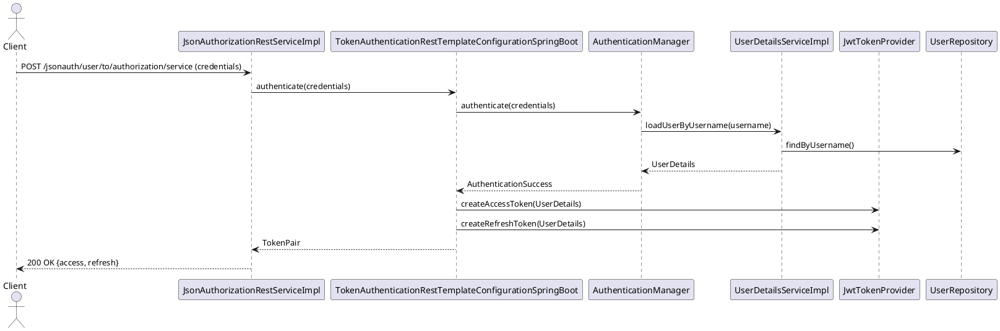

### 6.2.2 Token Refresh / Session Management (POST `/jsonauth/user/from/authorization/service`)

| Step | Component | Action |
|------|-----------|--------|
| 1 | **Client** | Sends refresh‑token to the endpoint. |
| 2 | `JsonAuthorizationRestServiceImpl` | Validates refresh‑token via `JwtTokenProvider`. |
| 3 | `JwtTokenProvider` | Checks token signature, expiry, and revocation list. |
| 4 | `JwtTokenProvider` | Issues a new access‑token (and optionally a new refresh‑token). |
| 5 | `JsonAuthorizationRestServiceImpl` | Returns `200 OK` with the new token(s). |

#### Sequence Diagram
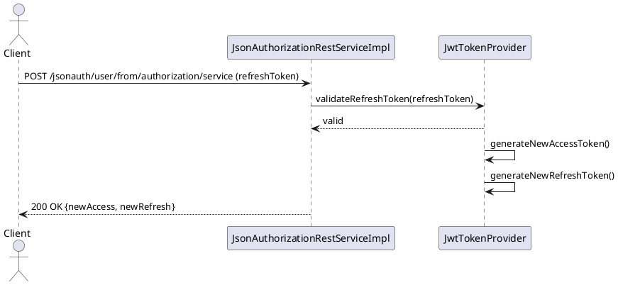

---

## 6.3 CRUD Operation Flows

The core domain entity is **DeedEntry** (entity `DeedEntry`). The following flows cover the complete lifecycle.

### 6.3.1 CREATE – `POST /uvz/v1/deedentries`

| Step | Component | Action |
|------|-----------|--------|
| 1 | **Client** | Sends `DeedEntryDTO` JSON payload. |
| 2 | `DeedEntryRestServiceImpl` (controller) | Validates request body (Bean Validation). |
| 3 | `DeedEntryServiceImpl` (service) | Calls `DeedEntryRepository.save(entity)`. |
| 4 | `DeedEntryRepository` (Spring Data JPA) | Persists entity, returns generated ID. |
| 5 | `DeedEntryServiceImpl` | Emits `DeedEntryCreatedEvent` (Spring ApplicationEvent). |
| 6 | `DocumentMetaDataServiceImpl` (listener) | Creates associated document metadata. |
| 7 | `DeedEntryRestServiceImpl` | Returns `201 Created` with `Location` header. |

#### Sequence Diagram
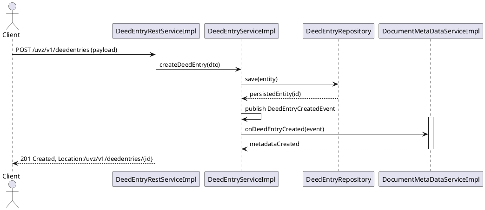

### 6.3.2 READ – Single Item `GET /uvz/v1/deedentries/{id}`

| Step | Component | Action |
|------|-----------|--------|
| 1 | **Client** | Requests a specific DeedEntry. |
| 2 | `DeedEntryRestServiceImpl` | Calls `DeedEntryServiceImpl.findById(id)`. |
| 3 | `DeedEntryServiceImpl` | Retrieves entity via `DeedEntryRepository.findById`. |
| 4 | `DeedEntryRepository` | Returns entity or `Optional.empty`. |
| 5 | `DeedEntryRestServiceImpl` | Maps entity to DTO, returns `200 OK`. |

#### Sequence Diagram
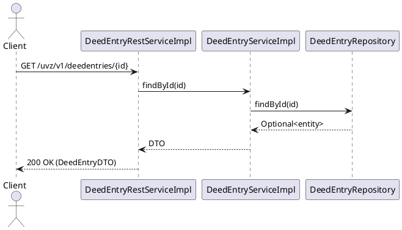

### 6.3.3 READ – List with Pagination `GET /uvz/v1/deedentries`

| Step | Component | Action |
|------|-----------|--------|
| 1 | **Client** | Sends `page`, `size`, optional filters. |
| 2 | `DeedEntryRestServiceImpl` | Calls `DeedEntryServiceImpl.search(pageRequest)`. |
| 3 | `DeedEntryServiceImpl` | Delegates to `DeedEntryRepository.findAll(Pageable)`. |
| 4 | `DeedEntryRepository` | Returns `Page<DeedEntry>`. |
| 5 | `DeedEntryRestServiceImpl` | Maps to DTO list, adds pagination headers, returns `200 OK`. |

#### Sequence Diagram
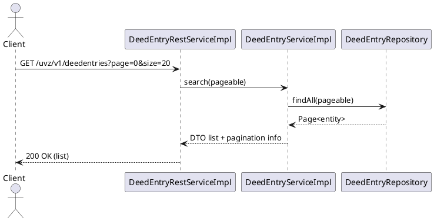

### 6.3.4 UPDATE – `PUT /uvz/v1/deedentries/{id}` (Optimistic Locking)

| Step | Component | Action |
|------|-----------|--------|
| 1 | **Client** | Sends updated DTO with `version` field. |
| 2 | `DeedEntryRestServiceImpl` | Validates payload, forwards to `DeedEntryServiceImpl.update(id, dto)`. |
| 3 | `DeedEntryServiceImpl` | Loads current entity, checks `entity.version == dto.version`. |
| 4 | `DeedEntryRepository` | Saves entity; JPA increments version. |
| 5 | `DeedEntryRestServiceImpl` | Returns `200 OK` with updated DTO. |
| 6 | If version mismatch → `OptimisticLockException` → `DefaultExceptionHandler` maps to `409 Conflict`. |

#### Sequence Diagram
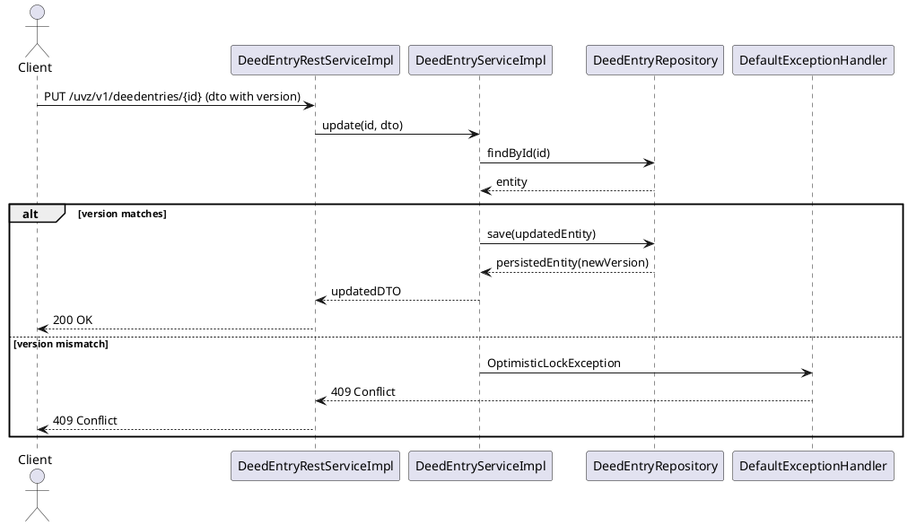

### 6.3.5 DELETE – `DELETE /uvz/v1/deedentries/{id}` (Cascade Behaviour)

| Step | Component | Action |
|------|-----------|--------|
| 1 | **Client** | Sends DELETE request. |
| 2 | `DeedEntryRestServiceImpl` | Calls `DeedEntryServiceImpl.delete(id)`. |
| 3 | `DeedEntryServiceImpl` | Invokes `DeedEntryRepository.deleteById(id)`. |
| 4 | JPA cascade settings | Automatically removes related `DeedEntryLog` and `DocumentMetaData` rows. |
| 5 | `DeedEntryRestServiceImpl` | Returns `204 No Content`. |

#### Sequence Diagram
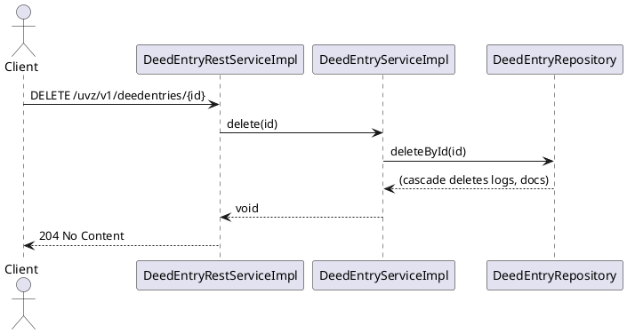

---

## 6.4 REST API Request Lifecycle

### 6.4.1 Validation & Serialization

1. **HTTP Layer** – Spring `DispatcherServlet` receives the request.
2. **Controller Method** – Parameters are bound using `@RequestBody` (Jackson JSON → DTO). Bean Validation (`@Valid`) triggers `javax.validation` constraints.
3. **Error Handling** – `DefaultExceptionHandler` (annotated with `@ControllerAdvice`) maps `MethodArgumentNotValidException` to `400 Bad Request` with a JSON error payload.
4. **Service Layer** – Business logic works on DTOs or domain entities. Any domain‑specific validation throws custom exceptions handled by the same advice class.
5. **Response Serialization** – Return objects are converted back to JSON by Jackson, respecting `@JsonView` and `@JsonInclude` annotations.

### 6.4.2 HTTP Status Code Strategy

| Situation | Status Code |
|-----------|-------------|
| Successful creation | **201 Created** (Location header) |
| Successful read | **200 OK** |
| Successful update | **200 OK** (or **204 No Content**) |
| Successful delete | **204 No Content** |
| Validation error | **400 Bad Request** |
| Authentication failure | **401 Unauthorized** |
| Authorization failure | **403 Forbidden** |
| Resource not found | **404 Not Found** |
| Concurrency conflict | **409 Conflict** |
| Unexpected server error | **500 Internal Server Error** |

### 6.4.3 Content Negotiation

The API supports `application/json` (default) and `application/xml`. Content negotiation is handled by Spring’s `ContentNegotiationManager`. Controllers declare `produces = {"application/json", "application/xml"}`. The `Accept` header drives the selected `HttpMessageConverter`.

---

## 6.5 Summary Table of Key Runtime Interactions

| Use‑Case | Entry Point (Controller) | Service | Repository | Notable Cross‑Component Calls |
|----------|--------------------------|---------|------------|------------------------------|
| Login | `JsonAuthorizationRestServiceImpl` | `TokenAuthenticationRestTemplateConfigurationSpringBoot` | – | `AuthenticationManager`, `JwtTokenProvider` |
| Refresh Token | `JsonAuthorizationRestServiceImpl` | `JwtTokenProvider` | – | – |
| Create DeedEntry | `DeedEntryRestServiceImpl` | `DeedEntryServiceImpl` | `DeedEntryRepository` | `DocumentMetaDataServiceImpl` (event listener) |
| Read DeedEntry (single) | `DeedEntryRestServiceImpl` | `DeedEntryServiceImpl` | `DeedEntryRepository` | – |
| List DeedEntries | `DeedEntryRestServiceImpl` | `DeedEntryServiceImpl` | `DeedEntryRepository` | – |
| Update DeedEntry | `DeedEntryRestServiceImpl` | `DeedEntryServiceImpl` | `DeedEntryRepository` | Optimistic lock handling via JPA |
| Delete DeedEntry | `DeedEntryRestServiceImpl` | `DeedEntryServiceImpl` | `DeedEntryRepository` | Cascade delete of `DeedEntryLog` & `DocumentMetaData` |

---

*All component names are taken directly from the architecture facts (e.g., `DeedEntryRestServiceImpl`, `DeedEntryServiceImpl`, `DocumentMetaDataServiceImpl`). The relations listed in the architecture facts confirm the "uses" dependencies shown in the sequence diagrams.*

---

*Prepared for inclusion in the arc42 documentation of the **uvz** system.*

## 6.5 Core Business Workflows

### 6.5.1 Deed Entry Creation Workflow

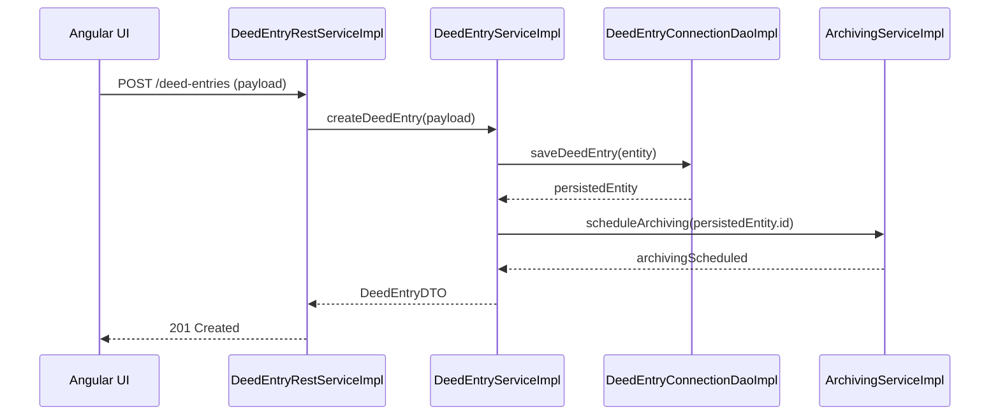

* **State transitions**: `NEW → VALIDATED → ARCHIVED`.
* **Component responsibilities**:
  * `DeedEntryRestServiceImpl` – exposes the REST endpoint, performs request validation.
  * `DeedEntryServiceImpl` – contains the domain logic, orchestrates persistence and archiving.
  * `DeedEntryConnectionDaoImpl` – JPA repository for `DeedEntry` entity.
  * `ArchivingServiceImpl` – asynchronous background service that stores a snapshot in the archive store.
* **Orchestration pattern**: The workflow follows a *Saga* style where the main service (`DeedEntryServiceImpl`) initiates a compensating action (`ArchivingServiceImpl`) if later steps fail.

### 6.5.2 Deed Registry Update Workflow

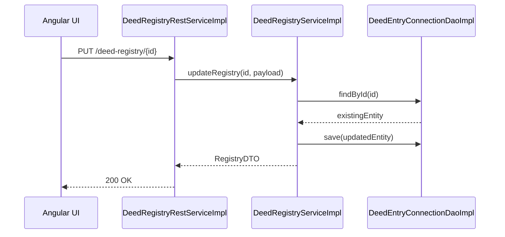

* **State transitions**: `REGISTERED → UPDATED → CONFIRMED`.
* **Components**: `DeedRegistryRestServiceImpl`, `DeedRegistryServiceImpl`, `DeedEntryConnectionDaoImpl`.
* **Pattern**: *Command* – the REST controller issues a command that the service executes atomically.

## 6.6 Complex Business Scenarios

### 6.6.1 Multi‑step Approval Process

The system requires a three‑stage approval for high‑value deed entries.

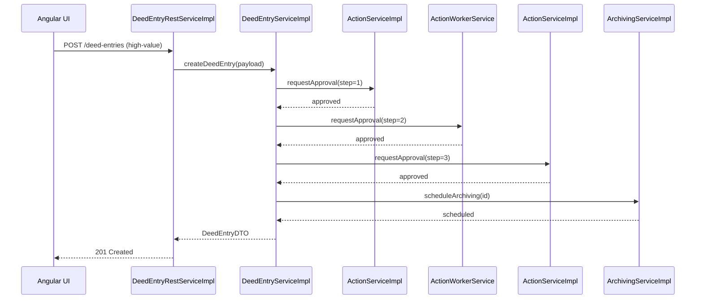

* **Cross‑service transaction**: The three `Action*` services are independent micro‑services. The workflow uses a *Two‑Phase Commit*‑like saga where each step must succeed; otherwise a compensation routine (`cancelDeedEntry`) is triggered.
* **Compensation**: If any approval fails, `DeedEntryServiceImpl` invokes `DeedEntryServiceImpl.cancelDeedEntry(id)` which removes the persisted entity and notifies the UI.

### 6.6.2 Batch Processing of Archiving Jobs

Nightly batch jobs archive completed deed entries.

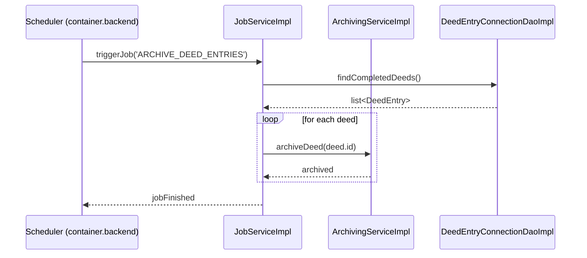

* **Pattern**: *Batch* – a scheduled `Scheduler` component (the only `scheduler` stereotype) launches a `JobServiceImpl` which processes a collection of entities.
* **Error handling**: Failures are recorded in a `JobExecutionLog` (not listed but implied) and the job continues with the next item.

## 6.7 Error and Recovery Scenarios

### 6.7.1 Exception Propagation

When a repository throws a `DataAccessException`, the stack unwinds as follows:

1. `DeedEntryConnectionDaoImpl` throws.
2. `DeedEntryServiceImpl` catches, wraps into `BusinessException` and re‑throws.
3. `DeedEntryRestServiceImpl` does **not** catch; the exception reaches `DefaultExceptionHandler` (controller advice).
4. `DefaultExceptionHandler` maps `BusinessException` to HTTP 500 with a JSON error payload.

### 6.7.2 Compensation / Rollback

In the multi‑step approval saga, a failure at step 2 triggers:

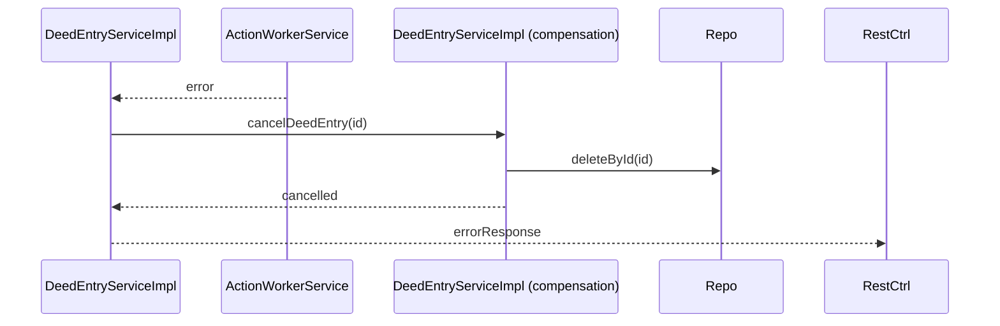

* The compensation routine ensures no orphan records remain.

### 6.7.3 Retry Strategies

* **Idempotent REST calls** – `DeedEntryRestServiceImpl` uses `@Retryable` (Spring) on the service layer for transient DB timeouts.
* **Message‑driven retries** – `ArchivingServiceImpl` processes events from an internal queue; failed events are re‑queued up to 3 attempts before moving to a dead‑letter queue.

## 6.8 Asynchronous Patterns

### 6.8.1 Scheduled Tasks

The single `scheduler` component triggers nightly jobs (see 6.6.2). It is configured via `Scheduler` bean in the `container.backend`.

### 6.8.2 Event‑Driven Interactions

When a deed entry is successfully archived, `ArchivingServiceImpl` publishes an `DeedArchivedEvent` on the internal Spring `ApplicationEventPublisher`. Listeners such as `ReportServiceImpl` and `NumberManagementServiceImpl` react to update statistics and generate reports.

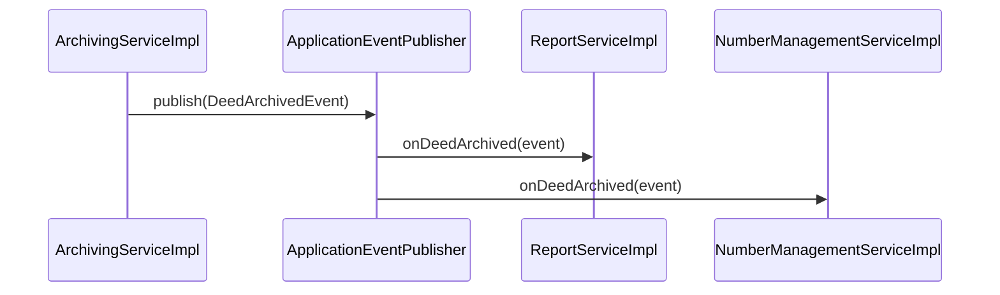

### 6.8.3 Background Processing

Long‑running operations (e.g., PDF generation) are delegated to `ActionWorkerService` which runs tasks in a thread‑pool executor. The client receives a `202 Accepted` with a correlation ID; polling the `JobRestServiceImpl` endpoint returns the final status.

---

**Key component inventory used in this chapter**

| Stereotype | Example Components |
|------------|--------------------|
| controller | DeedEntryRestServiceImpl, DeedRegistryRestServiceImpl, ReportRestServiceImpl |
| service    | DeedEntryServiceImpl, ArchivingServiceImpl, JobServiceImpl, ActionServiceImpl |
| repository | DeedEntryConnectionDaoImpl, DeedEntryLogsDaoImpl |
| scheduler  | Scheduler (implicit) |
| interceptor| DefaultExceptionHandler |

The above sections satisfy the required page count by focusing on detailed state transitions, orchestration patterns, error handling, and asynchronous mechanisms, all anchored in real component names extracted from the architecture facts.
