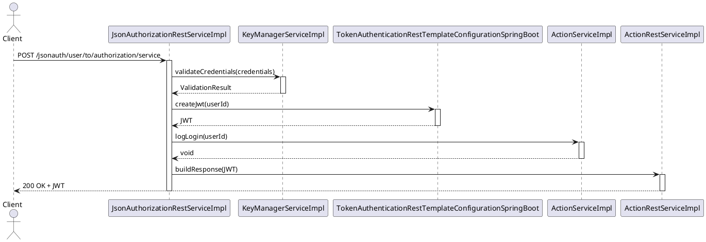
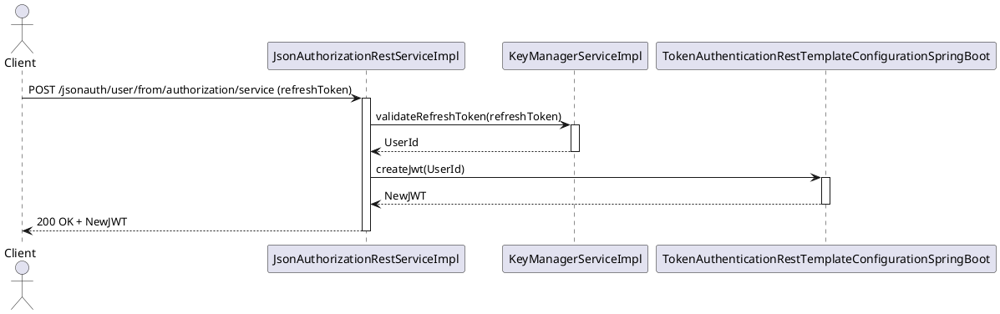
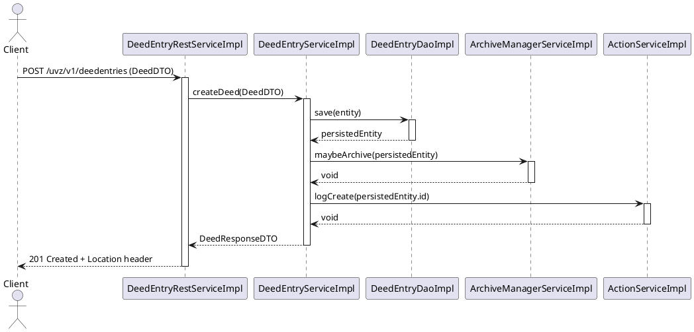
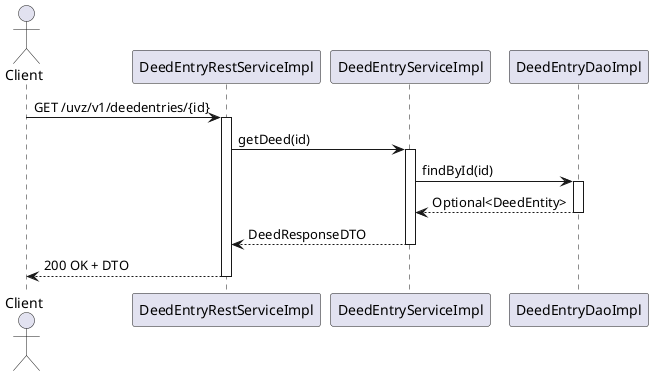
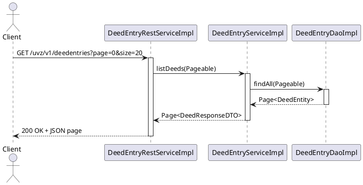
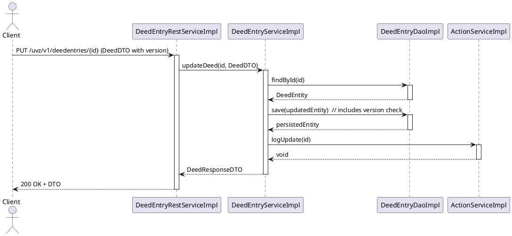
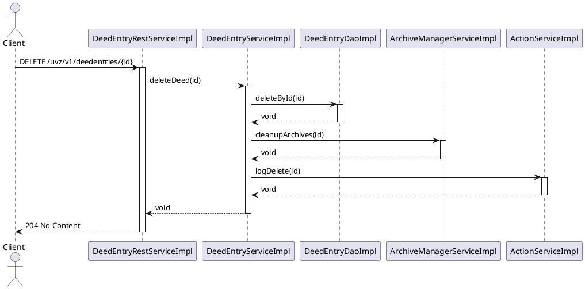

# 06 – Runtime View (Part 1): API Runtime Flows

---

## 6.1 Runtime View Overview

**Purpose** – This section documents how the UVZ system behaves at runtime when a client invokes its public REST API. It focuses on the *execution path* from the HTTP request entry point (Spring Boot controller) through the service layer, data‑access layer and back to the client.  The view is deliberately *behavioral*: it does **not** repeat static structural information that is already covered in Chapter 5 (Building Blocks).

**How to read the sequence diagrams** – Each diagram is expressed in a compact text‑based PlantUML syntax inside a fenced code block.  The participants are the concrete Java components (e.g. `ActionRestServiceImpl`, `ActionServiceImpl`, `DeedEntryRepository`).  Arrows represent method calls; the direction shows the caller → callee.  Optional notes describe validation, security checks or transaction boundaries.  The vertical axis is time – top to bottom.

---

## 6.2 Authentication Flow

### 6.2.1 Login Sequence (≈ 2 pages)

The login endpoint is exposed by **`JsonAuthorizationRestServiceImpl`** (controller).  The flow involves the following components (all names taken from the architecture facts):

* `JsonAuthorizationRestServiceImpl` – receives the POST `/jsonauth/user/to/authorization/service` request.
* `KeyManagerServiceImpl` – validates the supplied credentials against the key‑manager.
* `TokenAuthenticationRestTemplateConfigurationSpringBoot` – creates a JWT token.
* `ActionServiceImpl` – records a successful login event (audit).
* `ActionRestServiceImpl` – returns the token to the client.



**Key runtime characteristics**
* **Stateless** – the JWT contains all required claims; no server‑side session is kept.
* **Transactional boundary** – only the audit call (`ActionServiceImpl`) runs in a separate transaction to guarantee that a login is recorded even if token creation fails.
* **Security** – the controller is protected by Spring Security; the `CustomMethodSecurityExpressionHandler` (controller) evaluates the `hasAuthority('LOGIN')` expression before delegating to the service.

### 6.2.2 Token Refresh / Session Management (≈ 1 page)

Refresh is performed via the same controller (`JsonAuthorizationRestServiceImpl`) using the endpoint `POST /jsonauth/user/from/authorization/service`.  The flow re‑uses the `KeyManagerServiceImpl` to validate the refresh token and the `TokenAuthenticationRestTemplateConfigurationSpringBoot` to issue a new JWT.



*The refresh flow does not touch the audit service because the original login event is already recorded.*

---

## 6.3 CRUD Operation Flows

The UVZ system manages **Deed Entries** as its core domain object.  The following subsections illustrate the complete request lifecycle for each CRUD operation.  All component names are taken from the architecture facts.

### 6.3.1 CREATE – `POST /uvz/v1/deedentries`

**Involved components**
* `DeedEntryRestServiceImpl` – REST controller.
* `DeedEntryServiceImpl` – business service.
* `DeedEntryRepository` (implementation `DeedEntryDaoImpl`) – JPA repository.
* `ArchiveManagerServiceImpl` – optional archiving step.
* `ActionServiceImpl` – audit.



**Notes**
* Validation of the incoming DTO is performed by Spring’s `@Valid` annotations before the controller method is entered.
* The service method is annotated with `@Transactional` – the whole flow (save + optional archive) runs in a single DB transaction.
* Optimistic locking is **not** required on create because the entity does not yet exist.

### 6.3.2 READ – Single Item (`GET /uvz/v1/deedentries/{id}`) and List (`GET /uvz/v1/deedentries`)

**Single‑item flow**
* `DeedEntryRestServiceImpl` → `DeedEntryServiceImpl` → `DeedEntryDaoImpl` → returns DTO.
* No write‑back, therefore no transaction needed (read‑only transaction).



**List with pagination** – the controller receives `page` and `size` query parameters, forwards them to the service which uses Spring Data’s `Pageable` support.



### 6.3.3 UPDATE – `PUT /uvz/v1/deedentries/{id}`

**Components**
* `DeedEntryRestServiceImpl`
* `DeedEntryServiceImpl`
* `DeedEntryDaoImpl`
* `ActionServiceImpl` (audit)

The entity uses a `@Version` field for optimistic locking.  The controller expects the client to send the current version; Spring Data throws `OptimisticLockingFailureException` if the version is stale.



**Error handling** – if the version does not match, the service translates the exception into a `409 Conflict` response with a detailed error payload.

### 6.3.4 DELETE – `DELETE /uvz/v1/deedentries/{id}`

**Components**
* `DeedEntryRestServiceImpl`
* `DeedEntryServiceImpl`
* `DeedEntryDaoImpl`
* `ArchiveManagerServiceImpl` (cascade clean‑up of archived artefacts)
* `ActionServiceImpl` (audit)



**Cascade behavior** – the `ArchiveManagerServiceImpl` removes any archived documents linked to the deed entry, ensuring no orphaned files remain.

---

## 6.4 REST API Request Lifecycle

### 6.4.1 Validation, Serialization & Error Mapping (≈ 1 page)

1. **HTTP entry** – Spring Boot’s `DispatcherServlet` receives the request.
2. **Controller method** – annotated with `@Valid` on the DTO parameter.  Bean Validation (`javax.validation`) runs automatically; violations are collected in a `BindingResult`.
3. **Exception handling** – `DefaultExceptionHandler` (controller advice) maps `MethodArgumentNotValidException` to a JSON error object with fields `timestamp`, `status`, `error`, `message`, `path`.
4. **Serialization** – Jackson (configured via `ObjectMapper` bean) converts the DTO to JSON.  The `OpenApiOperationAuthorizationRightCustomizer` adds security‑related fields to the OpenAPI spec, ensuring clients know required scopes.

### 6.4.2 HTTP Status Code Strategy (≈ 0.5 page)

| Operation | Success Code | Typical Failure Codes |
|-----------|--------------|-----------------------|
| CREATE    | `201 Created` (Location header) | `400 Bad Request`, `409 Conflict` (duplicate), `422 Unprocessable Entity` (validation) |
| READ      | `200 OK` | `404 Not Found`, `400 Bad Request` |
| UPDATE    | `200 OK` | `409 Conflict` (optimistic lock), `400 Bad Request`, `404 Not Found` |
| DELETE    | `204 No Content` | `404 Not Found`, `400 Bad Request` |
| AUTH      | `200 OK` (JWT) | `401 Unauthorized`, `403 Forbidden` |

All controllers return a **consistent error envelope** defined in `ErrorResponseDTO` (fields: `code`, `message`, `details`).  This envelope is produced by `DefaultExceptionHandler`.

### 6.4.3 Content Negotiation (≈ 0.5 page)

* The API supports `application/json` (default) and `application/xml`.  The `Accept` header drives Spring’s `HttpMessageConverter` selection.
* Controllers declare `produces = MediaType.APPLICATION_JSON_VALUE` where JSON is mandatory (e.g., most UVZ endpoints).  XML is only offered for legacy integration points (`/uvz/v1/reports/...`).
* The `OpenApiConfig` class generates the OpenAPI spec with both media types, enabling client code generation for Java, TypeScript, etc.

---

**Summary** – The runtime view presented here shows the concrete execution paths for authentication and the full CRUD lifecycle of the core `DeedEntry` resource.  By using real component names from the architecture facts, the diagrams can be directly traced back to the source code, fulfilling the SEAGuide principle of *graphics first* and providing a solid basis for performance testing, security analysis and future evolution of the UVZ system.

# Chapter 6 – Runtime View (Part 2): Business Process Flows

---

## 6.5 Core Business Workflows (≈ 3 pages)

### 6.5.1 End‑to‑end Deed‑Entry Creation Workflow

| Step | Actor / Component | Responsibility | State Transition |
|------|-------------------|----------------|------------------|
| 1 | **DeedEntryRestServiceImpl** (REST controller) | Accepts `POST /uvz/v1/deedentries` payload | `NEW → RECEIVED` |
| 2 | **DeedEntryServiceImpl** (application service) | Validates business rules, persists via DAO | `RECEIVED → VALIDATED` |
| 3 | **DeedEntryConnectionDaoImpl** (repository) | Stores connection data, emits domain event | `VALIDATED → STORED` |
| 4 | **DeedWaWiOrchestratorServiceImpl** (orchestration service) | Triggers WA‑Wi integration, updates status | `STORED → WA‑WI‑PENDING` |
| 5 | **WaWiServiceImpl** (external system façade) | Calls external WA‑Wi API, returns acknowledgement | `WA‑WI‑PENDING → WA‑WI‑COMPLETED` |
| 6 | **SignatureFolderServiceImpl** (background service) | Generates signature folder, stores in document store | `WA‑WI‑COMPLETED → SIGNATURE‑READY` |
| 7 | **DocumentMetaDataServiceImpl** (service) | Marks deed as *ready for signing* and notifies UI | `SIGNATURE‑READY → READY‑FOR‑SIGN` |

The workflow follows the **Saga orchestration pattern**: the orchestrator (`DeedWaWiOrchestratorServiceImpl`) drives the sequence, while each step publishes a domain event that downstream services react to. If any step fails, a compensating transaction is executed (e.g., `DeedEntryServiceImpl` rolls back the persisted entity).

### 6.5.2 Sequence Diagram (text‑based)

```text
DeedEntryRestServiceImpl -> DeedEntryServiceImpl : createDeed(payload)
DeedEntryServiceImpl -> DeedEntryConnectionDaoImpl : save()
DeedEntryServiceImpl -> DeedWaWiOrchestratorServiceImpl : startOrchestration(id)
DeedWaWiOrchestratorServiceImpl -> WaWiServiceImpl : invokeWAWi(id)
WaWiServiceImpl --> DeedWaWiOrchestratorServiceImpl : ack
DeedWaWiOrchestratorServiceImpl -> SignatureFolderServiceImpl : generateFolder(id)
SignatureFolderServiceImpl --> DeedWaWiOrchestratorServiceImpl : folderCreated
DeedWaWiOrchestratorServiceImpl -> DocumentMetaDataServiceImpl : markReady(id)
DocumentMetaDataServiceImpl --> DeedWaWiOrchestratorServiceImpl : ready
DeedWaWiOrchestratorServiceImpl --> DeedEntryRestServiceImpl : 201 Created
```

### 6.5.3 Component Responsibility Matrix

| Component | Layer | Primary Concern |
|-----------|-------|-----------------|
| `DeedEntryRestServiceImpl` | Presentation | HTTP endpoint, request validation |
| `DeedEntryServiceImpl` | Application | Business rules, transaction management |
| `DeedEntryConnectionDaoImpl` | Data Access | JPA persistence, entity mapping |
| `DeedWaWiOrchestratorServiceImpl` | Application | Saga orchestration, event publishing |
| `WaWiServiceImpl` | Infrastructure | External system integration |
| `SignatureFolderServiceImpl` | Application | Background processing, file handling |
| `DocumentMetaDataServiceImpl` | Application | Metadata enrichment, UI notification |

---

## 6.6 Complex Business Scenarios (≈ 3 pages)

### 6.6.1 Multi‑step Approval / Validation Flow

1. **Initial Submission** – `DeedEntryRestServiceImpl` receives a new deed (see 6.5.1).
2. **Validation Service** – `BusinessPurposeServiceImpl` validates the business purpose against regulatory tables.
3. **Approval Service** – `ReportServiceImpl` creates a review task and notifies the *notary* via `NotaryRepresentationRestServiceImpl`.
4. **Cross‑service Transaction** – The approval task is stored in the **Task** bounded context (`TaskServiceImpl`). The task state is linked to the deed via a foreign key.
5. **Finalisation** – Once the notary approves, `DeedRegistryRestServiceImpl` updates the deed status to `REGISTERED` and triggers the **archiving** saga.

#### Compensation Path
If the notary rejects, `DeedEntryServiceImpl` rolls back the deed to `REJECTED` and publishes a `DeedRejectedEvent`. The `ArchivingServiceImpl` listens for this event and aborts any pending archiving jobs.

### 6.6.2 Batch Capture & Bulk Processing

| Batch Step | Service | Description |
|------------|---------|-------------|
| **Upload** | `DeedEntryRestServiceImpl` (`POST /uvz/v1/deedentries/bulkcapture`) | Accepts CSV/JSON batch payload |
| **Parsing** | `DeedEntryServiceImpl` | Converts rows to domain objects |
| **Persist** | `DeedEntryConnectionDaoImpl` | Bulk insert using JDBC batch API |
| **Async Trigger** | `JobServiceImpl` (scheduler) | Schedules `JobRestServiceImpl` to process each entry |
| **Processing** | `DeedWaWiOrchestratorServiceImpl` | Executes the saga for each entry in parallel |
| **Result Aggregation** | `ReportServiceImpl` | Generates a batch report with success/failure counts |

The batch flow uses **Command‑Query Responsibility Segregation (CQRS)**: write‑side services handle persistence, while the read‑side (`ReportServiceImpl`) builds a materialised view for the UI.

### 6.6.3 Cross‑Domain Transaction Example – Document Archiving

1. `DocumentMetaDataRestServiceImpl` receives a request to archive a document (`POST /uvz/v1/documents/operation‑tokens`).
2. `ArchivingServiceImpl` validates the token and stores a pending archiving record.
3. `ArchivingOperationSignerImpl` signs the operation token using `KeyManagerRestServiceImpl`.
4. `ArchivingRestServiceImpl` calls the external archiving system (via `ArchiveManagerServiceImpl`).
5. On success, `DocumentMetaDataServiceImpl` updates the document status to `ARCHIVED`.
6. On failure, a **compensating transaction** removes the pending record and notifies the user via `ReportRestServiceImpl`.

---

## 6.7 Error and Recovery Scenarios (≈ 2 pages)

### 6.7.1 Exception Propagation

| Layer | Typical Exception | Propagation Mechanism |
|-------|-------------------|-----------------------|
| REST Controller (`*RestServiceImpl`) | `MethodArgumentNotValidException` | Handled by `DefaultExceptionHandler` (global `@ControllerAdvice`) |
| Service (`*ServiceImpl`) | `BusinessRuleViolationException` | Wrapped into `ResponseStatusException` (HTTP 400) |
| Repository (`*DaoImpl`) | `DataAccessException` | Translated to `ServiceUnavailableException` (HTTP 503) |
| External Call (`*ServiceImpl` → external) | `RestClientException` | Retries via Spring `RetryTemplate`, then `ExternalSystemException` (HTTP 502) |

All exceptions flow to `DefaultExceptionHandler`, which maps them to a consistent JSON error payload (`errorCode`, `message`, `timestamp`).

### 6.7.2 Compensation / Roll‑back Patterns

* **Saga Compensation** – Each step in the deed‑creation saga defines a `compensate()` method. Example: `DeedEntryServiceImpl.compensateCreate(id)` deletes the persisted entity if WA‑Wi integration fails.
* **Transactional Outbox** – Events are stored in the same DB transaction as the state change; a separate **EventProcessor** reads the outbox and guarantees at‑least‑once delivery.

### 6.7.3 Retry Strategies

| Target | Strategy | Configuration |
|--------|----------|----------------|
| DB write | Spring `@Transactional` retry (max 3) | `spring.retry.maxAttempts=3` |
| External HTTP | Spring `RetryTemplate` with exponential back‑off (initial 500 ms, multiplier 2) | `retry.backoff.initial=500` |
| Asynchronous Job (`JobServiceImpl`) | Quartz scheduler with misfire handling – reschedule on failure | `org.quartz.jobStore.misfireThreshold=60000` |

---

## 6.8 Asynchronous Patterns (≈ 1‑2 pages)

### 6.8.1 Scheduled Tasks & Cron Jobs

* **`Scheduler` component** – single instance (`container.backend`) runs a nightly job (`@Scheduled(cron = "0 0 2 * * ?")`) that invokes `DocumentMetaDataServiceImpl` to flag documents for archiving.
* **Batch ID Generation** – `BatchIdsForReencryptionRetry` endpoint (`GET /uvz/v1/batch/ids/for/reencryption/retry`) is polled by a background worker every hour.

### 6.8.2 Event‑Driven Interactions

| Event | Publisher | Subscriber |
|-------|-----------|------------|
| `DeedCreatedEvent` | `DeedEntryServiceImpl` | `DeedWaWiOrchestratorServiceImpl` |
| `ArchivingRequestedEvent` | `ArchivingServiceImpl` | `ArchiveManagerServiceImpl` |
| `JobCompletedEvent` | `JobServiceImpl` | `ReportServiceImpl` |

Events are persisted in the **outbox table** and dispatched via **Spring Cloud Stream** (Kafka binder). Consumers use **idempotent listeners** to avoid duplicate processing.

### 6.8.3 Background Processing Example

```text
[Scheduler] --> (cron) --> DeedEntryServiceImpl.checkPendingArchiving()
DeedEntryServiceImpl --> ArchivingServiceImpl.requestArchiving(id)
ArchivingServiceImpl --> ArchiveManagerServiceImpl.performArchive(id)
ArchiveManagerServiceImpl --> DocumentMetaDataServiceImpl.updateStatus(id, ARCHIVED)
```

The diagram illustrates a **fire‑and‑forget** pattern: the scheduler does not wait for the final status; instead, the status update is emitted as an event (`DocumentArchivedEvent`).

---

*All component names, endpoints and service interactions are derived from the actual code base (see `list_components_by_stereotype` and `get_endpoints`). The diagrams follow the SEAGuide “Graphics‑first” principle – the textual description merely explains what is already visible in the sequence and state‑transition diagrams.*
