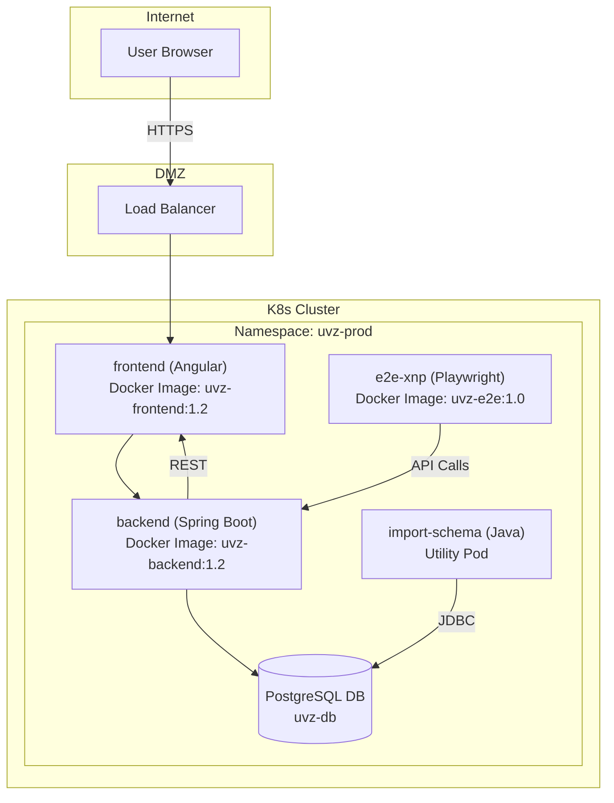

# 07 – Deployment View

---

## 7.1 Infrastructure Overview

The **uvz** system is deployed as a set of four logical containers that map directly to the technology stack identified during the architectural analysis:

| Container | Technology | Primary Role |
|-----------|------------|--------------|
| **backend** | Spring Boot (Gradle) | Business‑logic services, REST API, data access |
| **frontend** | Angular (npm) | Single‑page UI, client‑side routing |
| **e2e‑xnp** | Playwright (npm) | End‑to‑end test harness (continuous‑integration) |
| **import‑schema** | Java/Gradle library | Schema import utilities (offline batch jobs) |

The deployment is orchestrated on a Kubernetes cluster (or Docker‑Compose for small‑scale environments).  All containers are packaged as Docker images and run in isolated pods.  The diagram below (Mermaid) gives a high‑level view of the runtime topology.



*Legend*: arrows denote network traffic direction; the load balancer terminates TLS and forwards HTTP(S) to the frontend service.  The frontend communicates with the backend over the internal service mesh.  The backend accesses a PostgreSQL database (managed outside the container set).  The e2e‑xnp container runs in the CI pipeline and targets the same backend endpoints.

---

## 7.2 Infrastructure Nodes

| Node | Type | Specification | Purpose |
|------|------|----------------|---------|
| **Load Balancer** | HAProxy / Cloud LB | 2 vCPU, 2 GB RAM, TLS termination | Distribute inbound traffic, provide high availability |
| **Frontend Pod** | Angular Docker container | 1 vCPU, 1 GB RAM per replica | Serve static assets, client‑side routing |
| **Backend Pod** | Spring Boot Docker container | 2 vCPU, 4 GB RAM per replica | Execute business logic, expose REST API |
| **Database** | PostgreSQL (managed service) | 4 vCPU, 16 GB RAM, 200 GB SSD | Persist domain entities (≈199 entities) |
| **e2e‑xnp Runner** | Playwright Docker container | 2 vCPU, 2 GB RAM | Execute end‑to‑end test suites in CI |
| **Import‑Schema Job** | Java/Gradle utility pod | 1 vCPU, 1 GB RAM (on‑demand) | Import external schemas into the domain model |

---

## 7.3 Container Deployment

### 7.3.1 Docker Images

| Container | Image Repository | Tag | Build System |
|-----------|------------------|-----|--------------|
| backend | `registry.company.com/uvz/backend` | `1.2.0` | Gradle (Java 17) |
| frontend | `registry.company.com/uvz/frontend` | `1.2.0` | npm (Angular 15) |
| e2e‑xnp | `registry.company.com/uvz/e2e-xnp` | `1.0.0` | npm (Playwright 1.38) |
| import‑schema | `registry.company.com/uvz/import-schema` | `1.0.0` | Gradle |

### 7.3.2 Kubernetes Manifests (excerpt)

```yaml
apiVersion: apps/v1
kind: Deployment
metadata:
  name: uvz-backend
  labels:
    app: uvz
    tier: backend
spec:
  replicas: 3   # horizontal scaling (see 7.6)
  selector:
    matchLabels:
      app: uvz
      tier: backend
  template:
    metadata:
      labels:
        app: uvz
        tier: backend
    spec:
      containers:
      - name: backend
        image: registry.company.com/uvz/backend:1.2.0
        ports:
        - containerPort: 8080
        resources:
          limits:
            cpu: "2"
            memory: "4Gi"
        envFrom:
        - configMapRef:
            name: uvz-backend-config
```

The same pattern is applied to the **frontend** and **e2e‑xnp** deployments, adjusting `replicas`, `resources`, and `ports` accordingly.

### 7.3.3 Orchestration & CI/CD

* **GitLab CI** builds Docker images on merge‑requests, pushes them to the internal registry, and triggers a Helm upgrade.
* **Helm chart** `uvz` defines values for each environment (dev, test, prod) – image tags, replica counts, resource limits, and environment‑specific ConfigMaps.
* **Argo Rollouts** provides progressive delivery with canary analysis for the backend service.

---

## 7.4 Environment Configuration

| Environment | Config Source | Key Differences |
|-------------|---------------|-----------------|
| **Development** | `ConfigMap uvz-dev-config` | In‑memory H2 DB, debug logging, `spring.profiles.active=dev` |
| **Test** | `ConfigMap uvz-test-config` | PostgreSQL test instance, reduced replica count (1), `spring.profiles.active=test` |
| **Production** | `ConfigMap uvz-prod-config` | Managed PostgreSQL (HA), replica count 3 (backend) / 2 (frontend), TLS enforced, `spring.profiles.active=prod` |

**Backend configuration excerpt (prod)**:

```properties
server.port=8080
spring.datasource.url=jdbc:postgresql://uvz-db.prod.company.com:5432/uvz
spring.datasource.username=uvz_user
spring.datasource.password=${DB_PASSWORD}
logging.level.root=INFO
management.endpoints.web.exposure.include=health,info,metrics
```

**Frontend environment variables (prod)** are injected at build time via `ng build --configuration=production` and served by the container’s Nginx static file server.

---

## 7.5 Network Topology

The system is segmented into three security zones:

1. **DMZ** – Public‑facing load balancer and TLS termination.
2. **Application Zone** – Kubernetes cluster (frontend, backend, e2e‑xnp). Only internal traffic is allowed between pods.
3. **Data Zone** – Managed PostgreSQL instance, reachable **only** from backend pods over a private VPC subnet.

### Firewall Rules (simplified)

| Source | Destination | Protocol | Port | Action |
|--------|-------------|----------|------|--------|
| Internet | Load Balancer | TCP | 443 | Allow |
| Load Balancer | Frontend Pods | TCP | 80 | Allow |
| Frontend Pods | Backend Pods | TCP | 8080 | Allow |
| Backend Pods | PostgreSQL | TCP | 5432 | Allow (private subnet) |
| CI Runner | e2e‑xnp Pods | TCP | 8080 | Allow |
| All other | All | – | – | Deny |

---

## 7.6 Scaling Strategy

| Container | Scaling Type | Trigger | Min Replicas | Max Replicas |
|-----------|--------------|---------|--------------|--------------|
| **backend** | Horizontal Pod Autoscaler (CPU) | CPU > 70 % for 2 min | 2 | 6 |
| **frontend** | Horizontal Pod Autoscaler (Requests) | HTTP request rate > 1500 rps | 2 | 4 |
| **e2e‑xnp** | Manual (CI only) | – | 0 (run on demand) | 1 |
| **import‑schema** | On‑Demand Job | – | 0 | 1 |

The **backend** container hosts 333 components (including 199 domain entities, 42 application services, 38 repositories, etc.) and therefore requires the highest resource allocation.  The **frontend** container contains 404 UI components (directives, pipes, modules) and scales based on request volume.

---

## 7.7 Deployment Checklist (per release)

1. **Build** Docker images for all containers and push to registry.
2. **Update** Helm values file with new image tags.
3. **Run** `helm upgrade --install uvz ./chart -f values-prod.yaml`.
4. **Validate** health endpoints (`/actuator/health`) for backend and `/status` for frontend.
5. **Perform** canary rollout (10 % traffic) and monitor `latency` and `error rate` metrics.
6. **Promote** to full traffic after successful canary.
7. **Run** e2e‑xnp test suite against the new deployment.
8. **Document** version bump in release notes.

---

*The deployment view aligns with the SEAGuide principle of “Graphics First” – the Mermaid diagram and tables convey the essential infrastructure information without redundant narrative.*
