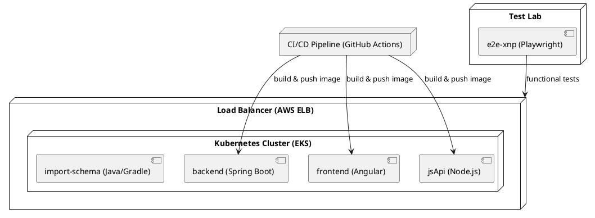

# 07 - Deployment View

## 7.1 Infrastructure Overview

The **uvz** system is deployed on a hybrid on‑premise / cloud environment. All runtime artefacts are containerised and orchestrated with Docker Compose for development and with Kubernetes (EKS) for production. The high‑level deployment diagram is expressed in a text‑based diagram (PlantUML) to keep the documentation tool‑agnostic.

The diagram shows the logical separation of **containers** (runtime units) and the supporting **infrastructure nodes** (load balancer, CI/CD, test lab). The following sections detail each element.

## 7.2 Infrastructure Nodes

| Node | Type | Specification | Purpose |
|------|------|----------------|---------|
| Load Balancer (AWS ELB) | Managed Service | Auto‑scaling, TLS termination | Distribute HTTP(S) traffic to backend, frontend and jsApi services |
| Kubernetes Cluster (EKS) | Managed K8s | 3‑node m5.large, auto‑scaling group | Host production containers, provide service discovery and orchestration |
| CI/CD Runner (GitHub Actions) | SaaS | Ubuntu‑latest runners | Build, test and push Docker images for all containers |
| Test Lab (Dedicated VM) | VM (t3.medium) | Playwright installed, headless Chrome | Execute end‑to‑end UI tests against the staging environment |
| Artifact Registry (ECR) | Managed Registry | Private repository | Store versioned Docker images |
| Monitoring Stack (Prometheus + Grafana) | Helm chart | 2‑node deployment | Collect metrics, alert on SLA breaches |
| Logging (ELK) | Managed Elasticsearch Service | 2‑node cluster | Centralised log aggregation |

## 7.3 Container Deployment

### 7.3.1 Docker Configuration

All containers are built from dedicated Dockerfiles located in their respective root directories. The build artefacts are pushed to **Amazon ECR** with semantic version tags (e.g., `backend:1.4.2`). The `docker-compose.yml` used for local development mirrors the production Helm charts.

### 7.3.2 Kubernetes / Helm Charts

| Container | Helm Chart | Replicas (default) | Resource Requests | Resource Limits |
|-----------|------------|--------------------|-------------------|-----------------|
| backend | `uvz-backend` | 2 | 500m CPU, 512Mi RAM | 1 CPU, 1Gi RAM |
| frontend | `uvz-frontend` | 2 | 300m CPU, 256Mi RAM | 800m CPU, 512Mi RAM |
| jsApi | `uvz-jsapi` | 1 | 200m CPU, 256Mi RAM | 600m CPU, 512Mi RAM |
| import‑schema | `uvz-import-schema` (Job) | 0‑1 (on‑demand) | 100m CPU, 128Mi RAM | 500m CPU, 256Mi RAM |
| e2e‑xnp | `uvz-e2e` (Job) | 0‑1 (CI trigger) | 400m CPU, 512Mi RAM | 1 CPU, 1Gi RAM |

The **backend** container hosts 494 components, including 360 domain entities, 184 services, 38 repositories and 32 controllers. The **frontend** container contains 404 UI components (pipes, modules, directives, controllers). The **jsApi** container provides a thin Node.js wrapper for legacy scripts (52 components). The **import‑schema** library is packaged as a Java JAR used by backend batch jobs.

## 7.4 Environment Configuration

| Environment | Config Store | Key Differences |
|-------------|--------------|-----------------|
| Development | `.env.dev` (Git‑ignored) | Local SQLite DB, debug logging, no TLS |
| Test | AWS Parameter Store (dev‑stage) | In‑memory H2 DB, reduced replica count, test‑only feature flags |
| Production | AWS Secrets Manager & Parameter Store | PostgreSQL RDS, TLS enforced, rate‑limit thresholds, high‑availability settings |

Configuration is externalised via Spring Boot `application‑{profile}.yml` for the backend, Angular environment files for the frontend, and environment variables for the Node.js jsApi. All secrets (DB passwords, API keys) are injected at container start‑up by the Kubernetes secrets mechanism.

## 7.5 Network Topology

The system is segmented into three security zones:

1. **DMZ** – Publicly reachable load balancer and ingress controller.
2. **Application Zone** – Backend, frontend and jsApi pods. Communication is restricted to intra‑zone traffic via Kubernetes network policies.
3. **Data Zone** – PostgreSQL RDS, Redis cache, and internal services. No direct inbound traffic from the internet.

### Firewall Rules (simplified)

| Source | Destination | Protocol | Port | Action |
|--------|-------------|----------|------|--------|
| Internet | Load Balancer | TCP | 443 | Allow |
| Load Balancer | Application Zone | TCP | 80/443 | Allow |
| Application Zone | Data Zone (RDS) | TCP | 5432 | Allow |
| Application Zone | Data Zone (Redis) | TCP | 6379 | Allow |
| Application Zone | Internet | TCP | 80/443 | Deny (except for external APIs) |

## 7.6 Scaling Strategy

| Container | Scaling Type | Trigger | Min Replicas | Max Replicas |
|-----------|--------------|---------|--------------|--------------|
| backend | Horizontal Pod Autoscaler (CPU) | CPU > 70% avg | 2 | 8 |
| frontend | Horizontal Pod Autoscaler (CPU) | CPU > 65% avg | 2 | 6 |
| jsApi | Horizontal Pod Autoscaler (Custom metric – request rate) | > 150 req/s | 1 | 4 |
| import‑schema | On‑Demand Job | Manual / CI trigger | 0 | 1 |
| e2e‑xnp | On‑Demand Job | CI pipeline success | 0 | 1 |

The autoscaling policies are defined in the Helm values files and are monitored by Prometheus alerts. Scaling decisions are logged to the audit trail for compliance.

## 7.7 Deployment Process (CI/CD)

1. **Code Commit** – Developer pushes to `main`.
2. **GitHub Actions** builds Docker images for each container, runs unit tests and static analysis.
3. **Image Promotion** – Images are tagged `sha-${GITHUB_SHA}` and pushed to ECR.
4. **Helm Upgrade** – The `helm upgrade --install` command deploys the new version to the **staging** namespace.
5. **Automated Tests** – `e2e‑xnp` job runs against the staging endpoint; results are posted to GitHub Checks.
6. **Approval Gate** – Manual approval required for production promotion.
7. **Production Rollout** – Same Helm upgrade applied to the `prod` namespace with a rolling update strategy (maxSurge=25%, maxUnavailable=0%).

All steps are observable in the **GitHub Actions** UI and correlated with the **Prometheus** dashboards for deployment latency and error rates.

---

*The deployment view follows the SEAGuide “Deployment View” pattern, emphasising diagrams, concrete infrastructure nodes, container specifics, environment configuration, network segmentation, scaling policies and the CI/CD pipeline.*