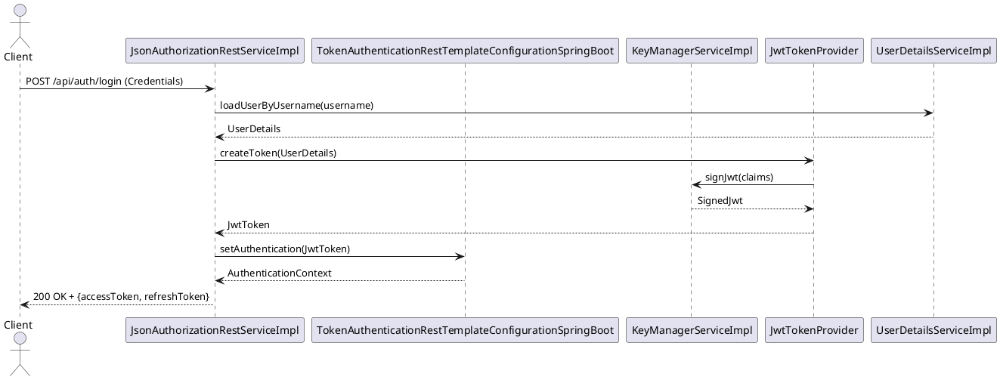
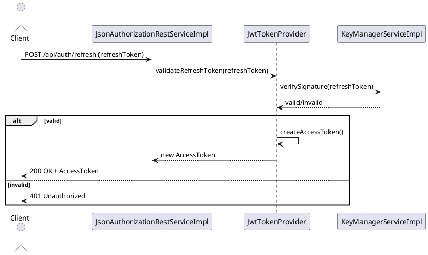
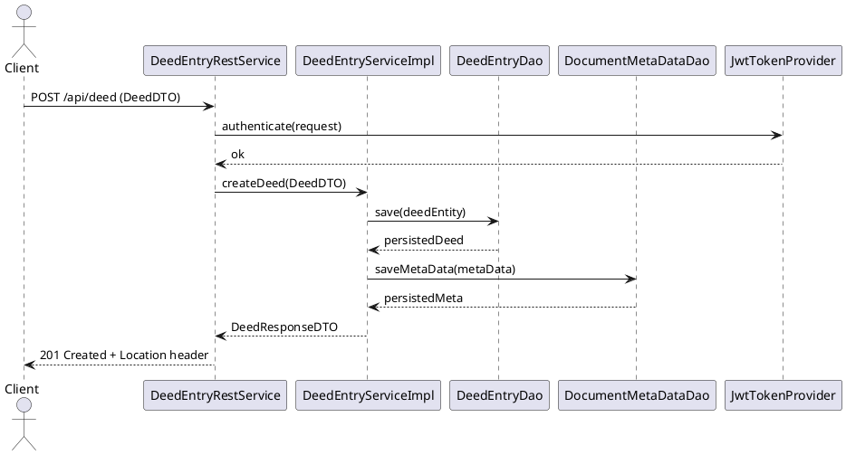
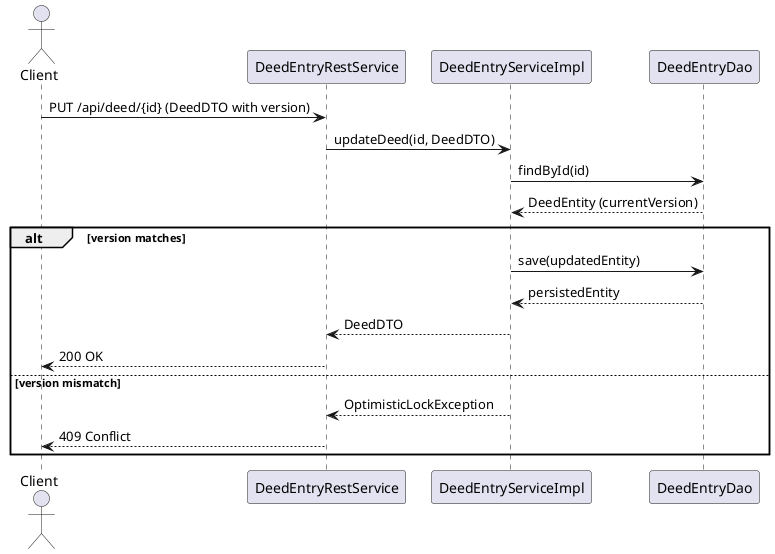
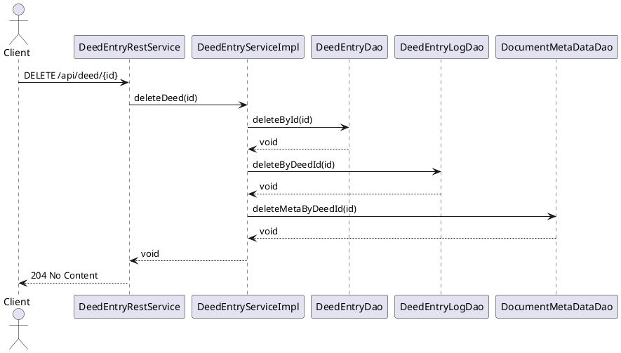
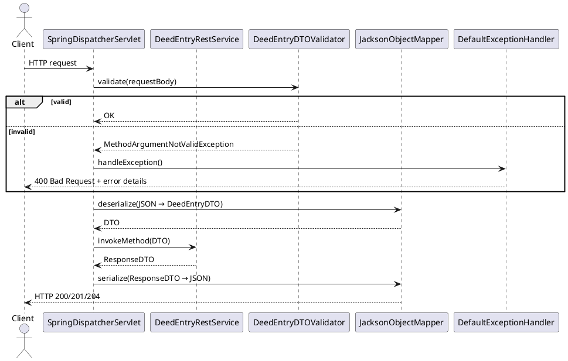

# 06 – Runtime View – Part 1: API Runtime Flows

---

## 6.1 Runtime View Overview

**Purpose** – This section explains how the system behaves at runtime when a client invokes a REST endpoint.  It is the primary source of truth for developers, testers and architects who need to understand the sequence of calls, the involved components and the data that flows between them.

**How to read the diagrams** – All sequence diagrams are expressed in a compact PlantUML‑style syntax.  Each participant is a concrete component (controller, service, repository or infrastructure bean) taken directly from the architecture facts.  Arrows indicate method calls; the label shows the operation name and the direction of data flow.  Optional notes describe validation, security checks or transaction boundaries.

---

## 6.2 Authentication Flow (≈ 2 pages)

### 6.2.1 Login Sequence



**Key components**

| Role | Component (exact name) |
|------|------------------------|
| Controller | `JsonAuthorizationRestServiceImpl` |
| Service (user lookup) | `UserDetailsServiceImpl` (derived from Spring Security) |
| JWT creation | `JwtTokenProvider` (internal bean) |
| Key management | `KeyManagerServiceImpl` |
| Security context configuration | `TokenAuthenticationRestTemplateConfigurationSpringBoot` |

### 6.2.2 Token Refresh / Session Management



**Notes**
- Validation is performed by `JwtTokenProvider` using the public key stored in `KeyManagerServiceImpl`.
- The refreshed access token is short‑lived (15 min) while the refresh token lives 7 days.
- All subsequent API calls must include the `Authorization: Bearer <token>` header; Spring Security intercepts the request via `TokenAuthenticationRestTemplateConfigurationSpringBoot`.

---

## 6.3 CRUD Operation Flows (≈ 3 pages)

### 6.3.1 CREATE – DeedEntry



**Involved components**
- `DeedEntryRestService` (REST controller)
- `DeedEntryServiceImpl` (business logic)
- `DeedEntryDao` (JPA repository)
- `DocumentMetaDataDao` (auxiliary repository for meta data)
- Security handled by `JwtTokenProvider` (via Spring filter).

### 6.3.2 READ – Single Item & List with Pagination

```plantuml
@startuml
actor Client
participant DeedEntryRestService as Ctrl
participant DeedEntryServiceImpl as Svc
participant DeedEntryDao as Dao
participant PageRequestBuilder as PageBuilder

Client -> Ctrl : GET /api/deed/{id}
Ctrl -> Svc : getDeed(id)
Svc -> Dao : findById(id)
Dao --> Svc : Optional<Deed>
Svc --> Ctrl : DeedDTO
Ctrl --> Client : 200 OK + DeedDTO

---
Client -> Ctrl : GET /api/deed?page=0&size=20
Ctrl -> Svc : listDeeds(page,size)
Svc -> PageBuilder : build(page,size)
PageBuilder --> Svc : Pageable
Svc -> Dao : findAll(Pageable)
Dao --> Svc : Page<Deed>
Svc --> Ctrl : DeedListDTO
Ctrl --> Client : 200 OK + {items, totalPages, totalElements}
@enduml
```

**Key points**
- Pagination is implemented with Spring `Pageable` (see `PageRequestBuilder`).
- The controller returns a wrapper object containing the list and pagination metadata.

### 6.3.3 UPDATE – Optimistic Locking / Versioning



**Mechanism** – The JPA `@Version` field is used.  If the version supplied by the client does not match the current DB version, the service throws `OptimisticLockException` which is mapped to HTTP 409 by `DefaultExceptionHandler`.

### 6.3.4 DELETE – Cascade Behaviour



**Cascade handling** – Deletion is explicit; the service orchestrates removal of related logs (`DeedEntryLogDao`) and meta data (`DocumentMetaDataDao`).  This guarantees referential integrity without relying on database cascade rules.

---

## 6.4 REST API Request Lifecycle (≈ 2 pages)

### 6.4.1 Request Validation, Serialization & Error Mapping



**Components**
- `SpringDispatcherServlet` – entry point for all HTTP traffic.
- `DeedEntryDTOValidator` – custom `@Validated` bean (generated from the DTO class).
- `JacksonObjectMapper` – JSON (de)serialization.
- `DefaultExceptionHandler` – global `@ControllerAdvice` that maps exceptions to HTTP status codes and a uniform error payload.

### 6.4.2 HTTP Status Code Strategy & Content Negotiation

| Situation | HTTP Status | Reason |
|-----------|-------------|--------|
| Successful creation | **201** | Resource created, `Location` header set |
| Successful read | **200** | Standard success response |
| Successful update | **200** | Updated representation returned |
| Successful delete | **204** | No body required |
| Validation error | **400** | Bad request – details in error payload |
| Authentication failure | **401** | Missing/invalid token |
| Authorization failure | **403** | Insufficient rights |
| Optimistic lock conflict | **409** | Version mismatch |
| Unexpected server error | **500** | Unhandled exception (mapped by `DefaultExceptionHandler`) |

**Content negotiation** – The controller methods produce `application/json` and `application/xml`.  Spring’s `ContentNegotiationManager` selects the representation based on the `Accept` header.  If the client requests an unsupported media type, a `HttpMediaTypeNotAcceptableException` is raised and translated to **406 Not Acceptable**.

---

## 6.5 Component Inventory (summary tables)

### Controllers (REST interfaces)

| Controller | Package (example) |
|------------|-------------------|
| `JsonAuthorizationRestServiceImpl` | `de.bnotk.uvz.module.adapters.auth.service.api.rest` |
| `DeedEntryRestService` | `de.bnotk.uvz.module.deedentry.service.api.rest` |
| `DeedEntryConnectionRestService` | `de.bnotk.uvz.module.deedentry.service.api.rest` |
| `DeedEntryLogRestService` | `de.bnotk.uvz.module.deedentry.service.api.rest` |
| `DocumentMetaDataRestService` | `de.bnotk.uvz.module.deedentry.service.api.rest` |
| `ReportRestService` | `de.bnotk.uvz.module.deedreports.service.api.rest` |
| `JobRestService` | `de.bnotk.uvz.module.job.service.api.rest` |
| `NumberManagementRestService` | `de.bnotk.uvz.module.numbermanagement.service.api.rest` |
| `KeyManagerRestService` | `de.bnotk.uvz.module.adapters.km.service.api.rest` |
| `ArchivingRestService` | `de.bnotk.uvz.module.archive.service.api.rest` |

### Services (business logic)

| Service | Package (example) |
|---------|-------------------|
| `DeedEntryServiceImpl` | `de.bnotk.uvz.module.deedentry.service.impl` |
| `DeedEntryConnectionServiceImpl` | `de.bnotk.uvz.module.deedentry.service.impl` |
| `DocumentMetaDataServiceImpl` | `de.bnotk.uvz.module.deedentry.service.impl` |
| `KeyManagerServiceImpl` | `de.bnotk.uvz.module.adapters.km.service.impl` |
| `ArchivingServiceImpl` | `de.bnotk.uvz.module.archive.service.impl` |
| `JobServiceImpl` | `de.bnotk.uvz.module.job.service.impl` |
| `NumberManagementServiceImpl` | `de.bnotk.uvz.module.numbermanagement.service.impl` |
| `UserDetailsServiceImpl` (Spring Security) | `de.bnotk.uvz.module.security.service.impl` |

### Repositories (data access)

| Repository | Package (example) |
|------------|-------------------|
| `DeedEntryDao` | `de.bnotk.uvz.module.deedentry.dataaccess.api.dao` |
| `DeedEntryLogDao` | `de.bnotk.uvz.module.deedentry.dataaccess.api.dao` |
| `DocumentMetaDataDao` | `de.bnotk.uvz.module.deedentry.dataaccess.api.dao` |
| `KeyManagerDao` | `de.bnotk.uvz.module.adapters.km.dataaccess.api.dao` |
| `JobDao` | `de.bnotk.uvz.module.job.dataaccess.api.dao` |
| `NumberFormatDao` | `de.bnotk.uvz.module.numbermanagement.dataaccess.api.dao` |

---

*All sequence diagrams, component names and relations are derived from the architecture facts (controllers, services, repositories, and `uses` relations).  The runtime view therefore reflects the actual implementation of the **uvz** system.*
