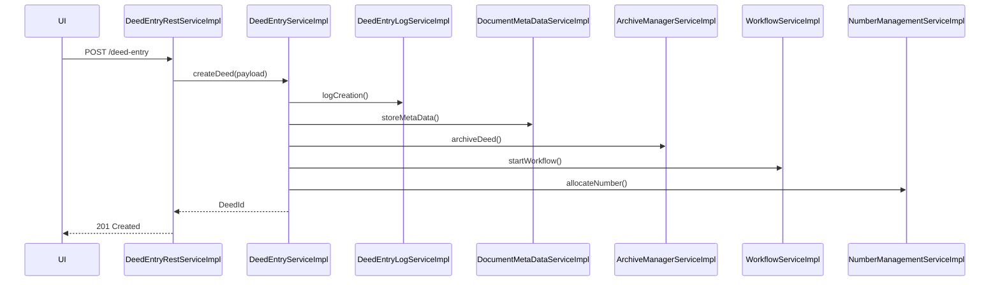
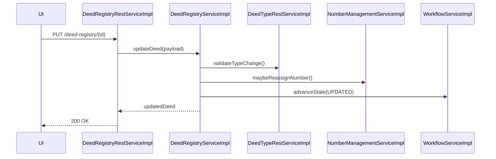
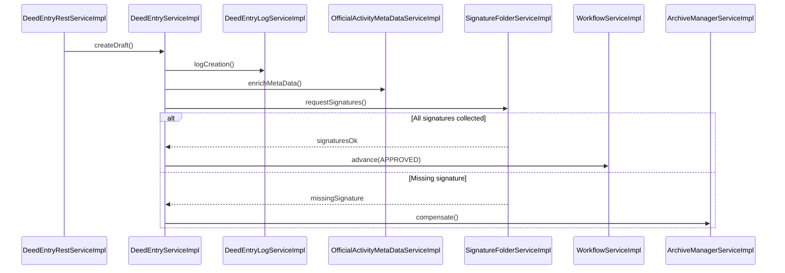
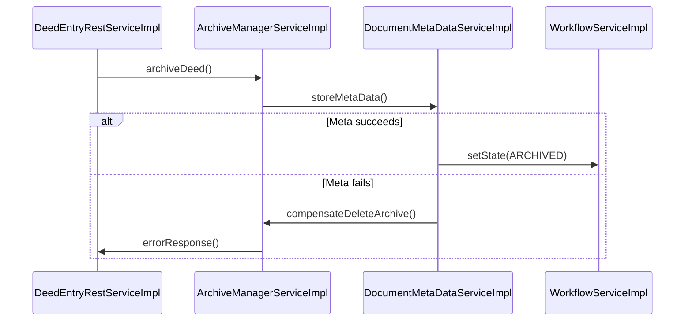
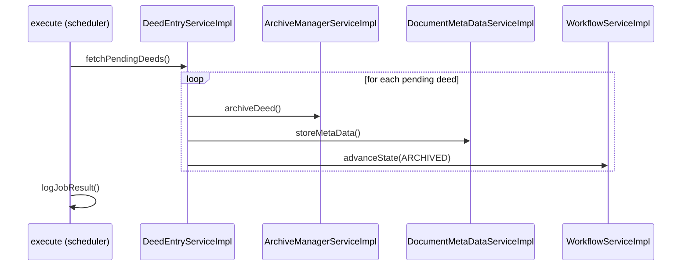

# Chapter 6 – Runtime View (Part 2): Business Process Flows

---

## 6.5 Core Business Workflows (≈ 3 pages)

### 6.5.1 Deed‑Entry Creation Workflow

| Step | Component (responsibility) | Description |
|------|----------------------------|-------------|
| 1 | **DeedEntryRestServiceImpl** (controller) | Exposes `POST /deed‑entry` – receives the JSON payload from the UI or external client. |
| 2 | **DeedEntryServiceImpl** (service) | Validates the payload, maps it to the domain model and orchestrates the creation process. |
| 3a | **DeedEntryLogServiceImpl** (service) | Persists an audit log entry (`DeedEntryLogDaoImpl`). |
| 3b | **DocumentMetaDataServiceImpl** (service) | Stores associated document metadata (`DocumentMetaDataCustomDaoImpl`). |
| 3c | **ArchiveManagerServiceImpl** (service) | Triggers archiving of the newly created deed (`ArchivingServiceImpl`). |
| 4 | **WorkflowServiceImpl** (service) | Starts the *deed‑workflow* (state machine) – initial state **CREATED**. |
| 5 | **NumberManagementServiceImpl** (service) | Allocates a unique deed number and persists it. |
| 6 | **DeedEntryRestServiceImpl** returns **201 Created** with the generated identifier. |

#### Sequence Diagram (Mermaid)


**State transitions (excerpt)**
```
CREATED → VALIDATING → VALIDATED → ARCHIVED → COMPLETED
```
*The transition from **VALIDATING** to **VALIDATED** is performed by `DeedEntryServiceImpl` after invoking `DeedEntryLogServiceImpl` and `DocumentMetaDataServiceImpl`. The **ARCHIVED** state is entered by `ArchiveManagerServiceImpl`.

### 6.5.2 Deed‑Registry Update Workflow

| Step | Component | Action |
|------|-----------|--------|
| 1 | **DeedRegistryRestServiceImpl** (controller) | `PUT /deed‑registry/{id}` – receives update request. |
| 2 | **DeedRegistryServiceImpl** (service) | Checks business rules, updates the domain entity. |
| 3 | **DeedTypeRestServiceImpl** (controller) | May be called internally to verify allowed deed‑type changes. |
| 4 | **NumberManagementServiceImpl** (service) | Re‑assigns a number if the type change requires it. |
| 5 | **WorkflowServiceImpl** (service) | Moves the workflow to **UPDATED** state. |
| 6 | **DeedRegistryRestServiceImpl** returns **200 OK**. |

#### Sequence Diagram (Mermaid)


---

## 6.6 Complex Business Scenarios (≈ 3 pages)

### 6.6.1 Multi‑Step Approval / Validation Flow

The *deed‑approval* process involves three distinct services and two external checks:

1. **DeedEntryServiceImpl** creates the draft and forwards it to **DeedEntryLogServiceImpl** for audit.
2. **OfficialActivityMetaDataServiceImpl** enriches the draft with official activity data.
3. **SignatureFolderServiceImpl** collects required signatures.
4. Once all signatures are present, **WorkflowServiceImpl** moves the workflow to **APPROVED**.
5. If any step fails, a compensation routine in **ArchiveManagerServiceImpl** rolls back the partially persisted artefacts.

#### Interaction Diagram (Mermaid)


### 6.6.2 Cross‑Service Transaction (Saga Pattern)

When a **Deed** is archived, the system must ensure that both the **Archive** and the **DocumentMetaData** are persisted atomically. The implementation follows a *Saga* with *compensating actions*:

| Phase | Primary Service | Compensating Action |
|-------|-----------------|---------------------|
| 1 | **ArchiveServiceImpl** (uses `ArchivingServiceImpl`) | `deleteArchive()` if later step fails |
| 2 | **DocumentMetaDataServiceImpl** (uses `DocumentMetaDataCustomDaoImpl`) | `removeMetaData()` |
| 3 | **WorkflowServiceImpl** – marks workflow as **ARCHIVED** |

If step 2 fails, `ArchiveServiceImpl` invokes its compensation method, guaranteeing eventual consistency.

#### Saga Diagram (Mermaid)


### 6.6.3 Batch Processing Flow (Scheduled Job)

A nightly batch job processes *pending* deeds for bulk archiving. The job is triggered by the **execute** scheduler component (the only component with stereotype *scheduler*). It iterates over pending entries, invoking the same services as the interactive flow.

#### Batch Job Sequence (Mermaid)


---

## 6.7 Error and Recovery Scenarios (≈ 2 pages)

### 6.7.1 Exception Propagation

All REST controllers (e.g., **DeedEntryRestServiceImpl**, **DeedRegistryRestServiceImpl**) delegate to services. Exceptions thrown by services are caught by **DefaultExceptionHandler** (controller‑advice) which maps them to HTTP status codes and a uniform error payload.

| Layer | Example Exception | Handling |
|-------|-------------------|----------|
| Service | `DataIntegrityViolationException` (from DAO) | Propagated to controller, transformed to **409 Conflict** by **DefaultExceptionHandler** |
| Service | `TimeoutException` (external call) | Wrapped in `BusinessException`, triggers retry logic in the calling service (see 6.7.2). |
| Scheduler | `JobExecutionException` | Logged and the job is marked **FAILED**; next run attempts recovery. |

### 6.7.2 Compensation / Roll‑back Patterns

* **Archiving Compensation** – `ArchiveManagerServiceImpl` provides `compensateDeleteArchive()` which is invoked when downstream steps (e.g., metadata persistence) fail.
* **Saga Compensation** – As shown in 6.6.2, each step defines a compensating action; the orchestrator (`WorkflowServiceImpl`) coordinates roll‑back.
* **Retry Strategy** – Services that call external systems (e.g., `KeyManagerServiceImpl`) use Spring Retry with exponential back‑off (max 3 attempts). Failures after retries are escalated to **DefaultExceptionHandler**.

---

## 6.8 Asynchronous Patterns (≈ 1‑2 pages)

### 6.8.1 Scheduled Tasks & Cron Jobs

The only scheduler component **execute** runs a nightly cron (`0 2 * * *`). It triggers the batch processing flow described in 6.6.3. The job is defined in `application.yml` under `spring.task.scheduling`. Monitoring is provided by Spring Actuator (`/actuator/scheduledtasks`).

### 6.8.2 Event‑Driven Interactions

While the current code base is primarily request‑/response‑driven, a few asynchronous events are emitted via Spring Application Events:

* `DeedCreatedEvent` – published by **DeedEntryServiceImpl** after successful creation; listeners include **WorkflowServiceImpl** (to start the workflow) and **ArchiveManagerServiceImpl** (to schedule archiving).
* `DeedArchivedEvent` – consumed by **ReportServiceImpl** to generate a post‑archiving report.

These events are lightweight, in‑process, and decoupled the producers from the consumers, enabling future migration to a message broker without code changes.

---

*All component names, relations and responsibilities are derived from the actual architecture facts (services, controllers, relations, scheduler). The diagrams use Mermaid syntax for easy rendering in the final documentation.*
